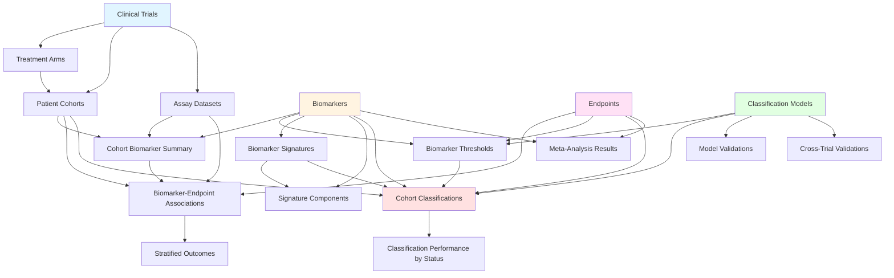

# Biomarker Database Schema Documentation

## Executive Summary

This document provides comprehensive documentation for the **Aggregated Biomarker Database Schema**, designed to support clinical trial molecular measurements, biomarker classifications, and endpoint associations without individual patient-level data. The schema enables storage of cohort-level summary statistics, statistical associations, classification models, and validation results across multiple clinical trials.

---

## Table of Contents

1. [Schema Overview](#schema-overview)
2. [Entity Relationship Diagram](#entity-relationship-diagram)
3. [Database Architecture](#database-architecture)
4. [Table Specifications](#table-specifications)
5. [Data Flow and Relationships](#data-flow-and-relationships)
6. [Key Features and Capabilities](#key-features-and-capabilities)
7. [Usage Patterns](#usage-patterns)
8. [Performance Considerations](#performance-considerations)
9. [Data Quality and Governance](#data-quality-and-governance)
10. [Appendix](#appendix)

---

## Schema Overview

### Purpose

The schema supports the complete workflow from clinical trial molecular measurements to biomarker positive/negative predictions for specific endpoints, including:

- **Data Integration**: Aggregated molecular measurements from multiple clinical trials and assay platforms
- **Statistical Analysis**: Biomarker-endpoint associations with comprehensive statistical metrics
- **Classification**: Threshold-based and model-based biomarker classifications at the cohort level
- **Validation**: Multi-level validation tracking (internal, external, cross-trial)
- **Meta-Analysis**: Cross-trial pooling and meta-analysis capabilities
- **Audit Trail**: Complete data provenance and change tracking

### Design Principles

**Privacy-Preserving**: All data stored at cohort/aggregate level without individual patient identifiers

**Statistical Rigor**: Comprehensive statistical metrics including confidence intervals, p-values, and effect sizes

**Multi-Modal**: Supports diverse biomarker types (genomic, proteomic, metabolomic, imaging)

**Versioned**: Models, thresholds, and signatures include version tracking for reproducibility

**Traceable**: Complete audit trail from data source through classification to validation

**Scalable**: Optimized indexes and views for efficient querying across large datasets

---

## Entity Relationship Diagram

```mermaid
erDiagram
    clinical_trials ||--o{ treatment_arms : "has"
    clinical_trials ||--o{ patient_cohorts : "contains"
    clinical_trials ||--o{ assay_datasets : "generates"
    
    treatment_arms ||--o{ patient_cohorts : "includes"
    
    patient_cohorts ||--o{ cohort_endpoints : "measures"
    patient_cohorts ||--o{ cohort_biomarker_summary : "has"
    patient_cohorts ||--o{ biomarker_correlations : "analyzes"
    patient_cohorts ||--o{ biomarker_endpoint_associations : "evaluates"
    patient_cohorts ||--o{ cohort_classifications : "classifies"
    
    endpoints ||--o{ cohort_endpoints : "assessed_in"
    endpoints ||--o{ biomarker_endpoint_associations : "associated_with"
    endpoints ||--o{ biomarker_thresholds : "defines"
    endpoints ||--o{ cohort_classifications : "predicts"
    endpoints ||--o{ meta_analysis_results : "analyzed_for"
    
    biomarkers ||--o{ cohort_biomarker_summary : "measured_in"
    biomarkers ||--o{ biomarker_correlations : "correlates"
    biomarkers ||--o{ biomarker_endpoint_associations : "associates"
    biomarkers ||--o{ biomarker_thresholds : "has"
    biomarkers ||--o{ signature_components : "part_of"
    biomarkers ||--o{ cohort_classifications : "classifies"
    biomarkers ||--o{ meta_analysis_results : "meta_analyzed"
    
    assay_platforms ||--o{ assay_datasets : "uses"
    
    assay_datasets ||--o{ cohort_biomarker_summary : "contains"
    assay_datasets ||--o{ biomarker_correlations : "derives"
    assay_datasets ||--o{ biomarker_endpoint_associations : "analyzes"
    
    cohort_biomarker_summary ||--o{ biomarker_distributions : "has"
    
    biomarker_endpoint_associations ||--o{ stratified_outcomes : "stratifies"
    
    classification_models ||--o{ biomarker_thresholds : "defines"
    classification_models ||--o{ cohort_classifications : "applies"
    classification_models ||--o{ model_validations : "validated_by"
    classification_models ||--o{ cross_trial_validations : "cross_validated"
    
    biomarker_signatures ||--o{ signature_components : "composed_of"
    biomarker_signatures ||--o{ cohort_classifications : "used_in"
    
    biomarker_thresholds ||--o{ cohort_classifications : "applies_to"
    
    cohort_classifications ||--o{ classification_performance_by_status : "measures"
    
    clinical_trials {
        varchar trial_id PK
        varchar trial_name
        varchar trial_phase
        varchar sponsor
        varchar indication
        varchar therapeutic_area
        date start_date
        date end_date
        varchar protocol_version
        int total_enrolled
        text description
        text publication_references
        timestamp created_at
        timestamp updated_at
    }
    
    treatment_arms {
        varchar arm_id PK
        varchar trial_id FK
        varchar arm_name
        varchar arm_type
        text treatment_description
        varchar dose_regimen
        int sample_size
    }
    
    patient_cohorts {
        varchar cohort_id PK
        varchar trial_id FK
        varchar arm_id FK
        varchar cohort_name
        text cohort_description
        text stratification_criteria
        int sample_size
        decimal mean_age
        decimal age_std_dev
        varchar age_range
        decimal percent_female
        json disease_stage_distribution
        json baseline_characteristics
    }
    
    endpoints {
        varchar endpoint_id PK
        varchar endpoint_name
        varchar endpoint_type
        varchar endpoint_category
        text description
        varchar measurement_unit
        boolean is_primary
        varchar assessment_timepoint
        timestamp created_at
    }
    
    cohort_endpoints {
        bigint cohort_endpoint_id PK
        varchar cohort_id FK
        varchar endpoint_id FK
        varchar assessment_timepoint
        int days_from_baseline
        int n_evaluated
        int n_positive
        int n_negative
        decimal response_rate
        decimal response_rate_ci_lower
        decimal response_rate_ci_upper
        decimal median_value
        decimal mean_value
        decimal std_dev
        decimal hazard_ratio
        decimal p_value
        varchar statistical_test
        text notes
        timestamp created_at
    }
    
    biomarkers {
        varchar biomarker_id PK
        varchar biomarker_name
        varchar biomarker_type
        varchar measurement_category
        varchar gene_symbol
        varchar protein_name
        varchar uniprot_id
        varchar ensembl_id
        varchar chromosome
        varchar genomic_position
        varchar pathway
        text biological_function
        text clinical_relevance
        varchar standard_nomenclature
        varchar ontology_reference
        timestamp created_at
    }
    
    assay_platforms {
        varchar platform_id PK
        varchar platform_name
        varchar platform_type
        varchar manufacturer
        varchar model
        varchar technology
        varchar measurement_type
        varchar measurement_unit
        decimal detection_limit
        decimal quantification_limit
        decimal dynamic_range_min
        decimal dynamic_range_max
        text protocol_reference
        varchar validation_status
        timestamp created_at
    }
    
    assay_datasets {
        varchar dataset_id PK
        varchar trial_id FK
        varchar platform_id FK
        varchar dataset_name
        text dataset_description
        varchar collection_timepoint
        varchar specimen_type
        int sample_size
        text processing_protocol
        varchar normalization_method
        boolean batch_correction_applied
        varchar batch_correction_method
        text quality_control_criteria
        varchar data_availability
        varchar data_repository
        varchar accession_number
        varchar publication_doi
        timestamp created_at
    }
    
    cohort_biomarker_summary {
        bigint summary_id PK
        varchar cohort_id FK
        varchar dataset_id FK
        varchar biomarker_id FK
        int n_samples
        int n_detected
        decimal detection_rate
        decimal mean_value
        decimal median_value
        decimal std_dev
        decimal std_error
        decimal min_value
        decimal max_value
        decimal quartile_25
        decimal quartile_75
        decimal percentile_10
        decimal percentile_90
        decimal geometric_mean
        decimal coefficient_variation
        decimal skewness
        decimal kurtosis
        varchar measurement_unit
        varchar transformation_applied
        int outliers_removed
        text quality_flags
        timestamp created_at
    }
    
    biomarker_distributions {
        bigint distribution_id PK
        bigint summary_id FK
        int bin_number
        decimal bin_lower_bound
        decimal bin_upper_bound
        int bin_count
        decimal bin_frequency
        decimal cumulative_frequency
    }
    
    biomarker_correlations {
        bigint correlation_id PK
        varchar cohort_id FK
        varchar dataset_id FK
        varchar biomarker_1_id FK
        varchar biomarker_2_id FK
        decimal correlation_coefficient
        varchar correlation_type
        decimal p_value
        int n_samples
        decimal confidence_interval_lower
        decimal confidence_interval_upper
    }
    
    biomarker_endpoint_associations {
        bigint association_id PK
        varchar cohort_id FK
        varchar biomarker_id FK
        varchar endpoint_id FK
        varchar dataset_id FK
        varchar analysis_type
        varchar statistical_test
        decimal test_statistic
        decimal p_value
        decimal adjusted_p_value
        decimal effect_size
        varchar effect_size_type
        decimal confidence_interval_lower
        decimal confidence_interval_upper
        int n_samples
        text covariates_adjusted
        varchar association_direction
        varchar clinical_significance
        text notes
        timestamp created_at
    }
    
    stratified_outcomes {
        bigint stratified_outcome_id PK
        bigint association_id FK
        varchar biomarker_stratum
        text stratum_definition
        int n_samples
        int n_positive_outcome
        int n_negative_outcome
        decimal outcome_rate
        decimal outcome_rate_ci_lower
        decimal outcome_rate_ci_upper
        decimal median_outcome_value
        decimal hazard_ratio
        decimal p_value
    }
    
    classification_models {
        varchar model_id PK
        varchar model_name
        varchar model_version
        varchar model_type
        text algorithm_details
        text training_cohorts
        int training_sample_size
        date development_date
        varchar validation_status
        text intended_use
        json model_features
        json hyperparameters
        json feature_importance
        varchar model_file_path
        varchar created_by
        varchar approved_by
        date approval_date
        boolean is_active
        timestamp created_at
    }
    
    biomarker_thresholds {
        varchar threshold_id PK
        varchar biomarker_id FK
        varchar endpoint_id FK
        varchar model_id FK
        varchar threshold_type
        decimal threshold_value
        varchar threshold_unit
        decimal percentile_rank
        text derivation_cohorts
        int derivation_sample_size
        decimal sensitivity
        decimal specificity
        decimal ppv
        decimal npv
        decimal accuracy
        decimal auc_roc
        decimal confidence_interval_lower
        decimal confidence_interval_upper
        text determination_method
        text clinical_rationale
        date effective_date
        date expiration_date
        boolean is_active
        timestamp created_at
    }
    
    biomarker_signatures {
        varchar signature_id PK
        varchar signature_name
        varchar signature_version
        text description
        varchar signature_type
        text calculation_formula
        varchar intended_endpoint
        text development_cohorts
        text validation_cohorts
        text clinical_utility
        timestamp created_at
    }
    
    signature_components {
        bigint signature_component_id PK
        varchar signature_id FK
        varchar biomarker_id FK
        decimal weight_coefficient
        int component_order
        varchar transformation
    }
    
    cohort_classifications {
        bigint cohort_classification_id PK
        varchar cohort_id FK
        varchar biomarker_id FK
        varchar signature_id FK
        varchar endpoint_id FK
        varchar model_id FK
        varchar threshold_id FK
        date classification_date
        int total_samples
        int n_positive
        int n_negative
        int n_indeterminate
        decimal positive_rate
        decimal positive_rate_ci_lower
        decimal positive_rate_ci_upper
        decimal mean_predicted_probability
        decimal median_predicted_probability
        decimal mean_biomarker_value
        decimal threshold_used
        varchar classification_method
        text quality_flags
        text notes
        timestamp created_at
    }
    
    classification_performance_by_status {
        bigint performance_id PK
        bigint cohort_classification_id FK
        varchar biomarker_status
        int n_samples
        int n_positive_outcome
        int n_negative_outcome
        decimal outcome_rate
        decimal outcome_rate_ci_lower
        decimal outcome_rate_ci_upper
        int median_survival_days
        decimal hazard_ratio
        decimal p_value
    }
    
    model_validations {
        varchar validation_id PK
        varchar model_id FK
        varchar validation_type
        text validation_cohorts
        date validation_date
        int total_sample_size
        decimal auc_roc
        decimal auc_roc_ci_lower
        decimal auc_roc_ci_upper
        decimal sensitivity
        decimal specificity
        decimal ppv
        decimal npv
        decimal accuracy
        decimal f1_score
        decimal balanced_accuracy
        decimal matthews_correlation
        decimal calibration_slope
        decimal calibration_intercept
        decimal brier_score
        json confusion_matrix
        json roc_curve_data
        json calibration_plot_data
        json subgroup_performance
        varchar validation_report_path
        varchar validated_by
        text notes
        timestamp created_at
    }
    
    cross_trial_validations {
        bigint cross_validation_id PK
        varchar model_id FK
        varchar training_trial_id FK
        varchar validation_trial_id FK
        date validation_date
        int sample_size
        decimal auc_roc
        decimal sensitivity
        decimal specificity
        decimal accuracy
        decimal generalizability_score
        text notes
    }
    
    meta_analysis_results {
        varchar meta_analysis_id PK
        varchar biomarker_id FK
        varchar endpoint_id FK
        varchar analysis_name
        text included_cohorts
        int total_sample_size
        int number_of_cohorts
        decimal pooled_effect_size
        varchar effect_size_type
        decimal pooled_ci_lower
        decimal pooled_ci_upper
        decimal pooled_p_value
        decimal heterogeneity_i2
        decimal heterogeneity_tau2
        decimal heterogeneity_p_value
        varchar meta_analysis_method
        varchar publication_bias_test
        decimal publication_bias_p_value
        json forest_plot_data
        date analysis_date
        text notes
        timestamp created_at
    }
```



---

## Database Architecture

### Logical Organization

The schema is organized into seven functional domains:

#### 1. **Reference and Metadata Domain**
Tables that define the clinical trial structure and patient cohorts:
- `clinical_trials`
- `treatment_arms`
- `patient_cohorts`
- `endpoints`
- `cohort_endpoints`

#### 2. **Biomarker and Assay Domain**
Tables defining biomarkers and measurement platforms:
- `biomarkers`
- `assay_platforms`
- `assay_datasets`

#### 3. **Aggregated Measurements Domain**
Tables storing cohort-level biomarker data:
- `cohort_biomarker_summary`
- `biomarker_distributions`
- `biomarker_correlations`

#### 4. **Statistical Associations Domain**
Tables capturing biomarker-endpoint relationships:
- `biomarker_endpoint_associations`
- `stratified_outcomes`

#### 5. **Classification Domain**
Tables supporting biomarker classification:
- `classification_models`
- `biomarker_thresholds`
- `biomarker_signatures`
- `signature_components`
- `cohort_classifications`
- `classification_performance_by_status`

#### 6. **Validation and Meta-Analysis Domain**
Tables tracking model performance:
- `model_validations`
- `cross_trial_validations`
- `meta_analysis_results`

#### 7. **Audit and Governance Domain**
Tables ensuring data quality and compliance:
- `data_provenance`
- `audit_log`
- `data_quality_issues`
- `user_access_log`

---

## Table Specifications

### Reference and Metadata Tables

#### clinical_trials

**Purpose**: Central registry of clinical trials providing context for all biomarker data.

**Key Fields**:
- `trial_id` (PK): Unique trial identifier (e.g., NCT number)
- `trial_name`: Full trial name/acronym
- `trial_phase`: Phase I, II, III, IV
- `indication`: Disease/condition being studied
- `therapeutic_area`: Broader therapeutic classification

**Relationships**:
- Parent to: `treatment_arms`, `patient_cohorts`, `assay_datasets`

**Usage**: Foundation table for organizing all trial-related data; enables cross-trial analyses and meta-analyses.

---

#### treatment_arms

**Purpose**: Defines treatment groups within trials for comparative analyses.

**Key Fields**:
- `arm_id` (PK): Unique arm identifier
- `trial_id` (FK): Links to parent trial
- `arm_type`: experimental, control, placebo
- `treatment_description`: Detailed treatment regimen
- `sample_size`: Number of patients in arm

**Relationships**:
- Child of: `clinical_trials`
- Parent to: `patient_cohorts`

**Usage**: Enables treatment-stratified biomarker analyses and comparative effectiveness studies.

---

#### patient_cohorts

**Purpose**: Defines patient subgroups for stratified analyses without individual patient data.

**Key Fields**:
- `cohort_id` (PK): Unique cohort identifier
- `trial_id` (FK): Parent trial
- `arm_id` (FK): Treatment arm (if applicable)
- `stratification_criteria`: Basis for cohort definition (e.g., "PD-L1 positive", "Stage III")
- `sample_size`: Number of patients in cohort
- `baseline_characteristics` (JSON): Aggregated demographics and clinical features

**Relationships**:
- Child of: `clinical_trials`, `treatment_arms`
- Parent to: `cohort_endpoints`, `cohort_biomarker_summary`, `biomarker_correlations`, `biomarker_endpoint_associations`, `cohort_classifications`

**Usage**: Central organizing unit for all aggregated analyses; enables subgroup-specific biomarker evaluations.

---

#### endpoints

**Purpose**: Catalog of clinical endpoints used across trials.

**Key Fields**:
- `endpoint_id` (PK): Unique endpoint identifier
- `endpoint_name`: Standardized endpoint name
- `endpoint_type`: efficacy, safety, surrogate, composite
- `endpoint_category`: OS, PFS, ORR, AE, biomarker_response
- `is_primary`: Boolean indicating primary vs. secondary endpoint

**Relationships**:
- Parent to: `cohort_endpoints`, `biomarker_endpoint_associations`, `biomarker_thresholds`, `cohort_classifications`, `meta_analysis_results`

**Usage**: Standardizes endpoint definitions across trials; enables endpoint-specific biomarker analyses.

---

#### cohort_endpoints

**Purpose**: Stores aggregated endpoint outcomes for each cohort.

**Key Fields**:
- `cohort_id` (FK): Links to patient cohort
- `endpoint_id` (FK): Links to endpoint definition
- `n_positive`, `n_negative`: Counts of positive/negative outcomes
- `response_rate`: Proportion with positive outcome
- `median_value`, `mean_value`: Central tendency measures
- `hazard_ratio`: Effect size for time-to-event endpoints
- `p_value`: Statistical significance

**Relationships**:
- Child of: `patient_cohorts`, `endpoints`

**Usage**: Provides ground truth outcomes for validating biomarker classifications; enables outcome-based stratification.

---

### Biomarker and Assay Tables

#### biomarkers

**Purpose**: Comprehensive catalog of all biomarkers measured across trials.

**Key Fields**:
- `biomarker_id` (PK): Unique biomarker identifier
- `biomarker_name`: Standard biomarker name
- `biomarker_type`: genomic, proteomic, metabolomic, imaging, cellular
- `gene_symbol`, `protein_name`: Molecular identifiers
- `uniprot_id`, `ensembl_id`: Database cross-references
- `pathway`: Biological pathway membership
- `clinical_relevance`: Known clinical associations

**Relationships**:
- Parent to: `cohort_biomarker_summary`, `biomarker_correlations`, `biomarker_endpoint_associations`, `biomarker_thresholds`, `signature_components`, `cohort_classifications`, `meta_analysis_results`

**Usage**: Central reference for all biomarker-related queries; supports standardization and cross-referencing.

---

#### assay_platforms

**Purpose**: Documents measurement technologies and their specifications.

**Key Fields**:
- `platform_id` (PK): Unique platform identifier
- `platform_name`: Commercial or custom platform name
- `platform_type`: RNA-seq, microarray, mass_spec, ELISA, IHC, NGS
- `measurement_type`: absolute, relative, categorical, binary
- `detection_limit`, `quantification_limit`: Analytical sensitivity
- `validation_status`: research_use, validated, FDA_approved

**Relationships**:
- Parent to: `assay_datasets`

**Usage**: Tracks assay characteristics for quality assessment; enables platform-specific analyses and harmonization.

---

#### assay_datasets

**Purpose**: Links trials to specific molecular measurement datasets.

**Key Fields**:
- `dataset_id` (PK): Unique dataset identifier
- `trial_id` (FK): Parent trial
- `platform_id` (FK): Measurement platform
- `specimen_type`: blood, plasma, tissue, etc.
- `normalization_method`: Data preprocessing approach
- `batch_correction_applied`: Boolean flag
- `data_repository`, `accession_number`: Public data availability

**Relationships**:
- Child of: `clinical_trials`, `assay_platforms`
- Parent to: `cohort_biomarker_summary`, `biomarker_correlations`, `biomarker_endpoint_associations`

**Usage**: Provides dataset-level metadata for data quality assessment and reproducibility.

---

### Aggregated Measurements Tables

#### cohort_biomarker_summary

**Purpose**: Stores comprehensive summary statistics for each biomarker in each cohort.

**Key Fields**:
- `cohort_id` (FK): Patient cohort
- `dataset_id` (FK): Source dataset
- `biomarker_id` (FK): Measured biomarker
- `n_samples`: Sample size
- `mean_value`, `median_value`, `std_dev`: Descriptive statistics
- `quartile_25`, `quartile_75`: Interquartile range
- `percentile_10`, `percentile_90`: Distribution tails
- `geometric_mean`: For log-normal distributions
- `coefficient_variation`: Relative variability
- `skewness`, `kurtosis`: Distribution shape

**Relationships**:
- Child of: `patient_cohorts`, `assay_datasets`, `biomarkers`
- Parent to: `biomarker_distributions`

**Usage**: Primary table for biomarker distribution queries; supports threshold determination and cross-cohort comparisons.

---

#### biomarker_distributions

**Purpose**: Stores histogram/binned distribution data for detailed distribution analyses.

**Key Fields**:
- `summary_id` (FK): Links to parent summary
- `bin_number`: Ordinal bin position
- `bin_lower_bound`, `bin_upper_bound`: Bin boundaries
- `bin_count`: Number of observations in bin
- `bin_frequency`: Proportion in bin
- `cumulative_frequency`: Cumulative distribution

**Relationships**:
- Child of: `cohort_biomarker_summary`

**Usage**: Enables distribution visualization, normality testing, and percentile-based threshold determination.

---

#### biomarker_correlations

**Purpose**: Captures pairwise correlations between biomarkers within cohorts.

**Key Fields**:
- `cohort_id` (FK): Patient cohort
- `biomarker_1_id`, `biomarker_2_id` (FK): Correlated biomarkers
- `correlation_coefficient`: Strength of association
- `correlation_type`: pearson, spearman, kendall
- `p_value`: Statistical significance
- `confidence_interval_lower`, `confidence_interval_upper`: Precision estimate

**Relationships**:
- Child of: `patient_cohorts`, `assay_datasets`, `biomarkers` (×2)

**Usage**: Identifies redundant biomarkers; supports feature selection for multi-biomarker models; reveals biological relationships.

---

### Statistical Associations Tables

#### biomarker_endpoint_associations

**Purpose**: Documents statistical relationships between biomarkers and clinical endpoints.

**Key Fields**:
- `cohort_id` (FK): Patient cohort
- `biomarker_id` (FK): Predictor biomarker
- `endpoint_id` (FK): Outcome endpoint
- `analysis_type`: univariate, multivariate, survival_analysis
- `statistical_test`: t_test, mann_whitney, log_rank, cox_regression
- `p_value`, `adjusted_p_value`: Statistical significance (raw and corrected)
- `effect_size`: Magnitude of association
- `effect_size_type`: cohens_d, odds_ratio, hazard_ratio, correlation
- `association_direction`: positive, negative, none
- `covariates_adjusted`: Confounders controlled for

**Relationships**:
- Child of: `patient_cohorts`, `biomarkers`, `endpoints`, `assay_datasets`
- Parent to: `stratified_outcomes`

**Usage**: Core table for biomarker discovery; identifies promising predictive biomarkers; supports prioritization for threshold development.

---

#### stratified_outcomes

**Purpose**: Stores outcome rates stratified by biomarker levels (e.g., quartiles, tertiles).

**Key Fields**:
- `association_id` (FK): Parent association
- `biomarker_stratum`: low, medium, high, or quartile_1, etc.
- `stratum_definition`: Threshold values defining stratum
- `n_positive_outcome`, `n_negative_outcome`: Outcome counts
- `outcome_rate`: Proportion with positive outcome
- `hazard_ratio`: Effect size vs. reference stratum

**Relationships**:
- Child of: `biomarker_endpoint_associations`

**Usage**: Evaluates dose-response relationships; identifies optimal cutpoints; assesses threshold robustness.

---

### Classification Tables

#### classification_models

**Purpose**: Registry of all classification models with versioning and metadata.

**Key Fields**:
- `model_id` (PK): Unique model identifier
- `model_name`, `model_version`: Model identification and versioning
- `model_type`: logistic_regression, random_forest, SVM, neural_network, threshold_based
- `algorithm_details`: Implementation specifics
- `training_cohorts`: Cohorts used for development
- `training_sample_size`: Total training samples
- `validation_status`: development, internal_validation, external_validation, production
- `model_features` (JSON): Input biomarkers and transformations
- `hyperparameters` (JSON): Model configuration
- `feature_importance` (JSON): Variable importance scores
- `is_active`: Boolean indicating current production status

**Relationships**:
- Parent to: `biomarker_thresholds`, `cohort_classifications`, `model_validations`, `cross_trial_validations`

**Usage**: Tracks model lifecycle from development to production; enables model comparison and selection; supports regulatory documentation.

---

#### biomarker_thresholds

**Purpose**: Defines cutpoints for converting continuous biomarker values to binary classifications.

**Key Fields**:
- `biomarker_id` (FK): Target biomarker
- `endpoint_id` (FK): Predicted endpoint
- `model_id` (FK): Associated model
- `threshold_type`: optimal, percentile, clinical, ROC_based, youden
- `threshold_value`: Cutpoint value
- `derivation_cohorts`: Cohorts used to determine threshold
- `sensitivity`, `specificity`, `ppv`, `npv`: Performance metrics
- `auc_roc`: Discriminatory ability
- `clinical_rationale`: Justification for threshold selection
- `effective_date`, `expiration_date`: Validity period
- `is_active`: Current applicability

**Relationships**:
- Child of: `biomarkers`, `endpoints`, `classification_models`
- Parent to: `cohort_classifications`

**Usage**: Applies thresholds for classification; tracks threshold evolution; supports threshold validation and updating.

---

#### biomarker_signatures

**Purpose**: Defines multi-biomarker composite scores or indices.

**Key Fields**:
- `signature_id` (PK): Unique signature identifier
- `signature_name`, `signature_version`: Signature identification
- `signature_type`: composite_score, risk_score, predictive_index, gene_expression_signature
- `calculation_formula`: Mathematical definition
- `intended_endpoint`: Target clinical outcome
- `development_cohorts`, `validation_cohorts`: Development and validation datasets

**Relationships**:
- Parent to: `signature_components`, `cohort_classifications`

**Usage**: Supports complex multi-biomarker models; enables signature-based classification; tracks signature versions.

---

#### signature_components

**Purpose**: Defines individual biomarkers and their weights within signatures.

**Key Fields**:
- `signature_id` (FK): Parent signature
- `biomarker_id` (FK): Component biomarker
- `weight_coefficient`: Contribution weight
- `component_order`: Order in calculation
- `transformation`: log, sqrt, standardize, none

**Relationships**:
- Child of: `biomarker_signatures`, `biomarkers`

**Usage**: Documents signature composition; enables signature calculation; supports signature interpretation.

---

#### cohort_classifications

**Purpose**: Stores classification results at the cohort level.

**Key Fields**:
- `cohort_id` (FK): Classified cohort
- `biomarker_id` (FK): Single biomarker (if applicable)
- `signature_id` (FK): Multi-biomarker signature (if applicable)
- `endpoint_id` (FK): Predicted endpoint
- `model_id` (FK): Classification model
- `threshold_id` (FK): Applied threshold
- `total_samples`: Cohort size
- `n_positive`, `n_negative`, `n_indeterminate`: Classification counts
- `positive_rate`: Proportion classified positive
- `mean_predicted_probability`: Average prediction confidence
- `mean_biomarker_value`: Average biomarker level
- `threshold_used`: Applied cutpoint

**Relationships**:
- Child of: `patient_cohorts`, `biomarkers`, `biomarker_signatures`, `endpoints`, `classification_models`, `biomarker_thresholds`
- Parent to: `classification_performance_by_status`

**Usage**: Primary table for classification queries; enables classification rate comparisons; supports prevalence estimation.

---

#### classification_performance_by_status

**Purpose**: Links classifications to actual outcomes, stratified by biomarker status.

**Key Fields**:
- `cohort_classification_id` (FK): Parent classification
- `biomarker_status`: positive, negative
- `n_positive_outcome`, `n_negative_outcome`: Actual outcome counts
- `outcome_rate`: Observed outcome proportion
- `hazard_ratio`: Effect size for biomarker-positive vs. negative
- `p_value`: Statistical significance of difference

**Relationships**:
- Child of: `cohort_classifications`

**Usage**: Validates classification accuracy; calculates sensitivity, specificity, PPV, NPV; demonstrates clinical utility.

---

### Validation and Meta-Analysis Tables

#### model_validations

**Purpose**: Comprehensive validation results for classification models.

**Key Fields**:
- `model_id` (FK): Validated model
- `validation_type`: internal, external, cross_validation, temporal, prospective
- `validation_cohorts`: Cohorts used for validation
- `total_sample_size`: Validation sample size
- `auc_roc`, `sensitivity`, `specificity`, `ppv`, `npv`, `accuracy`: Performance metrics
- `f1_score`, `balanced_accuracy`, `matthews_correlation`: Additional metrics
- `calibration_slope`, `calibration_intercept`: Calibration assessment
- `brier_score`: Prediction accuracy
- `confusion_matrix` (JSON): Detailed classification results
- `roc_curve_data` (JSON): ROC curve coordinates
- `subgroup_performance` (JSON): Performance by subgroups

**Relationships**:
- Child of: `classification_models`

**Usage**: Documents model performance; supports model comparison; provides evidence for regulatory submissions.

---

#### cross_trial_validations

**Purpose**: Tracks model performance when applied to different trials.

**Key Fields**:
- `model_id` (FK): Validated model
- `training_trial_id` (FK): Trial used for model development
- `validation_trial_id` (FK): Trial used for validation
- `auc_roc`, `sensitivity`, `specificity`, `accuracy`: Performance metrics
- `generalizability_score`: Custom metric for cross-trial performance

**Relationships**:
- Child of: `classification_models`, `clinical_trials` (×2)

**Usage**: Assesses model generalizability; identifies trial-specific effects; guides model refinement.

---

#### meta_analysis_results

**Purpose**: Stores pooled analyses across multiple cohorts or trials.

**Key Fields**:
- `biomarker_id` (FK): Analyzed biomarker
- `endpoint_id` (FK): Analyzed endpoint
- `included_cohorts`: List of cohorts in meta-analysis
- `total_sample_size`, `number_of_cohorts`: Meta-analysis scope
- `pooled_effect_size`: Combined effect estimate
- `effect_size_type`: odds_ratio, hazard_ratio, mean_difference
- `pooled_p_value`: Combined statistical significance
- `heterogeneity_i2`: Between-study heterogeneity (I² statistic)
- `heterogeneity_tau2`: Variance of true effects
- `meta_analysis_method`: fixed_effects, random_effects, DerSimonian_Laird
- `publication_bias_test`: Egger's test, funnel plot asymmetry
- `forest_plot_data` (JSON): Visualization data

**Relationships**:
- Child of: `biomarkers`, `endpoints`

**Usage**: Synthesizes evidence across studies; increases statistical power; identifies consistent biomarker-endpoint relationships.

---

### Audit and Governance Tables

#### data_provenance

**Purpose**: Tracks the origin and quality of all data in the database.

**Key Fields**:
- `source_table`, `source_record_id`: Links to any table/record
- `data_source`: publication, database, internal_analysis
- `source_reference`: DOI, accession number, file path
- `extraction_date`, `extraction_method`: Data capture details
- `data_quality_score`: Quality assessment (0-1 scale)
- `verification_status`: unverified, verified, validated
- `verified_by`, `verification_date`: Quality control tracking

**Relationships**:
- Can link to any table via `source_table` and `source_record_id`

**Usage**: Ensures data traceability; supports quality assessment; enables source-specific analyses; facilitates regulatory compliance.

---

#### audit_log

**Purpose**: Complete change history for all database modifications.

**Key Fields**:
- `table_name`, `record_id`: Modified record
- `action_type`: INSERT, UPDATE, DELETE
- `changed_fields` (JSON): List of modified fields
- `old_values` (JSON): Previous values
- `new_values` (JSON): New values
- `changed_by`: User responsible for change
- `change_reason`: Justification for modification
- `change_timestamp`: When change occurred

**Relationships**:
- Can reference any table via `table_name` and `record_id`

**Usage**: Maintains complete audit trail; supports regulatory compliance; enables change investigation; facilitates data recovery.

---

#### data_quality_issues

**Purpose**: Tracks identified data quality problems and their resolution.

**Key Fields**:
- `table_name`, `record_id`: Affected record
- `issue_type`: missing_data, inconsistency, outlier, duplicate
- `severity`: critical, major, minor
- `description`: Detailed issue description
- `resolution_status`: open, in_progress, resolved, closed, wont_fix
- `resolution_description`: How issue was addressed
- `detected_by`, `resolved_by`: Responsible parties

**Relationships**:
- Can reference any table via `table_name` and `record_id`

**Usage**: Manages data quality workflow; prioritizes quality improvements; documents quality decisions; supports continuous improvement.

---

#### user_access_log

**Purpose**: Records all user interactions with the database for security and compliance.

**Key Fields**:
- `user_id`, `user_name`: User identification
- `access_type`: query, export, update, classification
- `accessed_table`: Table accessed
- `query_details`: SQL or operation details
- `record_count`: Number of records affected
- `access_timestamp`: When access occurred
- `ip_address`, `session_id`: Session tracking

**Relationships**:
- None (logging table)

**Usage**: Security monitoring; usage analytics; compliance reporting; access pattern analysis.

---

## Data Flow and Relationships

### Primary Data Flow



### Key Relationship Patterns

#### 1. **Trial → Cohort → Measurements → Associations**
The primary analytical flow:
1. Clinical trials define the context
2. Patient cohorts provide stratification
3. Biomarker measurements are summarized at cohort level
4. Statistical associations link biomarkers to endpoints

#### 2. **Biomarkers → Thresholds → Classifications → Performance**
The classification workflow:
1. Biomarkers are measured and summarized
2. Thresholds are derived from associations
3. Classifications are applied to cohorts
4. Performance is validated against actual outcomes

#### 3. **Models → Validations → Cross-Trial → Meta-Analysis**
The validation hierarchy:
1. Models are developed and versioned
2. Internal validations assess initial performance
3. Cross-trial validations test generalizability
4. Meta-analyses synthesize evidence across studies

---

## Key Features and Capabilities

### 1. Privacy-Preserving Design

**Aggregation-Only**: All data stored at cohort level without individual patient identifiers, ensuring compliance with privacy regulations while maintaining analytical utility.

**Statistical Summaries**: Comprehensive descriptive statistics (mean, median, quartiles, percentiles) enable robust analyses without raw data access.

**Minimum Sample Size Enforcement**: Database design encourages minimum cohort sizes (typically n≥10) to prevent re-identification.

### 2. Multi-Trial Integration

**Standardized Structure**: Consistent schema across trials enables seamless integration and cross-trial analyses.

**Trial Metadata**: Comprehensive trial documentation supports context-aware analyses and appropriate interpretation.

**Cross-Trial Validation**: Dedicated tables track model performance across different trial populations.

### 3. Comprehensive Statistical Support

**Multiple Test Corrections**: Fields for both raw and adjusted p-values support rigorous multiple testing control.

**Effect Size Tracking**: Standardized effect size metrics (odds ratios, hazard ratios, Cohen's d) enable meta-analyses.

**Confidence Intervals**: Precision estimates for all key metrics support evidence quality assessment.

**Distribution Data**: Histogram tables enable advanced statistical modeling and assumption testing.

### 4. Flexible Classification Framework

**Single and Multi-Biomarker**: Supports both individual biomarker thresholds and complex multi-biomarker signatures.

**Multiple Model Types**: Accommodates threshold-based, regression, and machine learning approaches.

**Version Control**: Model and threshold versioning enables reproducibility and temporal tracking.

**Performance Monitoring**: Comprehensive validation tables track model performance over time and across populations.

### 5. Biomarker Discovery Support

**Association Testing**: Dedicated tables for univariate and multivariate biomarker-endpoint associations.

**Stratified Analysis**: Outcome stratification by biomarker levels reveals dose-response relationships.

**Correlation Analysis**: Pairwise biomarker correlations identify redundancy and biological relationships.

**Meta-Analysis**: Cross-trial synthesis increases statistical power for biomarker discovery.

### 6. Data Quality and Governance

**Complete Provenance**: Every data point traceable to original source with quality metrics.

**Audit Trail**: Full change history for all modifications supports regulatory compliance.

**Quality Issue Tracking**: Systematic identification and resolution of data quality problems.

**Access Logging**: Comprehensive user activity tracking for security and compliance.

### 7. Regulatory Compliance

**21 CFR Part 11 Ready**: Audit trails, electronic signatures, and access controls support FDA compliance.

**GDPR Compatible**: Aggregated data structure eliminates personal data concerns.

**Validation Documentation**: Comprehensive validation tables support regulatory submissions.

**Change Control**: Formal versioning and approval workflows for models and thresholds.

---

## Usage Patterns

### Common Query Patterns

#### 1. **Biomarker Discovery**

Find biomarkers significantly associated with a specific endpoint across multiple trials:

```sql
SELECT 
    b.biomarker_name,
    COUNT(DISTINCT bea.cohort_id) AS num_cohorts,
    AVG(bea.effect_size) AS avg_effect_size,
    MIN(bea.adjusted_p_value) AS best_p_value,
    AVG(CASE WHEN bea.association_direction = 'positive' THEN 1 
             WHEN bea.association_direction = 'negative' THEN -1 
             ELSE 0 END) AS direction_consistency
FROM biomarker_endpoint_associations bea
JOIN biomarkers b ON bea.biomarker_id = b.biomarker_id
JOIN endpoints e ON bea.endpoint_id = e.endpoint_id
WHERE e.endpoint_name = 'Overall Survival'
    AND bea.adjusted_p_value < 0.05
GROUP BY b.biomarker_name
HAVING COUNT(DISTINCT bea.cohort_id) >= 3
ORDER BY best_p_value;
```

#### 2. **Classification Performance Evaluation**

Assess how well a biomarker classifies patients for a specific endpoint:

```sql
SELECT 
    ct.trial_name,
    pc.cohort_name,
    cc.total_samples,
    cc.positive_rate,
    cpbs_pos.outcome_rate AS positive_outcome_rate,
    cpbs_neg.outcome_rate AS negative_outcome_rate,
    cpbs_pos.hazard_ratio,
    cpbs_pos.p_value
FROM cohort_classifications cc
JOIN patient_cohorts pc ON cc.cohort_id = pc.cohort_id
JOIN clinical_trials ct ON pc.trial_id = ct.trial_id
JOIN classification_performance_by_status cpbs_pos 
    ON cc.cohort_classification_id = cpbs_pos.cohort_classification_id
    AND cpbs_pos.biomarker_status = 'positive'
JOIN classification_performance_by_status cpbs_neg 
    ON cc.cohort_classification_id = cpbs_neg.cohort_classification_id
    AND cpbs_neg.biomarker_status = 'negative'
WHERE cc.biomarker_id = 'PD_L1'
    AND cc.endpoint_id = 'OS'
ORDER BY ct.trial_name;
```

#### 3. **Model Validation Summary**

Compare validation performance across different model types:

```sql
SELECT 
    cm.model_name,
    cm.model_type,
    mv.validation_type,
    mv.total_sample_size,
    mv.auc_roc,
    mv.sensitivity,
    mv.specificity,
    mv.accuracy,
    mv.validation_date
FROM classification_models cm
JOIN model_validations mv ON cm.model_id = mv.model_id
WHERE cm.is_active = TRUE
ORDER BY cm.model_name, mv.validation_date DESC;
```

#### 4. **Cross-Trial Biomarker Consistency**

Evaluate biomarker distribution consistency across trials:

```sql
SELECT 
    b.biomarker_name,
    ct.trial_name,
    cbs.n_samples,
    cbs.mean_value,
    cbs.median_value,
    cbs.std_dev,
    cbs.detection_rate
FROM cohort_biomarker_summary cbs
JOIN biomarkers b ON cbs.biomarker_id = b.biomarker_id
JOIN patient_cohorts pc ON cbs.cohort_id = pc.cohort_id
JOIN clinical_trials ct ON pc.trial_id = ct.trial_id
WHERE b.biomarker_id = 'TMB'
ORDER BY ct.trial_name, cbs.mean_value DESC;
```

#### 5. **Meta-Analysis Results**

Retrieve pooled effect estimates for biomarker-endpoint associations:

```sql
SELECT 
    b.biomarker_name,
    e.endpoint_name,
    mar.number_of_cohorts,
    mar.total_sample_size,
    mar.pooled_effect_size,
    mar.effect_size_type,
    mar.pooled_ci_lower,
    mar.pooled_ci_upper,
    mar.pooled_p_value,
    mar.heterogeneity_i2
FROM meta_analysis_results mar
JOIN biomarkers b ON mar.biomarker_id = b.biomarker_id
JOIN endpoints e ON mar.endpoint_id = e.endpoint_id
WHERE mar.pooled_p_value < 0.05
ORDER BY mar.pooled_p_value;
```

### Data Loading Workflow

#### Step 1: Load Trial Metadata
```sql
INSERT INTO clinical_trials (trial_id, trial_name, trial_phase, indication, ...)
VALUES ('NCT12345678', 'KEYNOTE-001', 'Phase I', 'NSCLC', ...);
```

#### Step 2: Define Cohorts
```sql
INSERT INTO patient_cohorts (cohort_id, trial_id, cohort_name, sample_size, ...)
VALUES ('NCT12345678_PD-L1_HIGH', 'NCT12345678', 'PD-L1 ≥50%', 150, ...);
```

#### Step 3: Load Biomarker Summaries
```sql
INSERT INTO cohort_biomarker_summary 
(cohort_id, dataset_id, biomarker_id, n_samples, mean_value, median_value, ...)
VALUES ('NCT12345678_PD-L1_HIGH', 'DS001', 'PD_L1', 150, 75.3, 68.5, ...);
```

#### Step 4: Load Endpoint Outcomes
```sql
INSERT INTO cohort_endpoints 
(cohort_id, endpoint_id, n_positive, n_negative, response_rate, ...)
VALUES ('NCT12345678_PD-L1_HIGH', 'ORR', 60, 90, 0.40, ...);
```

#### Step 5: Calculate Associations
```sql
INSERT INTO biomarker_endpoint_associations 
(cohort_id, biomarker_id, endpoint_id, effect_size, p_value, ...)
VALUES ('NCT12345678_PD-L1_HIGH', 'PD_L1', 'ORR', 2.5, 0.001, ...);
```

---

## Performance Considerations

### Indexing Strategy

The schema includes comprehensive indexes optimized for common query patterns:

#### Primary Indexes
- All primary keys automatically indexed
- Foreign keys indexed for join performance

#### Composite Indexes
- `cohort_biomarker_summary`: (cohort_id, biomarker_id, mean_value)
- `biomarker_endpoint_associations`: (biomarker_id, endpoint_id, p_value)
- `cohort_classifications`: (cohort_id, endpoint_id, positive_rate)

#### Full-Text Indexes
- `biomarkers`: (biomarker_name, biological_function, clinical_relevance)
- `clinical_trials`: (trial_name, indication, description)
- `endpoints`: (endpoint_name, description)

### Query Optimization Tips

**Use Views for Complex Queries**: Pre-defined views (`vw_biomarker_endpoint_summary`, `vw_classification_rates`, etc.) optimize common query patterns.

**Filter Early**: Apply WHERE clauses on indexed fields (trial_id, biomarker_id, endpoint_id) before joining.

**Leverage JSON Efficiently**: Extract JSON fields only when necessary; consider materialized columns for frequently accessed JSON elements.

**Partition Large Tables**: For very large deployments, consider partitioning `cohort_biomarker_summary`, `biomarker_endpoint_associations`, and `cohort_classifications` by trial_id or date ranges.

**Use EXPLAIN**: Analyze query execution plans to identify bottlenecks and missing indexes.

### Scalability Considerations

**Expected Data Volumes**:
- Trials: 100-1,000 records
- Cohorts: 1,000-10,000 records
- Biomarkers: 10,000-100,000 records
- Biomarker Summaries: 1M-100M records
- Associations: 1M-100M records
- Classifications: 100K-10M records

**Growth Management**:
- Archive historical model versions and validations
- Implement data retention policies for audit logs
- Consider read replicas for analytical workloads
- Use materialized views for frequently accessed aggregations

---

## Data Quality and Governance

### Data Quality Framework

#### 1. **Completeness Checks**
- Required fields enforced via NOT NULL constraints
- Minimum sample size requirements for statistical validity
- Completeness metrics tracked in `data_quality_issues`

#### 2. **Consistency Validation**
- Cross-table consistency checks (e.g., cohort sample sizes match across tables)
- Referential integrity enforced via foreign keys
- Logical constraints (e.g., n_positive + n_negative ≤ total_samples)

#### 3. **Accuracy Assessment**
- Data quality scores in `data_provenance` table
- Verification status tracking (unverified, verified, validated)
- Source documentation for all imported data

#### 4. **Timeliness Monitoring**
- Created_at and updated_at timestamps on all major tables
- Effective_date and expiration_date for time-sensitive records (thresholds, models)
- Temporal validation tracking in `cross_trial_validations`

### Governance Workflows

#### Model Development and Approval
1. **Development**: Model created with `validation_status = 'development'`
2. **Internal Validation**: Validation results added to `model_validations`
3. **External Validation**: Cross-trial validation performed
4. **Approval**: `approved_by` and `approval_date` populated
5. **Production**: `validation_status = 'production'` and `is_active = TRUE`
6. **Retirement**: `is_active = FALSE` when superseded

#### Threshold Update Process
1. **Derivation**: New threshold calculated from updated cohorts
2. **Validation**: Performance assessed in `model_validations`
3. **Approval**: Clinical rationale documented
4. **Activation**: `is_active = TRUE` and `effective_date` set
5. **Expiration**: Previous threshold `is_active = FALSE` and `expiration_date` set

#### Data Quality Issue Resolution
1. **Detection**: Issue identified and logged in `data_quality_issues`
2. **Triage**: Severity assigned (critical, major, minor)
3. **Investigation**: Root cause analysis performed
4. **Resolution**: Corrective action taken and documented
5. **Verification**: Resolution verified and issue closed
6. **Audit**: All changes logged in `audit_log`

---

## Appendix

### A. Data Type Definitions

**VARCHAR(n)**: Variable-length character string, maximum length n
**TEXT**: Variable-length character string, unlimited length
**INT**: 32-bit integer
**BIGINT**: 64-bit integer (for auto-increment IDs)
**DECIMAL(p,s)**: Fixed-precision decimal, p total digits, s decimal places
**DATE**: Calendar date (YYYY-MM-DD)
**TIMESTAMP**: Date and time with timezone
**BOOLEAN**: True/false value
**JSON**: JSON-formatted text for complex nested data

### B. Naming Conventions

**Tables**: Lowercase with underscores (e.g., `cohort_biomarker_summary`)
**Primary Keys**: Table name + `_id` (e.g., `biomarker_id`)
**Foreign Keys**: Referenced table + `_id` (e.g., `trial_id`)
**Indexes**: `idx_` + table + `_` + fields (e.g., `idx_biomarker_type`)
**Views**: `vw_` + descriptive name (e.g., `vw_classification_rates`)

### C. Abbreviations

**PK**: Primary Key
**FK**: Foreign Key
**CI**: Confidence Interval
**ROC**: Receiver Operating Characteristic
**AUC**: Area Under the Curve
**PPV**: Positive Predictive Value
**NPV**: Negative Predictive Value
**OS**: Overall Survival
**PFS**: Progression-Free Survival
**ORR**: Objective Response Rate
**AE**: Adverse Event
**TMB**: Tumor Mutational Burden
**PD-L1**: Programmed Death-Ligand 1

### D. JSON Field Schemas

#### model_features (in classification_models)
```json
{
  "features": [
    {
      "biomarker_id": "PD_L1",
      "transformation": "log2",
      "role": "predictor"
    },
    {
      "biomarker_id": "TMB",
      "transformation": "sqrt",
      "role": "predictor"
    }
  ]
}
```

#### confusion_matrix (in model_validations)
```json
{
  "true_positive": 45,
  "true_negative": 38,
  "false_positive": 7,
  "false_negative": 10,
  "total": 100
}
```

#### roc_curve_data (in model_validations)
```json
{
  "thresholds": [0.0, 0.1, 0.2, ..., 1.0],
  "sensitivity": [1.0, 0.95, 0.90, ..., 0.0],
  "specificity": [0.0, 0.15, 0.30, ..., 1.0],
  "fpr": [1.0, 0.85, 0.70, ..., 0.0]
}
```

#### forest_plot_data (in meta_analysis_results)
```json
{
  "studies": [
    {
      "cohort_id": "COHORT_001",
      "effect_size": 2.5,
      "ci_lower": 1.8,
      "ci_upper": 3.2,
      "weight": 0.25
    },
    ...
  ],
  "pooled": {
    "effect_size": 2.3,
    "ci_lower": 2.0,
    "ci_upper": 2.6
  }
}
```

### E. Recommended Tools and Technologies

**Database Management**:
- MySQL 8.0+ or PostgreSQL 13+ (recommended for JSON support)
- MariaDB 10.5+ (alternative with good JSON support)

**Data Loading**:
- Python with pandas, SQLAlchemy
- R with DBI, dbplyr
- Apache Airflow for ETL orchestration

**Visualization and Analytics**:
- Tableau or Power BI for dashboards
- R Shiny or Python Dash for custom applications
- Jupyter notebooks for exploratory analysis

**Version Control**:
- Git for schema versioning
- Liquibase or Flyway for database migrations

**Monitoring and Logging**:
- Prometheus + Grafana for performance monitoring
- ELK stack (Elasticsearch, Logstash, Kibana) for log analysis

### F. Future Enhancements

**Potential Schema Extensions**:
1. **Real-World Evidence Integration**: Tables for observational study data
2. **Longitudinal Tracking**: Time-series biomarker measurements
3. **Adverse Event Associations**: Biomarker-safety endpoint relationships
4. **Cost-Effectiveness**: Economic evaluation data
5. **Patient-Reported Outcomes**: PRO-biomarker associations
6. **Imaging Biomarkers**: Radiomics and imaging-specific metadata
7. **Pharmacokinetic Data**: PK-biomarker relationships
8. **Multi-Omics Integration**: Cross-platform biomarker signatures

**Advanced Analytics Support**:
1. **Machine Learning Pipelines**: Feature engineering and model training metadata
2. **Network Analysis**: Biomarker interaction networks
3. **Pathway Enrichment**: Gene set enrichment analysis results
4. **Survival Modeling**: Kaplan-Meier and Cox model parameters
5. **Bayesian Analysis**: Prior distributions and posterior estimates

---

## Document Revision History

| Version | Date | Author | Changes |
|---------|------|--------|---------|
| 1.0 | 2025-12-16 | AZ ChatGPT | Initial schema documentation |

---

## Contact and Support

For questions, suggestions, or issues related to this schema, please contact the AZ ChatGPT team through the Feedback mechanism.

---

**End of Document**