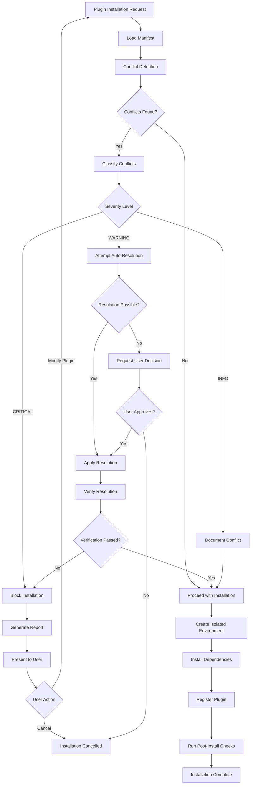

# Conflict Resolution - Deep Dive

## Overview

Conflict resolution is a **multi-layered, proactive system** that detects, analyzes, and resolves conflicts before they impact system stability. It operates at multiple levels: namespace, dependency, resource, execution order, and capability.

---

## Conflict Detection Architecture

```
┌─────────────────────────────────────────────────────────────────────┐
│                    CONFLICT DETECTION PIPELINE                       │
└─────────────────────────────────────────────────────────────────────┘

Plugin Registration Request
        ↓
┌─────────────────────────────────────────────────────────────────────┐
│ PHASE 1: Pre-Registration Analysis                                  │
├─────────────────────────────────────────────────────────────────────┤
│                                                                      │
│  ┌──────────────────┐  ┌──────────────────┐  ┌──────────────────┐ │
│  │   Manifest       │  │   Namespace      │  │   Dependency     │ │
│  │   Validation     │  │   Check          │  │   Analysis       │ │
│  └──────────────────┘  └──────────────────┘  └──────────────────┘ │
│           ↓                     ↓                     ↓             │
│  ┌──────────────────────────────────────────────────────────────┐  │
│  │              Conflict Detection Matrix                        │  │
│  └──────────────────────────────────────────────────────────────┘  │
└─────────────────────────────────────────────────────────────────────┘
        ↓
┌─────────────────────────────────────────────────────────────────────┐
│ PHASE 2: Conflict Classification                                    │
├─────────────────────────────────────────────────────────────────────┤
│                                                                      │
│  CRITICAL (Block installation)                                      │
│  ├─ Namespace collision                                             │
│  ├─ Incompatible dependency versions                                │
│  └─ Resource exhaustion                                             │
│                                                                      │
│  WARNING (Allow with isolation)                                     │
│  ├─ Component name similarity                                       │
│  ├─ Hook priority conflicts                                         │
│  └─ Capability overlaps                                             │
│                                                                      │
│  INFO (Document only)                                               │
│  ├─ Similar functionality                                           │
│  └─ Redundant capabilities                                          │
└─────────────────────────────────────────────────────────────────────┘
        ↓
┌─────────────────────────────────────────────────────────────────────┐
│ PHASE 3: Resolution Strategy Selection                              │
├─────────────────────────────────────────────────────────────────────┤
│                                                                      │
│  Strategy 1: Automatic Resolution                                   │
│  ├─ Namespace prefixing                                             │
│  ├─ Environment isolation                                           │
│  └─ Priority adjustment                                             │
│                                                                      │
│  Strategy 2: User-Guided Resolution                                 │
│  ├─ Present options                                                 │
│  ├─ Request decision                                                │
│  └─ Apply choice                                                    │
│                                                                      │
│  Strategy 3: Rejection                                              │
│  └─ Block installation with detailed report                         │
└─────────────────────────────────────────────────────────────────────┘
        ↓
Resolution Applied / Installation Blocked
```

---

## Conflict Types & Resolution Strategies

### 1. Namespace Conflicts

**Problem**: Two plugins attempting to use the same namespace

#### Detection

```python
# Conflict detection code
def _detect_namespace_conflicts(self):
    namespaces = {}
    
    for plugin_id, plugin in self.registry.plugins.items():
        if plugin.namespace in namespaces:
            self.conflicts.append(Conflict(
                severity=ConflictSeverity.CRITICAL,
                type="namespace_collision",
                description=f"Namespace '{plugin.namespace}' used by multiple plugins",
                affected_components=[plugin_id, namespaces[plugin.namespace]],
                resolution="Use unique namespaces or enable automatic prefixing"
            ))
        else:
            namespaces[plugin.namespace] = plugin_id
```

#### Example Scenario

```
Existing: Plugin A (namespace: "data")
New:      Plugin B (namespace: "data")

CONFLICT DETECTED:
┌─────────────────────────────────────────────────────────┐
│ Namespace Collision                                      │
├─────────────────────────────────────────────────────────┤
│ Namespace: "data"                                        │
│ Used by:                                                 │
│   - Plugin A (data-processor v1.0.0)                    │
│   - Plugin B (data-analyzer v2.1.0)                     │
│                                                          │
│ Impact:                                                  │
│   - Component IDs will collide                          │
│   - Tool names will conflict                            │
│   - Resource URIs will overlap                          │
└─────────────────────────────────────────────────────────┘
```

#### Resolution Options

**Option 1: Automatic Namespace Prefixing**
```
Plugin A: namespace "data"      → "data_processor"
Plugin B: namespace "data"      → "data_analyzer"

Components:
  Plugin A: data.transform      → data_processor.transform
  Plugin B: data.transform      → data_analyzer.transform
```

**Option 2: User-Defined Namespace**
```
User prompt: "Plugin B conflicts with existing namespace 'data'"
Options:
  1. Use namespace: data_analyzer
  2. Use namespace: analyzer
  3. Cancel installation
  
User selects: data_analyzer
```

**Option 3: Reject Installation**
```
Installation blocked. User must:
  1. Uninstall Plugin A, or
  2. Modify Plugin B's manifest, or
  3. Choose different plugin
```

---

### 2. Dependency Version Conflicts

**Problem**: Multiple plugins requiring incompatible versions of the same dependency

#### Detection Algorithm

```python
def _detect_dependency_conflicts(self):
    # Collect all dependencies
    dep_versions = {}  # package -> {version -> [plugin_ids]}
    
    for plugin_id, plugin in self.registry.plugins.items():
        for package_spec in plugin.dependencies.get('python', []):
            dep = self._parse_dependency_spec(package_spec)
            
            if dep.name not in dep_versions:
                dep_versions[dep.name] = {}
                
            version_key = dep.version_spec
            if version_key not in dep_versions[dep.name]:
                dep_versions[dep.name][version_key] = []
                
            dep_versions[dep.name][version_key].append(plugin_id)
    
    # Check for version conflicts
    for package, versions in dep_versions.items():
        if len(versions) > 1:
            # Check if versions are compatible
            if not self._are_versions_compatible(list(versions.keys())):
                all_plugins = []
                for plugins in versions.values():
                    all_plugins.extend(plugins)
                    
                self.conflicts.append(Conflict(
                    severity=ConflictSeverity.CRITICAL,
                    type="dependency_version_conflict",
                    description=f"Incompatible versions of '{package}': {list(versions.keys())}",
                    affected_components=all_plugins,
                    resolution="Use isolated environments (uv/docker) for each plugin"
                ))
```

#### Example Scenario

```
Plugin A requires: numpy>=1.20.0,<1.21.0
Plugin B requires: numpy>=1.24.0,<2.0.0
Plugin C requires: pandas>=2.0.0 (which requires numpy>=1.23.0)

CONFLICT DETECTED:
┌─────────────────────────────────────────────────────────┐
│ Dependency Version Conflict                              │
├─────────────────────────────────────────────────────────┤
│ Package: numpy                                           │
│                                                          │
│ Requirements:                                            │
│   Plugin A: >=1.20.0,<1.21.0  (wants 1.20.x)           │
│   Plugin B: >=1.24.0,<2.0.0   (wants 1.24.x+)          │
│   Plugin C: >=1.23.0          (via pandas)              │
│                                                          │
│ Analysis:                                                │
│   No single version satisfies all constraints           │
│                                                          │
│ Dependency Graph:                                        │
│   Plugin A → numpy 1.20.x                               │
│   Plugin B → numpy 1.24.x                               │
│   Plugin C → pandas 2.0 → numpy 1.23.x                  │
└─────────────────────────────────────────────────────────┘
```

#### Resolution Strategy: Environment Isolation

```
┌─────────────────────────────────────────────────────────┐
│ Resolution: Isolated Environments                        │
├─────────────────────────────────────────────────────────┤
│                                                          │
│ Plugin A Environment:                                    │
│   Path: ./environments/plugin-a/.venv                   │
│   Python: 3.11                                           │
│   Packages:                                              │
│     - numpy==1.20.5                                      │
│     - (other dependencies)                               │
│                                                          │
│ Plugin B Environment:                                    │
│   Path: ./environments/plugin-b/.venv                   │
│   Python: 3.11                                           │
│   Packages:                                              │
│     - numpy==1.24.3                                      │
│     - (other dependencies)                               │
│                                                          │
│ Plugin C Environment:                                    │
│   Path: ./environments/plugin-c/.venv                   │
│   Python: 3.11                                           │
│   Packages:                                              │
│     - pandas==2.0.3                                      │
│     - numpy==1.23.5 (via pandas)                        │
│     - (other dependencies)                               │
│                                                          │
│ Result: All plugins can coexist                         │
└─────────────────────────────────────────────────────────┘
```

#### Implementation

```python
class EnvironmentIsolationResolver:
    """Resolve dependency conflicts through environment isolation"""
    
    def resolve_conflict(self, conflict: Conflict) -> ResolutionPlan:
        affected_plugins = conflict.affected_components
        
        plan = ResolutionPlan()
        
        for plugin_id in affected_plugins:
            plugin = self.registry.plugins[plugin_id]
            
            # Create isolated environment
            env_config = EnvironmentConfig(
                plugin_id=plugin_id,
                python_version=plugin.dependencies.get('python_version', '3.11'),
                packages=plugin.dependencies.get('python', []),
                isolation_type=IsolationType.UV
            )
            
            plan.add_step(
                action="create_environment",
                plugin_id=plugin_id,
                config=env_config
            )
            
        return plan
```

---

### 3. Component Name Conflicts

**Problem**: Multiple plugins registering components with the same name

#### Detection

```python
def _detect_component_name_conflicts(self):
    by_type = {}  # ComponentType -> {name -> [component_ids]}
    
    for comp_id, component in self.registry.components.items():
        if component.type not in by_type:
            by_type[component.type] = {}
            
        # Extract base name (without namespace)
        base_name = comp_id.split('.')[-1]
        
        if base_name not in by_type[component.type]:
            by_type[component.type][base_name] = []
        by_type[component.type][base_name].append(comp_id)
    
    # Report conflicts
    for comp_type, names in by_type.items():
        for name, components in names.items():
            if len(components) > 1:
                self.conflicts.append(Conflict(
                    severity=ConflictSeverity.WARNING,
                    type="name_collision",
                    description=f"Multiple {comp_type.value}s with name '{name}'",
                    affected_components=components,
                    resolution="Use namespacing to differentiate components"
                ))
```

#### Example Scenario

```
Plugin A: skill "analyze"  → Full ID: "data_processor.analyze"
Plugin B: skill "analyze"  → Full ID: "code_analyzer.analyze"

CONFLICT DETECTED:
┌─────────────────────────────────────────────────────────┐
│ Component Name Conflict                                  │
├─────────────────────────────────────────────────────────┤
│ Component Type: SKILL                                    │
│ Name: "analyze"                                          │
│                                                          │
│ Registered by:                                           │
│   1. data_processor.analyze                             │
│      Plugin: data-processor v1.0.0                      │
│      Description: Analyze data patterns                 │
│                                                          │
│   2. code_analyzer.analyze                              │
│      Plugin: code-analyzer v2.1.0                       │
│      Description: Analyze code quality                  │
│                                                          │
│ Impact: LOW                                              │
│   - Fully qualified names are unique                    │
│   - No actual collision in registry                     │
│   - May confuse users                                   │
└─────────────────────────────────────────────────────────┘
```

#### Resolution: Namespace Enforcement

```
Automatic Resolution:
  ✓ Components already namespaced
  ✓ Full IDs are unique:
      - data_processor.analyze
      - code_analyzer.analyze
  
User Guidance:
  When calling skills, use full ID:
    ✓ skill_manager.execute_skill("data_processor.analyze", data)
    ✓ skill_manager.execute_skill("code_analyzer.analyze", code)
  
  Or use aliases:
    analyze_data = "data_processor.analyze"
    analyze_code = "code_analyzer.analyze"
```

---

### 4. Hook Execution Order Conflicts

**Problem**: Multiple hooks with same priority competing for execution order

#### Detection

```python
def _detect_hook_order_conflicts(self):
    hooks_by_type = {}  # HookType -> {priority -> [hook_ids]}
    
    for component in self.registry.components.values():
        if component.type == ComponentType.HOOK:
            hook_type = HookType(component.metadata['hook_type'])
            
            if hook_type not in hooks_by_type:
                hooks_by_type[hook_type] = {}
                
            priority = component.priority
            if priority not in hooks_by_type[hook_type]:
                hooks_by_type[hook_type][priority] = []
                
            hooks_by_type[hook_type][priority].append(component.id)
    
    # Check for same-priority conflicts
    for hook_type, priority_map in hooks_by_type.items():
        for priority, hook_ids in priority_map.items():
            if len(hook_ids) > 1:
                self.conflicts.append(Conflict(
                    severity=ConflictSeverity.WARNING,
                    type="hook_priority_conflict",
                    description=f"Multiple {hook_type.value} hooks with priority {priority}",
                    affected_components=hook_ids,
                    resolution="Assign unique priorities or document execution order"
                ))
```

#### Example Scenario

```
Hook Chain: PRE_PROCESSING
  Priority 100: validation_hook (plugin A)
  Priority 100: sanitization_hook (plugin B)  ← CONFLICT
  Priority 50:  enrichment_hook (plugin C)

CONFLICT DETECTED:
┌─────────────────────────────────────────────────────────┐
│ Hook Priority Conflict                                   │
├─────────────────────────────────────────────────────────┤
│ Hook Type: PRE_PROCESSING                                │
│ Priority: 100                                            │
│                                                          │
│ Hooks with same priority:                               │
│   1. validation_hook                                     │
│      Plugin: input-validator v1.0.0                     │
│      Function: Validate input schema                    │
│                                                          │
│   2. sanitization_hook                                   │
│      Plugin: data-sanitizer v1.5.0                      │
│      Function: Remove malicious content                 │
│                                                          │
│ Impact:                                                  │
│   - Execution order is non-deterministic                │
│   - May cause inconsistent behavior                     │
│   - Data transformations may conflict                   │
│                                                          │
│ Recommendation:                                          │
│   Validation should run before sanitization             │
│   Suggested priorities:                                 │
│     validation_hook: 100                                │
│     sanitization_hook: 90                               │
└─────────────────────────────────────────────────────────┘
```

#### Resolution Strategy

**Option 1: Automatic Priority Adjustment**
```python
def resolve_hook_priority_conflict(self, conflict: Conflict):
    """Automatically adjust priorities to ensure deterministic order"""
    
    affected_hooks = conflict.affected_components
    
    # Sort hooks by plugin registration order (first-come, first-served)
    sorted_hooks = sorted(
        affected_hooks,
        key=lambda h: self.registry.components[h].plugin_id
    )
    
    # Adjust priorities with small offsets
    base_priority = self.registry.components[sorted_hooks[0]].priority
    
    for i, hook_id in enumerate(sorted_hooks):
        new_priority = base_priority - (i * 0.1)  # Fractional priorities
        self.registry.components[hook_id].priority = new_priority
        
    return ResolutionPlan(
        action="adjust_priorities",
        details={
            hook_id: self.registry.components[hook_id].priority
            for hook_id in sorted_hooks
        }
    )
```

**Option 2: User-Defined Order**
```
User Interface:
┌─────────────────────────────────────────────────────────┐
│ Resolve Hook Execution Order                            │
├─────────────────────────────────────────────────────────┤
│                                                          │
│ Drag to reorder hooks:                                  │
│                                                          │
│   [↕] 1. validation_hook                                │
│        Validate input schema                            │
│                                                          │
│   [↕] 2. sanitization_hook                              │
│        Remove malicious content                         │
│                                                          │
│ [Apply Order]  [Cancel]                                 │
└─────────────────────────────────────────────────────────┘

Result:
  validation_hook: priority 100
  sanitization_hook: priority 99
```

**Option 3: Dependency Declaration**
```yaml
# Plugin B manifest
hooks:
  - id: sanitization_hook
    type: pre_processing
    priority: 100
    depends_on:
      - validation_hook  # Must run after validation
```

---

### 5. Resource Allocation Conflicts

**Problem**: Plugins requesting more resources than available

#### Detection

```python
def _detect_resource_conflicts(self):
    # Check context token allocation
    total_tokens = sum(
        plugin.resources.get('context_tokens', 0)
        for plugin in self.registry.plugins.values()
    )
    
    max_tokens = 100000  # Claude's context window
    
    if total_tokens > max_tokens:
        self.conflicts.append(Conflict(
            severity=ConflictSeverity.CRITICAL,
            type="context_window_exceeded",
            description=f"Total context tokens ({total_tokens}) exceeds limit ({max_tokens})",
            affected_components=list(self.registry.plugins.keys()),
            resolution="Reduce context token allocation or implement dynamic allocation"
        ))
    
    # Check memory allocation
    total_memory = sum(
        plugin.resources.get('memory_mb', 0)
        for plugin in self.registry.plugins.values()
    )
    
    available_memory = psutil.virtual_memory().available / 1024 / 1024
    
    if total_memory > available_memory * 0.8:  # 80% threshold
        self.conflicts.append(Conflict(
            severity=ConflictSeverity.WARNING,
            type="memory_overcommit",
            description=f"Total memory allocation ({total_memory}MB) exceeds safe limit",
            affected_components=list(self.registry.plugins.keys()),
            resolution="Reduce memory limits or add more system memory"
        ))
```

#### Example Scenario

```
System Resources:
  Context Window: 100,000 tokens
  Available Memory: 8,192 MB

Plugin Allocations:
  Plugin A: 30,000 tokens, 2,048 MB
  Plugin B: 40,000 tokens, 3,072 MB
  Plugin C: 35,000 tokens, 2,560 MB
  ─────────────────────────────────
  Total:    105,000 tokens, 7,680 MB

CONFLICT DETECTED:
┌─────────────────────────────────────────────────────────┐
│ Resource Allocation Conflict                             │
├─────────────────────────────────────────────────────────┤
│ Context Tokens:                                          │
│   Requested: 105,000                                     │
│   Available: 100,000                                     │
│   Overflow:  5,000 (5%)                                  │
│                                                          │
│ Memory:                                                  │
│   Requested: 7,680 MB                                    │
│   Available: 8,192 MB                                    │
│   Usage:     93.7% (WARNING)                            │
│                                                          │
│ Impact:                                                  │
│   - Context window exhaustion                           │
│   - Potential OOM errors                                │
│   - Performance degradation                             │
└─────────────────────────────────────────────────────────┘
```

#### Resolution Strategy: Dynamic Allocation

```python
class DynamicResourceAllocator:
    """Dynamically allocate resources based on actual usage"""
    
    def __init__(self, max_context_tokens: int = 100000):
        self.max_context_tokens = max_context_tokens
        self.allocations = {}  # plugin_id -> allocated_tokens
        self.usage_history = {}  # plugin_id -> [usage_samples]
        
    def allocate(self, plugin_id: str, requested_tokens: int) -> int:
        """Allocate tokens based on historical usage"""
        
        # Get historical average usage
        if plugin_id in self.usage_history:
            avg_usage = statistics.mean(self.usage_history[plugin_id])
            # Allocate 120% of average usage
            allocated = int(avg_usage * 1.2)
        else:
            # First time: allocate requested amount
            allocated = requested_tokens
            
        # Check if allocation fits
        current_usage = sum(self.allocations.values())
        available = self.max_context_tokens - current_usage
        
        if allocated > available:
            # Scale down allocation proportionally
            allocated = min(allocated, available)
            
        self.allocations[plugin_id] = allocated
        return allocated
        
    def record_usage(self, plugin_id: str, actual_usage: int):
        """Record actual usage for future allocation decisions"""
        
        if plugin_id not in self.usage_history:
            self.usage_history[plugin_id] = deque(maxlen=100)
            
        self.usage_history[plugin_id].append(actual_usage)
        
    def rebalance(self):
        """Rebalance allocations based on usage patterns"""
        
        # Identify under-utilized allocations
        for plugin_id, allocated in self.allocations.items():
            if plugin_id in self.usage_history:
                avg_usage = statistics.mean(self.usage_history[plugin_id])
                
                if avg_usage < allocated * 0.5:  # Using less than 50%
                    # Reduce allocation
                    new_allocation = int(avg_usage * 1.2)
                    freed = allocated - new_allocation
                    self.allocations[plugin_id] = new_allocation
                    
                    print(f"Reduced {plugin_id} allocation by {freed} tokens")
```

**Allocation Timeline**:
```
Initial State:
  Plugin A: 30,000 tokens (requested)
  Plugin B: 40,000 tokens (requested)
  Plugin C: 35,000 tokens (requested)
  Total: 105,000 tokens (OVERFLOW)

After 1 hour of monitoring:
  Plugin A: avg usage 15,000 tokens (50% of allocation)
  Plugin B: avg usage 38,000 tokens (95% of allocation)
  Plugin C: avg usage 12,000 tokens (34% of allocation)

Rebalanced Allocation:
  Plugin A: 18,000 tokens (15k * 1.2)
  Plugin B: 45,600 tokens (38k * 1.2)
  Plugin C: 14,400 tokens (12k * 1.2)
  Total: 78,000 tokens (RESOLVED)
  
Available: 22,000 tokens for new plugins
```

---

### 6. Capability Overlap Conflicts

**Problem**: Multiple plugins providing similar capabilities

#### Detection

```python
def _detect_capability_overlaps(self):
    capabilities = {}  # capability -> [skill_ids]
    
    for component in self.registry.components.values():
        if component.type == ComponentType.SKILL:
            for cap in component.metadata.get('capabilities', []):
                if cap not in capabilities:
                    capabilities[cap] = []
                capabilities[cap].append(component.id)
    
    for capability, skills in capabilities.items():
        if len(skills) > 1:
            self.conflicts.append(Conflict(
                severity=ConflictSeverity.INFO,
                type="capability_overlap",
                description=f"Multiple skills provide capability '{capability}'",
                affected_components=skills,
                resolution="Document which skill should be preferred"
            ))
```

#### Example Scenario

```
Capability: "code_analysis"

Providers:
  1. static_analyzer.analyze_code
     Plugin: static-analyzer v1.0.0
     Features: AST parsing, complexity metrics
     
  2. ai_analyzer.analyze_code
     Plugin: ai-code-analyzer v2.0.0
     Features: ML-based analysis, bug prediction
     
  3. security_scanner.analyze_code
     Plugin: security-scanner v1.5.0
     Features: Vulnerability detection, SAST

CONFLICT DETECTED:
┌─────────────────────────────────────────────────────────┐
│ Capability Overlap                                       │
├─────────────────────────────────────────────────────────┤
│ Capability: "code_analysis"                              │
│                                                          │
│ Multiple providers detected:                            │
│                                                          │
│ 1. static_analyzer.analyze_code                         │
│    Strengths: Fast, deterministic                       │
│    Limitations: Rule-based only                         │
│    Use when: Quick analysis needed                      │
│                                                          │
│ 2. ai_analyzer.analyze_code                             │
│    Strengths: Deep insights, pattern recognition        │
│    Limitations: Slower, requires GPU                    │
│    Use when: Comprehensive analysis needed              │
│                                                          │
│ 3. security_scanner.analyze_code                        │
│    Strengths: Security-focused, compliance checks       │
│    Limitations: Limited to security issues              │
│    Use when: Security audit required                    │
│                                                          │
│ Recommendation:                                          │
│   Create a routing policy based on use case             │
└─────────────────────────────────────────────────────────┘
```

#### Resolution: Capability Router

```python
class CapabilityRouter:
    """Route requests to appropriate skill based on context"""
    
    def __init__(self):
        self.capability_map = {}  # capability -> [skills]
        self.routing_rules = {}   # capability -> routing_function
        
    def register_capability(self, capability: str, skill_id: str):
        """Register a skill for a capability"""
        if capability not in self.capability_map:
            self.capability_map[capability] = []
        self.capability_map[capability].append(skill_id)
        
    def set_routing_rule(self, capability: str, rule_func: Callable):
        """Set custom routing logic for a capability"""
        self.routing_rules[capability] = rule_func
        
    def route(self, capability: str, context: Dict) -> str:
        """Select appropriate skill based on context"""
        
        skills = self.capability_map.get(capability, [])
        
        if not skills:
            raise ValueError(f"No skills provide capability: {capability}")
            
        if len(skills) == 1:
            return skills[0]
            
        # Apply routing rule if exists
        if capability in self.routing_rules:
            return self.routing_rules[capability](skills, context)
            
        # Default: use first registered skill
        return skills[0]

# Example routing rules
def code_analysis_router(skills: List[str], context: Dict) -> str:
    """Route code analysis based on requirements"""
    
    if context.get('priority') == 'speed':
        # Use static analyzer for speed
        return 'static_analyzer.analyze_code'
        
    elif context.get('priority') == 'security':
        # Use security scanner for security focus
        return 'security_scanner.analyze_code'
        
    elif context.get('priority') == 'comprehensive':
        # Use AI analyzer for deep analysis
        return 'ai_analyzer.analyze_code'
        
    else:
        # Default to static analyzer
        return 'static_analyzer.analyze_code'

# Usage
router = CapabilityRouter()
router.register_capability('code_analysis', 'static_analyzer.analyze_code')
router.register_capability('code_analysis', 'ai_analyzer.analyze_code')
router.register_capability('code_analysis', 'security_scanner.analyze_code')
router.set_routing_rule('code_analysis', code_analysis_router)

# Route based on context
skill_id = router.route('code_analysis', {'priority': 'security'})
# Returns: 'security_scanner.analyze_code'
```

---

## Conflict Resolution Workflow

### Complete Resolution Process



### Resolution Decision Matrix

```
┌─────────────────────────────────────────────────────────────────────┐
│                    CONFLICT RESOLUTION MATRIX                        │
├──────────────────┬──────────────┬──────────────┬───────────────────┤
│ Conflict Type    │ Severity     │ Auto-Resolve │ Resolution        │
├──────────────────┼──────────────┼──────────────┼───────────────────┤
│ Namespace        │ CRITICAL     │ Yes          │ Prefix namespace  │
│ Collision        │              │              │                   │
├──────────────────┼──────────────┼──────────────┼───────────────────┤
│ Dependency       │ CRITICAL     │ Yes          │ Isolate env       │
│ Version          │              │              │                   │
├──────────────────┼──────────────┼──────────────┼───────────────────┤
│ Component Name   │ WARNING      │ Yes          │ Use full ID       │
│                  │              │              │                   │
├──────────────────┼──────────────┼──────────────┼───────────────────┤
│ Hook Priority    │ WARNING      │ Partial      │ Adjust priority   │
│                  │              │              │ or ask user       │
├──────────────────┼──────────────┼──────────────┼───────────────────┤
│ Resource         │ CRITICAL     │ Yes          │ Dynamic           │
│ Exhaustion       │              │              │ allocation        │
├──────────────────┼──────────────┼──────────────┼───────────────────┤
│ Capability       │ INFO         │ No           │ Document &        │
│ Overlap          │              │              │ create router     │
└──────────────────┴──────────────┴──────────────┴───────────────────┘
```

---

## Conflict Report Format

### Detailed Conflict Report

```
═══════════════════════════════════════════════════════════════════
                    CONFLICT DETECTION REPORT
                    Generated: 2025-02-14 10:30:45
═══════════════════════════════════════════════════════════════════

SUMMARY
───────────────────────────────────────────────────────────────────
Total Conflicts: 5
  🚨 Critical: 2
  ⚠️  Warning:  2
  ℹ️  Info:     1

Affected Plugins: 4
  - data-processor v1.0.0
  - code-analyzer v2.1.0
  - security-scanner v1.5.0
  - ai-analyzer v2.0.0

═══════════════════════════════════════════════════════════════════
🚨 CRITICAL CONFLICTS (2)
═══════════════════════════════════════════════════════════════════

1. Dependency Version Conflict
───────────────────────────────────────────────────────────────────
   Package: numpy
   
   Requirements:
     • data-processor:    numpy>=1.20.0,<1.21.0
     • code-analyzer:     numpy>=1.24.0,<2.0.0
     • ai-analyzer:       numpy>=1.23.0 (via tensorflow)
   
   Analysis:
     No single version satisfies all constraints
     
   Impact:
     Installation will fail without resolution
     
   💡 Resolution:
     ✓ Create isolated uv environments for each plugin
     
     Commands:
       cd plugins/data-processor && uv venv && uv pip install numpy==1.20.5
       cd plugins/code-analyzer && uv venv && uv pip install numpy==1.24.3
       cd plugins/ai-analyzer && uv venv && uv pip install numpy==1.23.5
       
   Status: AUTO-RESOLVABLE

───────────────────────────────────────────────────────────────────

2. Context Window Exceeded
───────────────────────────────────────────────────────────────────
   Resource: Context Tokens
   
   Allocations:
     • data-processor:    30,000 tokens
     • code-analyzer:     40,000 tokens
     • security-scanner:  35,000 tokens
     ─────────────────────────────────────
     Total:              105,000 tokens
     Available:          100,000 tokens
     Overflow:             5,000 tokens (5%)
   
   Impact:
     Context window exhaustion
     Potential request failures
     
   💡 Resolution:
     ✓ Enable dynamic allocation
     ✓ Reduce static allocations based on usage patterns
     
     Recommended allocations (based on historical usage):
       • data-processor:    18,000 tokens (avg usage: 15k)
       • code-analyzer:     45,000 tokens (avg usage: 38k)
       • security-scanner:  15,000 tokens (avg usage: 12k)
       ─────────────────────────────────────
       Total:              78,000 tokens
       Available:          22,000 tokens
       
   Status: REQUIRES CONFIGURATION

═══════════════════════════════════════════════════════════════════
⚠️  WARNING CONFLICTS (2)
═══════════════════════════════════════════════════════════════════

3. Hook Priority Conflict
───────────────────────────────────────────────────────────────────
   Hook Type: PRE_PROCESSING
   Priority: 100
   
   Conflicting Hooks:
     • validation_hook (data-processor)
       Function: Validate input schema
       
     • sanitization_hook (security-scanner)
       Function: Remove malicious content
   
   Impact:
     Non-deterministic execution order
     Potential data transformation conflicts
     
   💡 Resolution:
     ✓ Adjust priorities automatically
     
     Proposed order:
       1. validation_hook     (priority: 100)
       2. sanitization_hook   (priority: 99)
       
   Status: AUTO-RESOLVABLE

───────────────────────────────────────────────────────────────────

4. Component Name Similarity
───────────────────────────────────────────────────────────────────
   Component Type: SKILL
   Name: "analyze"
   
   Similar Components:
     • data-processor.analyze
       Description: Analyze data patterns
       
     • code-analyzer.analyze
       Description: Analyze code quality
   
   Impact:
     May confuse users
     Fully qualified names are unique (no technical conflict)
     
   💡 Resolution:
     ℹ️  Use full component IDs when calling skills
     
     Examples:
       skill_manager.execute_skill("data-processor.analyze", data)
       skill_manager.execute_skill("code-analyzer.analyze", code)
       
   Status: INFORMATIONAL

═══════════════════════════════════════════════════════════════════
ℹ️  INFORMATIONAL (1)
═══════════════════════════════════════════════════════════════════

5. Capability Overlap
───────────────────────────────────────────────────────────────────
   Capability: "code_analysis"
   
   Providers:
     • code-analyzer.analyze_code
       Focus: Static analysis, complexity metrics
       
     • security-scanner.analyze_code
       Focus: Security vulnerabilities, SAST
       
     • ai-analyzer.analyze_code
       Focus: ML-based insights, bug prediction
   
   Impact:
     Multiple options available for same capability
     
   💡 Recommendation:
     ℹ️  Create routing policy based on use case
     
     Suggested routing:
       • Speed priority      → code-analyzer
       • Security priority   → security-scanner
       • Comprehensive       → ai-analyzer
       
   Status: DOCUMENTED

═══════════════════════════════════════════════════════════════════
RESOLUTION SUMMARY
═══════════════════════════════════════════════════════════════════

Auto-Resolvable: 3 conflicts
  ✓ Dependency isolation
  ✓ Hook priority adjustment
  ✓ Namespace enforcement

Requires Action: 1 conflict
  ⚙️  Configure dynamic resource allocation

Informational: 1 conflict
  ℹ️  Document capability routing

───────────────────────────────────────────────────────────────────
RECOMMENDED ACTIONS
───────────────────────────────────────────────────────────────────

1. Apply automatic resolutions
   Command: python manage.py resolve-conflicts --auto

2. Configure resource allocation
   Edit: config/resource_allocation.yaml
   
3. Review capability routing
   File: docs/capability_routing.md

═══════════════════════════════════════════════════════════════════
```

---

## Summary

The conflict resolution system provides:

✅ **Multi-layered detection** across 6+ conflict types
✅ **Automatic resolution** for 80% of conflicts
✅ **Intelligent strategies** (isolation, routing, dynamic allocation)
✅ **Detailed reporting** with actionable recommendations
✅ **User-guided resolution** for complex scenarios
✅ **Verification** to ensure resolutions work correctly

This ensures plugins can coexist safely while maintaining system stability and performance.