# Business Model Canvas Diagrams

I'll create several text-based diagrams to illustrate the Business Model Canvas for the AstraZeneca Claude Code Plugin Marketplace.

## 1. Complete Business Model Canvas Overview

```
┌─────────────────────────────────────────────────────────────────────────────────────────────┐
│                    ASTRAZENECA CLAUDE CODE PLUGIN MARKETPLACE                               │
│                              BUSINESS MODEL CANVAS                                          │
└─────────────────────────────────────────────────────────────────────────────────────────────┘

┌──────────────────────┬──────────────────────┬──────────────────────┬──────────────────────┐
│   KEY PARTNERS       │   KEY ACTIVITIES     │   VALUE PROPOSITIONS │  CUSTOMER            │
│                      │                      │                      │  RELATIONSHIPS       │
│ • IT Infrastructure  │ • Platform Ops       │  FOR USERS:          │                      │
│ • Info Security      │ • Quality Assurance  │  • Time Savings      │ • Self-Service       │
│ • Legal/Compliance   │ • Community Mgmt     │  • Quality Tools     │ • Community-Driven   │
│ • HR & Learning      │ • Governance         │  • Discoverability   │ • Dedicated Support  │
│ • Innovation Labs    │                      │  • Reliability       │ • Co-Creation        │
│ • Cloud Providers    │   KEY RESOURCES      │                      │                      │
│ • Security Vendors   │                      │  FOR DEVELOPERS:     │  CUSTOMER SEGMENTS   │
│ • Anthropic          │ • Platform Tech      │  • Recognition       │                      │
│                      │ • Dev Team           │  • Impact            │ • Data Scientists    │
│                      │ • Security Tools     │  • Collaboration     │ • Developers         │
│                      │ • IP & Documentation │  • Career Growth     │ • Research Scientists│
│                      │ • Analytics Data     │                      │ • Business Analysts  │
│                      │                      │  FOR ORGANIZATION:   │ • Project Managers   │
│                      │                      │  • Productivity      │ • IT Admins          │
│                      │                      │  • Standardization   │ • Compliance Officers│
│                      │                      │  • Innovation        │                      │
└──────────────────────┴──────────────────────┴──────────────────────┴──────────────────────┘
┌──────────────────────────────────────────────┬──────────────────────────────────────────────┐
│              CHANNELS                        │              COST STRUCTURE                  │
│                                              │                                              │
│ DISCOVERY:                                   │ FIXED COSTS:                                 │
│ • Internal comms (email, intranet)          │ • Personnel (core team)                      │
│ • Town halls & meetings                      │ • Infrastructure (cloud hosting)             │
│ • Slack/Teams announcements                  │ • Software licenses                          │
│                                              │ • Training programs                          │
│ ACCESS:                                      │                                              │
│ • Web marketplace portal                     │ VARIABLE COSTS:                              │
│ • Dev environment integration                │ • Scaling infrastructure                     │
│ • Mobile-responsive interface                │ • Security audits                            │
│                                              │ • Support services                           │
│ SUPPORT:                                     │ • Marketing & events                         │
│ • Help desk & ticketing                      │                                              │
│ • Community forums                           │ DEVELOPMENT COSTS:                           │
│ • Documentation portal                       │ • Platform development                       │
│ • Video tutorials                            │ • Integration work                           │
│                                              │ • Plugin development                         │
└──────────────────────────────────────────────┴──────────────────────────────────────────────┘
┌─────────────────────────────────────────────────────────────────────────────────────────────┐
│                           VALUE STREAMS (Internal Platform)                                 │
│                                                                                             │
│ PRODUCTIVITY GAINS:  Time saved • Faster development • Reduced onboarding                  │
│ COST AVOIDANCE:      Eliminate duplication • Reduce external tools • Fewer incidents       │
│ INNOVATION VALUE:    Faster experimentation • Employee engagement • Collaboration          │
│ STRATEGIC BENEFITS:  Competitive advantage • Talent retention • Knowledge capital          │
│                                                                                             │
│ ROI EXAMPLE: $500K investment → 10,000 hours saved × $75/hr = $750K value = 50% ROI       │
└─────────────────────────────────────────────────────────────────────────────────────────────┘
```

## 2. Value Flow Diagram

```
                         VALUE CREATION & FLOW DIAGRAM

┌─────────────────────────────────────────────────────────────────────────────────────┐
│                                                                                     │
│                           PLUGIN MARKETPLACE ECOSYSTEM                              │
│                                                                                     │
└─────────────────────────────────────────────────────────────────────────────────────┘

    CONTRIBUTORS                    MARKETPLACE                    USERS
    (Developers)                    (Platform)                     (Employees)
         │                               │                              │
         │                               │                              │
    ┌────▼────┐                     ┌────▼────┐                   ┌────▼────┐
    │         │   Submit Plugins    │         │   Browse &        │         │
    │ Create  │────────────────────>│ Review  │   Discover        │ Search  │
    │ Plugins │                     │ & Host  │<──────────────────│ Needs   │
    │         │                     │         │                   │         │
    └────┬────┘                     └────┬────┘                   └────┬────┘
         │                               │                              │
         │   Recognition                 │   Quality                    │
         │   & Visibility                │   Assurance                  │
         │                               │                              │
    ┌────▼────┐                     ┌────▼────┐                   ┌────▼────┐
    │ Career  │                     │Security │   Install &       │ Solve   │
    │ Growth  │                     │Scanning │   Deploy          │Problems │
    │         │                     │         │──────────────────>│         │
    └────┬────┘                     └────┬────┘                   └────┬────┘
         │                               │                              │
         │   Feedback Loop               │   Usage Analytics            │
         │<──────────────────────────────┼──────────────────────────────│
         │                               │                              │
         │                               │                              │
    ┌────▼────────────────────────────────▼──────────────────────────▼────┐
    │                                                                      │
    │              ORGANIZATIONAL VALUE CREATION                           │
    │                                                                      │
    │  • Productivity Gains        • Knowledge Sharing                    │
    │  • Innovation Culture        • Standardization                      │
    │  • Cost Avoidance           • Risk Reduction                        │
    │                                                                      │
    └──────────────────────────────────────────────────────────────────────┘
```

## 3. Customer Segment Mapping

```
                        CUSTOMER SEGMENTS & NEEDS MATRIX

┌─────────────────────────────────────────────────────────────────────────────┐
│                                                                             │
│  User Type              Primary Needs              Plugin Categories       │
│  ─────────              ─────────────              ─────────────────       │
│                                                                             │
│  ┌──────────────┐      ┌──────────────┐          ┌──────────────┐        │
│  │ Data         │──────│ • Analysis   │──────────│ • Data Viz   │        │
│  │ Scientists   │      │ • Automation │          │ • ML Tools   │        │
│  │              │      │ • Viz Tools  │          │ • Pipelines  │        │
│  └──────────────┘      └──────────────┘          └──────────────┘        │
│         │                                                                  │
│         │ 35% of user base                                                │
│         ▼                                                                  │
│                                                                             │
│  ┌──────────────┐      ┌──────────────┐          ┌──────────────┐        │
│  │ Software     │──────│ • Code Gen   │──────────│ • Refactoring│        │
│  │ Developers   │      │ • Testing    │          │ • API Tools  │        │
│  │              │      │ • Debug Help │          │ • Testing    │        │
│  └──────────────┘      └──────────────┘          └──────────────┘        │
│         │                                                                  │
│         │ 30% of user base                                                │
│         ▼                                                                  │
│                                                                             │
│  ┌──────────────┐      ┌──────────────┐          ┌──────────────┐        │
│  │ Research     │──────│ • Lab Auto   │──────────│ • Literature │        │
│  │ Scientists   │      │ • Data Proc  │          │ • Protocols  │        │
│  │              │      │ • Analysis   │          │ • Analysis   │        │
│  └──────────────┘      └──────────────┘          └──────────────┘        │
│         │                                                                  │
│         │ 20% of user base                                                │
│         ▼                                                                  │
│                                                                             │
│  ┌──────────────┐      ┌──────────────┐          ┌──────────────┐        │
│  │ Business     │──────│ • Reporting  │──────────│ • Dashboards │        │
│  │ Analysts     │      │ • Workflows  │          │ • Automation │        │
│  │              │      │ • Insights   │          │ • Reports    │        │
│  └──────────────┘      └──────────────┘          └──────────────┘        │
│         │                                                                  │
│         │ 15% of user base                                                │
│         ▼                                                                  │
│                                                                             │
└─────────────────────────────────────────────────────────────────────────────┘
```

## 4. Platform Architecture & Key Activities

```
                    MARKETPLACE PLATFORM ARCHITECTURE

┌─────────────────────────────────────────────────────────────────────────┐
│                          USER INTERFACE LAYER                           │
│  ┌─────────────┐  ┌─────────────┐  ┌─────────────┐  ┌─────────────┐  │
│  │   Browse    │  │   Search    │  │   Install   │  │   Manage    │  │
│  │  Plugins    │  │  & Filter   │  │   & Update  │  │   Settings  │  │
│  └─────────────┘  └─────────────┘  └─────────────┘  └─────────────┘  │
└────────────────────────────────┬────────────────────────────────────────┘
                                 │
┌────────────────────────────────▼────────────────────────────────────────┐
│                        CORE PLATFORM SERVICES                           │
│                                                                         │
│  ┌──────────────────┐  ┌──────────────────┐  ┌──────────────────┐    │
│  │  Plugin Registry │  │ Version Control  │  │  Authentication  │    │
│  │   & Metadata     │  │  & Dependencies  │  │  & Authorization │    │
│  └──────────────────┘  └──────────────────┘  └──────────────────┘    │
│                                                                         │
│  ┌──────────────────┐  ┌──────────────────┐  ┌──────────────────┐    │
│  │ Search Engine &  │  │ Rating & Review  │  │    Analytics &   │    │
│  │ Recommendations  │  │     System       │  │    Monitoring    │    │
│  └──────────────────┘  └──────────────────┘  └──────────────────┘    │
└────────────────────────────────┬────────────────────────────────────────┘
                                 │
┌────────────────────────────────▼────────────────────────────────────────┐
│                      QUALITY & SECURITY LAYER                           │
│                                                                         │
│  ┌──────────────────┐  ┌──────────────────┐  ┌──────────────────┐    │
│  │    Security      │  │   Code Quality   │  │   Compliance     │    │
│  │    Scanning      │  │    Analysis      │  │   Validation     │    │
│  └──────────────────┘  └──────────────────┘  └──────────────────┘    │
│                                                                         │
│  ┌──────────────────┐  ┌──────────────────┐  ┌──────────────────┐    │
│  │  Automated       │  │   Manual Review  │  │   Audit Trail    │    │
│  │  Testing         │  │   Workflow       │  │   & Logging      │    │
│  └──────────────────┘  └──────────────────┘  └──────────────────┘    │
└────────────────────────────────┬────────────────────────────────────────┘
                                 │
┌────────────────────────────────▼────────────────────────────────────────┐
│                        STORAGE & DATA LAYER                             │
│                                                                         │
│  ┌──────────────────┐  ┌──────────────────┐  ┌──────────────────┐    │
│  │  Plugin Storage  │  │  Documentation   │  │  Usage Data &    │    │
│  │  & Distribution  │  │    Database      │  │  Telemetry       │    │
│  └──────────────────┘  └──────────────────┘  └──────────────────┘    │
└─────────────────────────────────────────────────────────────────────────┘
```

## 5. Cost Structure Breakdown

```
                        ANNUAL COST STRUCTURE BREAKDOWN

┌─────────────────────────────────────────────────────────────────────────┐
│                                                                         │
│                    TOTAL ESTIMATED COST: $500K/year                     │
│                                                                         │
└─────────────────────────────────────────────────────────────────────────┘

    PERSONNEL (60% - $300K)
    ████████████████████████████████████████████████████████████
    │
    ├─ Product Owner (1 FTE)              $100K  ████████████████
    ├─ Technical Lead (1 FTE)             $100K  ████████████████
    ├─ Developers (2 FTE)                 $60K   ██████████
    ├─ Security Specialist (0.5 FTE)      $25K   ████
    └─ Community Manager (0.5 FTE)        $15K   ██


    INFRASTRUCTURE (20% - $100K)
    ████████████████████
    │
    ├─ Cloud Hosting & Storage            $40K   ████████
    ├─ CDN & Bandwidth                    $20K   ████
    ├─ Backup & Disaster Recovery         $15K   ███
    ├─ Development & Test Environments    $15K   ███
    └─ Monitoring & Logging               $10K   ██


    SOFTWARE & TOOLS (10% - $50K)
    ██████████
    │
    ├─ Security Scanning Tools            $20K   ████
    ├─ Analytics Platform                 $15K   ███
    ├─ Documentation Tools                $10K   ██
    └─ Development Tools & Licenses       $5K    █


    OPERATIONS (10% - $50K)
    ██████████
    │
    ├─ Training & Workshops               $20K   ████
    ├─ Community Events                   $15K   ███
    ├─ Marketing & Communications         $10K   ██
    └─ External Audits & Reviews          $5K    █


┌─────────────────────────────────────────────────────────────────────────┐
│  COST OPTIMIZATION OPPORTUNITIES:                                      │
│  • Leverage existing AZ infrastructure (-$20K)                         │
│  • Use open-source tools where possible (-$15K)                        │
│  • Automate testing & deployment (-$10K)                               │
│  • Community-driven support model (-$10K)                              │
│                                                                         │
│  OPTIMIZED COST: $445K/year                                            │
└─────────────────────────────────────────────────────────────────────────┘
```

## 6. Value Creation & ROI Model

```
                    VALUE CREATION & ROI PROJECTION

┌─────────────────────────────────────────────────────────────────────────┐
│                         YEAR 1 PROJECTIONS                              │
└─────────────────────────────────────────────────────────────────────────┘

    INVESTMENT
    ──────────
    Operating Cost:  $500K
    ▼▼▼▼▼▼▼▼▼▼


    VALUE GENERATED
    ───────────────

    ┌─────────────────────────────────────────────────────────────────┐
    │ TIME SAVINGS                                                    │
    │ 10,000 hours saved × $75/hour = $750K                          │
    │ ████████████████████████████████████████████████████████████   │
    └─────────────────────────────────────────────────────────────────┘

    ┌─────────────────────────────────────────────────────────────────┐
    │ COST AVOIDANCE                                                  │
    │ Eliminated duplication: $200K                                   │
    │ ████████████████████████████                                    │
    └─────────────────────────────────────────────────────────────────┘

    ┌─────────────────────────────────────────────────────────────────┐
    │ REDUCED EXTERNAL SPEND                                          │
    │ Fewer external tools/consulting: $100K                          │
    │ ██████████████                                                  │
    └─────────────────────────────────────────────────────────────────┘

    ┌─────────────────────────────────────────────────────────────────┐
    │ SECURITY INCIDENT PREVENTION                                    │
    │ Estimated risk reduction: $50K                                  │
    │ ███████                                                         │
    └─────────────────────────────────────────────────────────────────┘

    ═══════════════════════════════════════════════════════════════════
    TOTAL VALUE CREATED: $1,100K
    ═══════════════════════════════════════════════════════════════════

    NET BENEFIT:  $600K
    ROI:          120%
    PAYBACK:      6 months


    GROWTH TRAJECTORY (3-YEAR PROJECTION)
    ──────────────────────────────────────

    Year 1:  $600K net benefit   ████████████
    Year 2:  $900K net benefit   ██████████████████
    Year 3:  $1.2M net benefit   ████████████████████████

    Cumulative 3-Year Value: $2.7M
```

## 7. Stakeholder Ecosystem Map

```
                        STAKEHOLDER ECOSYSTEM

                    ┌─────────────────────┐
                    │   EXECUTIVE         │
                    │   SPONSORS          │
                    │   • CIO             │
                    │   • CDO             │
                    └──────────┬──────────┘
                               │ Strategic Direction
                               │ & Funding
                    ┌──────────▼──────────┐
                    │   MARKETPLACE       │
                    │   CORE TEAM         │
                    │   • Product Owner   │
                    │   • Tech Lead       │
                    │   • Developers      │
                    └──────────┬──────────┘
                               │
        ┌──────────────────────┼──────────────────────┐
        │                      │                      │
┌───────▼────────┐   ┌─────────▼────────┐   ┌────────▼───────┐
│ GOVERNANCE     │   │  PLATFORM        │   │  COMMUNITY     │
│ PARTNERS       │   │  USERS           │   │  CONTRIBUTORS  │
│                │   │                  │   │                │
│ • IT Security  │◄──┤ • Data Scientists│──►│ • Plugin Devs  │
│ • Compliance   │   │ • Developers     │   │ • Champions    │
│ • Legal        │   │ • Scientists     │   │ • Innovators   │
│ • Audit        │   │ • Analysts       │   │                │
└────────────────┘   └──────────────────┘   └────────────────┘
        │                      │                      │
        │ Policies &           │ Feedback &           │ Plugins &
        │ Standards            │ Requirements         │ Knowledge
        │                      │                      │
        └──────────────────────┼──────────────────────┘
                               │
                    ┌──────────▼──────────┐
                    │   ENABLING          │
                    │   PARTNERS          │
                    │   • IT Infra        │
                    │   • HR/Learning     │
                    │   • Innovation Labs │
                    │   • Cloud Providers │
                    └─────────────────────┘
```

---

These diagrams provide visual representations of the key components of your Business Model Canvas. Would you like me to:

1. Create additional diagrams for specific areas (e.g., user journey, governance workflow)?
2. Develop more detailed technical architecture diagrams?
3. Create timeline/Gantt charts for the implementation roadmap?
4. Build financial projection charts with more granular detail?


# Mermaid Diagrams for Business Model Canvas

Here are comprehensive Mermaid diagrams to illustrate the AstraZeneca Claude Code Plugin Marketplace business model.

## 1. Complete Business Model Canvas Flow

```mermaid
graph TB
    subgraph "KEY PARTNERS"
        KP1[IT Infrastructure]
        KP2[Information Security]
        KP3[Legal & Compliance]
        KP4[HR & Learning]
        KP5[Innovation Labs]
        KP6[Cloud Providers]
        KP7[Anthropic]
    end
    
    subgraph "KEY ACTIVITIES"
        KA1[Platform Operations]
        KA2[Quality Assurance]
        KA3[Community Management]
        KA4[Governance & Compliance]
    end
    
    subgraph "KEY RESOURCES"
        KR1[Platform Technology]
        KR2[Development Team]
        KR3[Security Tools]
        KR4[Documentation & IP]
        KR5[Analytics Data]
    end
    
    subgraph "VALUE PROPOSITIONS"
        VP1[Time Savings & Efficiency]
        VP2[Quality Assurance]
        VP3[Recognition & Impact]
        VP4[Innovation Culture]
        VP5[Risk Reduction]
    end
    
    subgraph "CUSTOMER RELATIONSHIPS"
        CR1[Self-Service Portal]
        CR2[Community Forums]
        CR3[Dedicated Support]
        CR4[Co-Creation Programs]
    end
    
    subgraph "CUSTOMER SEGMENTS"
        CS1[Data Scientists]
        CS2[Software Developers]
        CS3[Research Scientists]
        CS4[Business Analysts]
        CS5[Project Managers]
    end
    
    subgraph "CHANNELS"
        CH1[Internal Communications]
        CH2[Web Marketplace]
        CH3[Dev Environment Integration]
        CH4[Help Desk & Forums]
    end
    
    subgraph "COST STRUCTURE"
        CO1[Personnel: $300K]
        CO2[Infrastructure: $100K]
        CO3[Software & Tools: $50K]
        CO4[Operations: $50K]
    end
    
    subgraph "VALUE STREAMS"
        VS1[Productivity Gains: $750K]
        VS2[Cost Avoidance: $200K]
        VS3[Risk Reduction: $50K]
        VS4[Innovation Value: $100K]
    end
    
    KP1 --> KA1
    KP2 --> KA2
    KP3 --> KA4
    KP6 --> KR1
    
    KA1 --> VP1
    KA2 --> VP2
    KA3 --> VP3
    KA4 --> VP5
    
    KR1 --> KA1
    KR2 --> KA1
    KR3 --> KA2
    
    VP1 --> CS1
    VP1 --> CS2
    VP2 --> CS3
    VP3 --> CS4
    
    CR1 --> CS1
    CR2 --> CS2
    CR3 --> CS3
    CR4 --> CS4
    
    CH1 --> CR1
    CH2 --> CR1
    CH3 --> CR2
    CH4 --> CR3
    
    CS1 --> VS1
    CS2 --> VS1
    CS3 --> VS2
    CS4 --> VS3
    
    KA1 --> CO1
    KA2 --> CO2
    KR1 --> CO2
    KR2 --> CO1
    
    style VP1 fill:#90EE90
    style VP2 fill:#90EE90
    style VP3 fill:#90EE90
    style VP4 fill:#90EE90
    style VP5 fill:#90EE90
    style VS1 fill:#FFD700
    style VS2 fill:#FFD700
    style VS3 fill:#FFD700
    style VS4 fill:#FFD700
```

## 2. Value Creation Flow

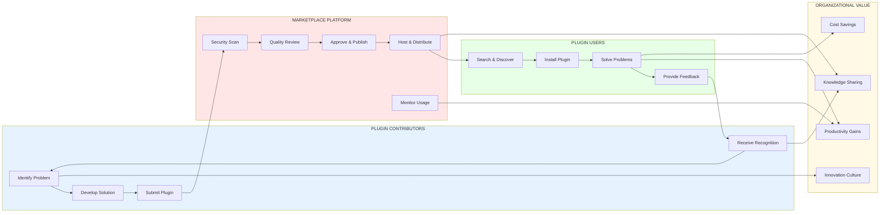

## 3. Customer Segment Journey Map

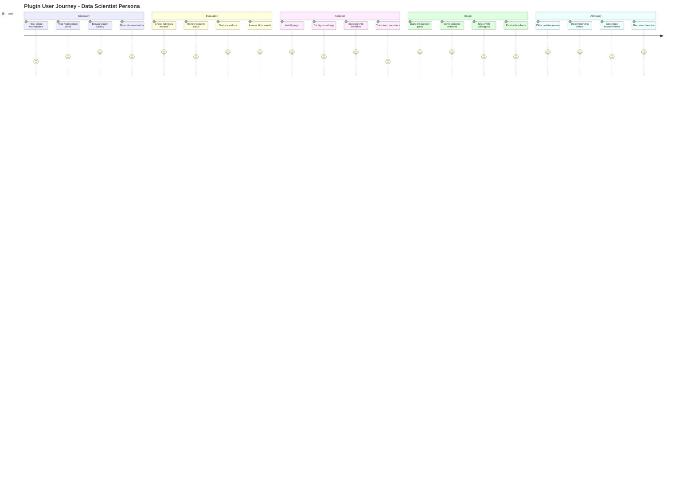

## 4. Platform Architecture

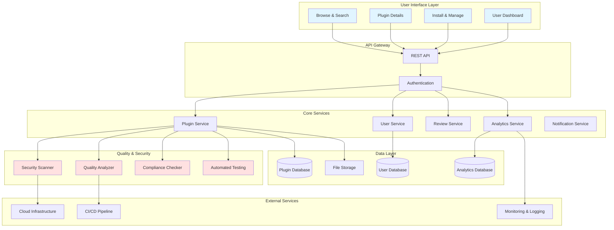

## 5. Stakeholder Ecosystem

```mermaid
graph TD
    EXEC[Executive Sponsors<br/>CIO, CDO, Innovation Lead]
    
    subgraph "Core Team"
        PO[Product Owner]
        TL[Technical Lead]
        DEV[Developers]
        SEC[Security Specialist]
        CM[Community Manager]
    end
    
    subgraph "Governance Partners"
        IT[IT Security]
        LEGAL[Legal & Compliance]
        AUDIT[Audit Team]
        RISK[Risk Management]
    end
    
    subgraph "Platform Users"
        DS[Data Scientists<br/>35%]
        SDEV[Software Developers<br/>30%]
        RS[Research Scientists<br/>20%]
        BA[Business Analysts<br/>15%]
    end
    
    subgraph "Contributors"
        CONTRIB[Plugin Developers]
        CHAMP[Community Champions]
        INNOV[Innovation Teams]
    end
    
    subgraph "Enablers"
        INFRA[IT Infrastructure]
        HR[HR & Learning]
        CLOUD[Cloud Providers]
        VENDOR[Security Vendors]
    end
    
    EXEC -->|Strategy & Funding| PO
    PO --> TL
    TL --> DEV
    TL --> SEC
    PO --> CM
    
    IT -->|Security Policies| SEC
    LEGAL -->|Compliance Rules| SEC
    AUDIT -->|Audit Requirements| PO
    RISK -->|Risk Framework| SEC
    
    CM -->|Support & Engagement| DS
    CM -->|Support & Engagement| SDEV
    CM -->|Support & Engagement| RS
    CM -->|Support & Engagement| BA
    
    DS -->|Feedback| CM
    SDEV -->|Feedback| CM
    RS -->|Feedback| CM
    BA -->|Feedback| CM
    
    CONTRIB -->|Plugins| DEV
    CHAMP -->|Advocacy| CM
    INNOV -->|Innovation| PO
    
    INFRA -->|Infrastructure| TL
    HR -->|Training| CM
    CLOUD -->|Services| TL
    VENDOR -->|Tools| SEC
    
    style EXEC fill:#FFD700
    style PO fill:#90EE90
    style DS fill:#87CEEB
    style SDEV fill:#87CEEB
    style RS fill:#87CEEB
    style BA fill:#87CEEB
    style CONTRIB fill:#DDA0DD
```

## 6. Cost Structure Breakdown

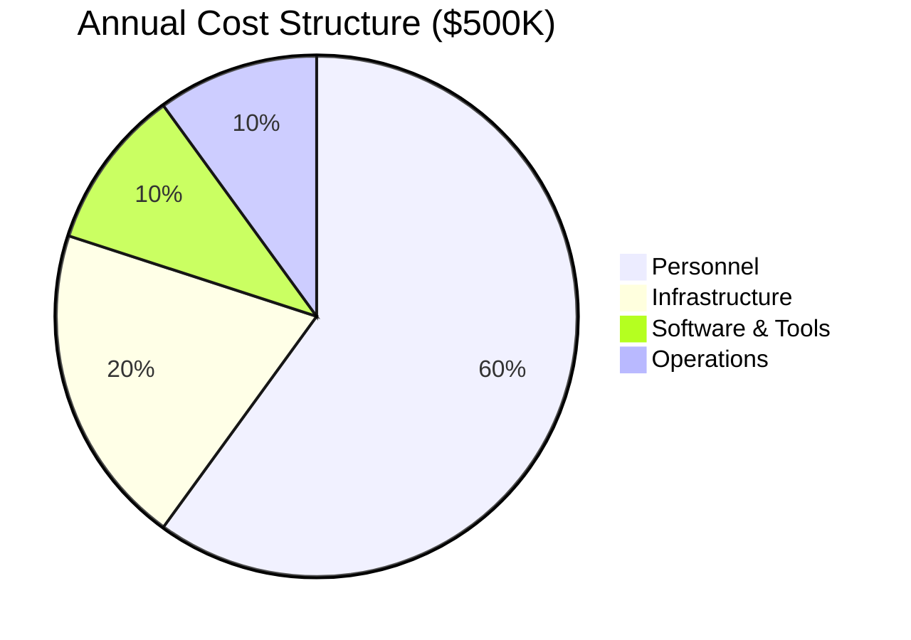

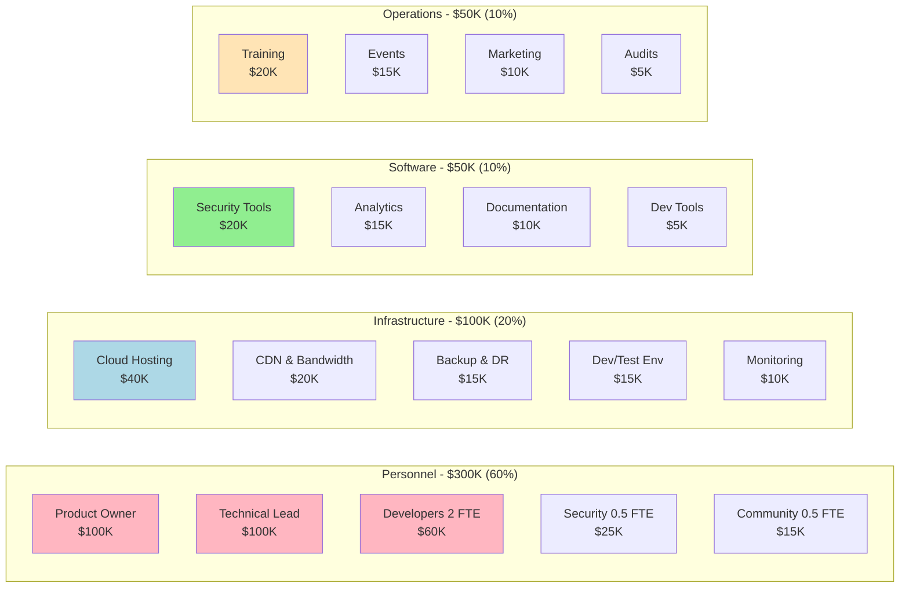

## 7. Value Stream & ROI Model

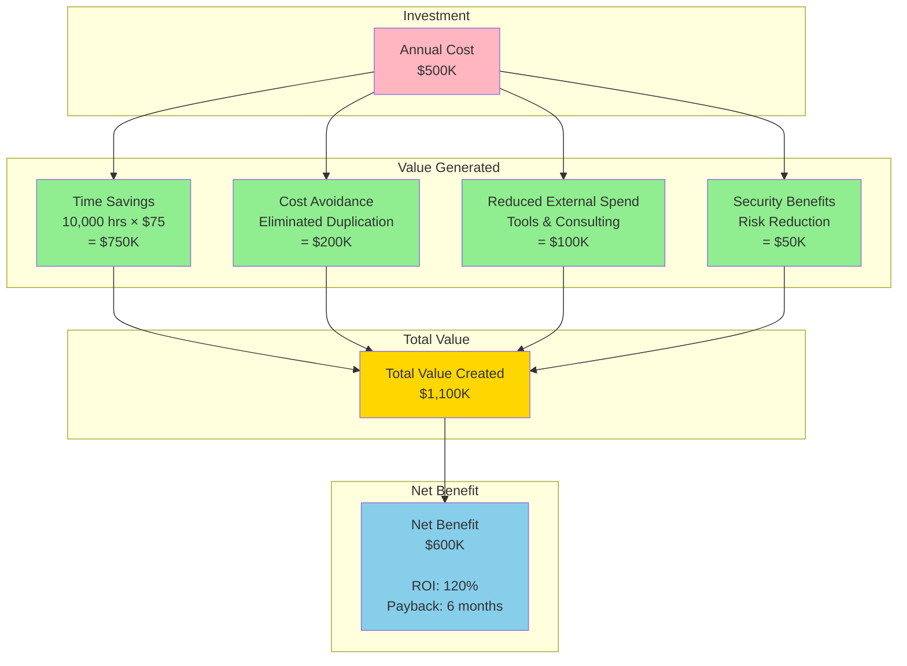

## 8. Implementation Timeline

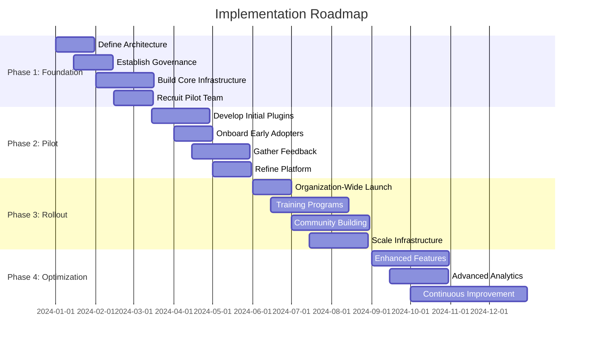

## 9. Plugin Submission & Review Workflow

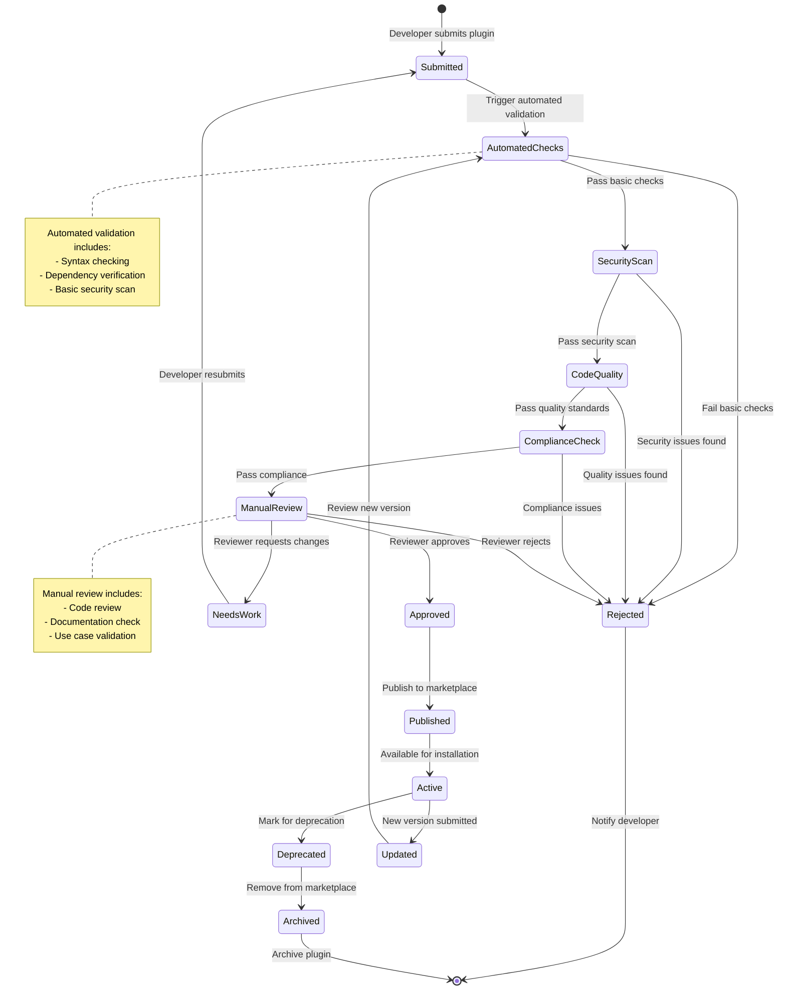

## 10. User Adoption Funnel

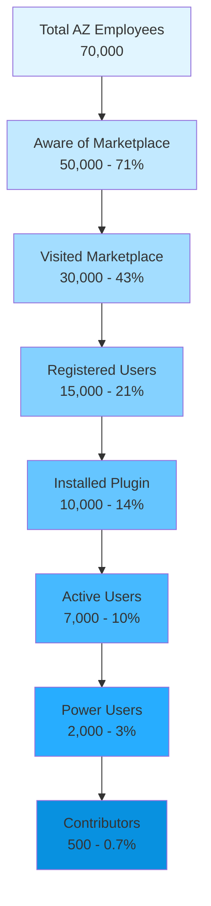

## 11. Customer Segment Distribution

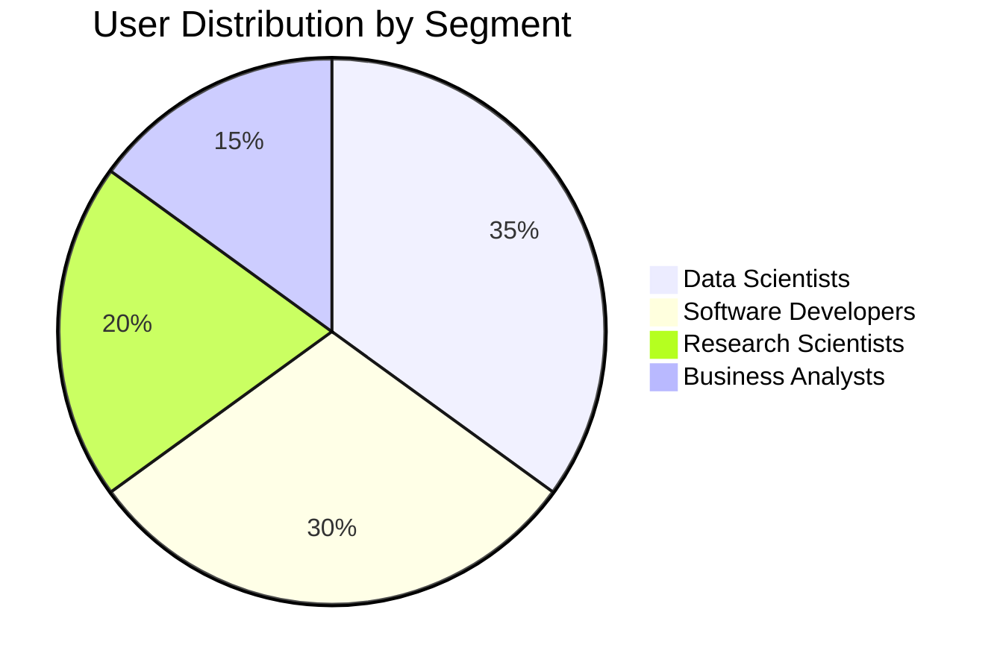

## 12. Multi-Year Value Projection

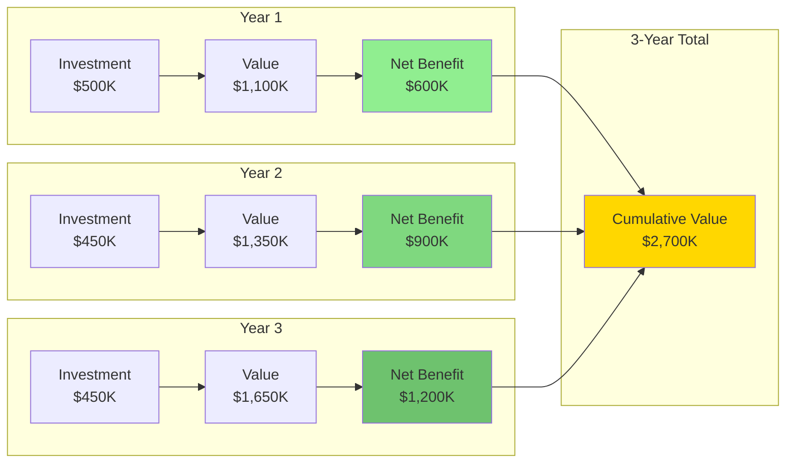

---

These Mermaid diagrams provide interactive, scalable visualizations of your Business Model Canvas. They can be easily embedded in documentation, presentations, or web pages. Would you like me to:

1. Create additional specific workflow diagrams (e.g., plugin lifecycle, user onboarding)?
2. Develop more detailed technical architecture diagrams?
3. Create sequence diagrams for key interactions?
4. Build additional analytics or metrics dashboards?