# 10-Minute Elevator Pitch: AZ Claude Code Plugin Marketplace

## Presentation Structure (10 Minutes Total)

**Slide Count:** 6 slides
**Timing:** 7 minutes presentation + 3 minutes Q&A
**Audience:** Busy executives, initial stakeholder conversations, quick decision briefings

---

## Slide 1: The Problem & Opportunity (90 seconds)

```mermaid
graph LR
    subgraph "TODAY'S REALITY"
        P1[🔴 Ungoverned AI Tools<br/>Security & Compliance Risk]
        P2[🔴 Duplicated Efforts<br/>$2M Annual Waste]
        P3[🔴 Knowledge Silos<br/>No Sharing Mechanism]
    end
    
    subgraph "THE OPPORTUNITY"
        O1[✅ Centralized Marketplace<br/>Secure & Governed]
        O2[✅ Reusable Solutions<br/>10,000 Hours Saved]
        O3[✅ Innovation Culture<br/>Knowledge Sharing]
    end
    
    P1 --> O1
    P2 --> O2
    P3 --> O3
    
    O1 --> VALUE[$1.1M Annual Value]
    O2 --> VALUE
    O3 --> VALUE
    
    style P1 fill:#FFB6C1
    style P2 fill:#FFB6C1
    style P3 fill:#FFB6C1
    style O1 fill:#90EE90
    style O2 fill:#90EE90
    style O3 fill:#90EE90
    style VALUE fill:#FFD700
```

### Key Talking Points

**The Problem (30 seconds):**
"Right now, AZ employees are building Claude Code plugins independently across the organization. This creates three critical issues:
- **Security risk**: No centralized scanning or governance
- **Wasted resources**: Teams solving the same problems separately—costing us $2M annually
- **Missed opportunities**: No way to discover and share solutions"

**The Opportunity (30 seconds):**
"We can solve this with a centralized Plugin Marketplace—think of it as an 'App Store' for AI tools with built-in security, governance, and discovery. This will:
- Eliminate security and compliance risks
- Save 10,000 hours annually through reuse
- Foster an innovation culture where knowledge is shared"

**The Hook (30 seconds):**
"This isn't just about efficiency—**Pfizer launched their marketplace in Q4 2025 and we're at risk of falling behind**. Plus, FDA guidance on AI governance is coming, and we need to be ready."

---

## Slide 2: The Solution in 60 Seconds (90 seconds)

```mermaid
graph TB
    subgraph "USER EXPERIENCE"
        U1[🔍 Discover<br/>Find tools in seconds]
        U2[✅ Trust<br/>Security-validated]
        U3[⚡ Deploy<br/>One-click install]
    end
    
    subgraph "GOVERNANCE"
        G1[🛡️ Security Scanning]
        G2[📋 Compliance Validation]
        G3[📊 Complete Audit Trails]
    end
    
    subgraph "VALUE"
        V1[💰 $1.1M Annual Value]
        V2[🎯 120% ROI Year 1]
        V3[⏱️ 6-Month Payback]
    end
    
    U1 --> G1
    U2 --> G2
    U3 --> G3
    
    G1 --> V1
    G2 --> V2
    G3 --> V3
    
    style U1 fill:#E1F5FF
    style U2 fill:#E1F5FF
    style U3 fill:#E1F5FF
    style G1 fill:#FFE1E1
    style G2 fill:#FFE1E1
    style G3 fill:#FFE1E1
    style V1 fill:#90EE90
    style V2 fill:#90EE90
    style V3 fill:#90EE90
```

### Key Talking Points

**What It Is (30 seconds):**
"The AZ Plugin Marketplace is a centralized platform where employees can:
- **Discover** pre-built, vetted plugins through intelligent search
- **Trust** that every tool has passed security scanning and compliance validation
- **Deploy** solutions with one click—no technical expertise required"

**How It Works (30 seconds):**
"Behind the scenes, we have:
- **Automated security scanning** before any plugin is published
- **Compliance validation** against GxP, GDPR, and FDA requirements
- **Complete audit trails** for regulatory readiness
- **Usage analytics** to measure ROI and adoption"

**Why It Matters (30 seconds):**
"This creates **$1.1M in annual value** through time savings, cost avoidance, and risk reduction. That's a **120% ROI in Year 1** with a **6-month payback**. And it positions us as an industry leader in responsible AI adoption."

---

## Slide 3: The Financial Case (90 seconds)

### Investment vs. Return

### Value Breakdown

| **Value Source** | **Annual Impact** | **How We Measure** |
|------------------|------------------|-------------------|
| **Time Savings** | $750K | 10,000 hours × $75/hour (tracked via analytics) |
| **Cost Avoidance** | $200K | Eliminated duplicate development (before/after comparison) |
| **Reduced External Spend** | $100K | Fewer external tools & consulting (procurement data) |
| **Security Benefits** | $50K | Risk reduction & incident prevention (actuarial) |
| **TOTAL** | **$1,100K** | **Measurable, tracked monthly** |

### Key Talking Points

**The Investment (30 seconds):**
"We're asking for **$500K in Year 1**, dropping to $450K annually thereafter. This covers:
- A lean core team (5 people)
- Cloud infrastructure
- Security tools
- Training and support

That's **$2.3M over 5 years**—less than what competitors are spending."

**The Return (30 seconds):**
"We'll generate **$1.1M in value annually** through:
- **Time savings**: 10,000 hours we're currently wasting
- **Cost avoidance**: Stopping duplicate work
- **Risk reduction**: Preventing security incidents

All measurable and tracked monthly."

**The Bottom Line (30 seconds):**
"**120% ROI in Year 1. 6-month payback. $5.9M net benefit over 5 years.**

Even in our conservative scenario—if we only hit 50% of targets—we still get positive ROI. This is a low-risk, high-return investment."

---

## Slide 4: Why Now? Competitive & Regulatory Urgency (90 seconds)

### Three Reasons We Can't Wait

**1. Competitive Pressure**
- ✅ Pfizer already launched (Q4 2025)
- ✅ Novartis piloting (Q2 2026)
- 🔴 We risk falling behind key competitors

**2. Regulatory Requirements**
- ✅ FDA draft guidance (Jan 2026): AI governance required
- ✅ EMA mandates audit trails (2027)
- 🔴 Compliance gap growing

**3. Current State Costs**
- ✅ $2M wasted annually on duplication
- ✅ Security incidents increasing
- 🔴 Every month we delay costs $170K+

### Key Talking Points

**Competitive Context (30 seconds):**
"**Pfizer launched their marketplace in Q4 2025**—they're already seeing 40% productivity gains. Novartis is piloting. We're at a decision point: **lead or follow?**

If we approve today, we can launch in 6 months and be in the leading group. If we wait, we'll be playing catch-up for years."

**Regulatory Pressure (30 seconds):**
"The FDA released draft guidance in January requiring documented AI governance for drug development. The EMA is mandating audit trails by 2027. **This isn't optional anymore**—it's a regulatory requirement.

We can be proactive and build this right, or reactive and scramble under pressure."

**Cost of Delay (30 seconds):**
"Every month we delay costs us **$170K in wasted effort and risk exposure**. That's $1M over 6 months—**twice the cost of just building the solution**.

Plus, if we have a security incident (which becomes more likely every day), remediation costs $250K+. **The status quo is actually the most expensive option.**"

---

## Slide 5: Implementation & Risk (90 seconds)

### 12-Month Phased Approach

### Risk Mitigation

| **Risk** | **Mitigation** | **Status** |
|----------|---------------|-----------|
| **Security Breach** | Multi-layer scanning + manual review | ✅ Low probability |
| **Low Adoption** | Pilot validation + change management | ✅ Proven approach |
| **Budget Overrun** | Phased gates + monthly reviews | ✅ Controlled |
| **Compliance Issues** | Legal review + validation workflow | ✅ Built-in |

### Key Talking Points

**Proven Approach (30 seconds):**
"We're using a **phased, gate-based approach**:
- **Months 1-3**: Build foundation and core platform
- **Months 4-6**: Pilot with 500 users—prove value before scaling
- **Months 7-9**: Organization-wide rollout
- **Months 10-12**: Optimize based on real usage

This minimizes risk—we validate at each phase before proceeding."

**Risk Management (30 seconds):**
"We've identified the top risks and have mitigation strategies:
- **Security**: Multi-layer scanning plus manual review by CISO team
- **Adoption**: Pilot proves value first, plus comprehensive change management
- **Budget**: Monthly financial reviews with 10% contingency buffer
- **Compliance**: Legal and compliance teams involved from day one

**The biggest risk is actually NOT doing this**—continued waste and exposure."

**Resource Requirements (30 seconds):**
"We need a lean core team:
- 1 Product Owner
- 1 Technical Lead
- 2 Developers
- Part-time security and community support

We're leveraging existing AZ infrastructure and tools where possible. **This is a strategic investment in internal capability, not an external dependency.**"

---

## Slide 6: Decision & Next Steps (90 seconds)

### What We're Asking For

```mermaid
graph TB
    ASK1[✅ Approve $500K Budget] --> NEXT1[Week 1-2:<br/>Recruit Core Team]
    ASK2[✅ Assign CIO as Sponsor] --> NEXT2[Week 2:<br/>Kick-off Meeting]
    ASK3[✅ Authorize Hiring] --> NEXT3[Month 1:<br/>Technical Design]
    
    NEXT1 --> LAUNCH[Month 6:<br/>Pilot Launch]
    NEXT2 --> LAUNCH
    NEXT3 --> LAUNCH
    
    LAUNCH --> VALUE[Month 12:<br/>$600K Net Benefit<br/>120% ROI Achieved]
    
    style ASK1 fill:#FFD700
    style ASK2 fill:#FFD700
    style ASK3 fill:#FFD700
    style LAUNCH fill:#90EE90
    style VALUE fill:#4169E1,color:#fff
```

### The Ask (Clear & Specific)

**Today's Decision:**
1. ✅ **Approve $500K annual budget** (FY26)
2. ✅ **Assign Executive Sponsor** (recommend CIO)
3. ✅ **Authorize hiring/contracts** for core team

**Upon Approval:**
- **Week 1-2**: Recruit Product Owner and Technical Lead
- **Month 1**: Complete technical design and governance framework
- **Month 6**: Launch pilot with 500 users
- **Month 12**: Achieve 120% ROI with 10,000+ users

### Alternative: What Happens If We Wait?

**6-Month Delay Costs:**
- 💰 **$1M in lost productivity** and continued waste
- 🔴 **Competitive disadvantage** vs. Pfizer/Novartis
- ⚠️ **Increased security exposure** (potential $250K+ incident)
- 📉 **Regulatory compliance gap** widens

### Key Talking Points

**The Ask (30 seconds):**
"We need three things today:
1. **Approve the $500K budget** for Year 1
2. **Assign the CIO as Executive Sponsor** for strategic direction
3. **Authorize hiring** for the core team

With approval today, we can **launch the pilot in 6 months** and achieve **full ROI within 12 months**."

**Why This Makes Sense (30 seconds):**
"This is a **low-risk, high-return investment**:
- ✅ **120% ROI** in Year 1 (exceptional for infrastructure)
- ✅ **Proven approach** used by competitors successfully
- ✅ **Phased implementation** with validation gates
- ✅ **Addresses regulatory requirements** proactively
- ✅ **Builds internal capability** vs. external dependency

**The real question isn't 'should we do this?'—it's 'can we afford NOT to?'**"

**Closing (30 seconds):**
"We're ready to move quickly. The team is identified, the architecture is designed, and we have buy-in from IT, Security, and Compliance.

**Pfizer is already ahead. Regulatory pressure is increasing. Every month we delay costs $170K.**

I'm asking for your approval today so we can launch in 6 months and position AZ as an industry leader in responsible AI adoption.

Questions?"

---

## One-Page Leave-Behind

### AZ Claude Code Plugin Marketplace - Executive Brief

**The Problem:**
AZ employees are building AI tools independently, creating security risks, wasted effort ($2M annually), and missed collaboration opportunities.

**The Solution:**
A centralized Plugin Marketplace with governance, security, and discovery—an "App Store" for AI tools.

**The Business Case:**
- **Investment**: $500K annually
- **Return**: $1.1M annual value
- **ROI**: 120% Year 1, 254% over 5 years
- **Payback**: 6 months

**Why Now:**
1. **Competitive**: Pfizer launched Q4 2025, Novartis piloting Q2 2026
2. **Regulatory**: FDA guidance requires AI governance
3. **Cost**: Delaying costs $170K/month in waste and risk

**The Ask:**
1. Approve $500K budget
2. Assign CIO as Executive Sponsor
3. Authorize hiring for core team

**Timeline:**
Approve today → Launch pilot in 6 months → Full ROI in 12 months

**Contact:** [Your Name] | [Email] | [Phone]

---

## Delivery Script & Tips

### Opening (30 seconds)

**Script:**
"Thanks for your time. I'm here to propose a **$500K investment that will return $1.1M in Year 1**—a **120% ROI with 6-month payback**.

This is about creating a centralized marketplace for AI tools with built-in security and governance. **Pfizer already launched theirs**, and we're at risk of falling behind.

I'll cover the problem, solution, financial case, and what we need from you—**7 minutes with 3 for questions**. Let's dive in."

### Middle (6 minutes)

**Pacing Tips:**
- **Slide 1 (90 sec)**: Start with the pain—make it real and urgent
- **Slide 2 (90 sec)**: Show the solution is simple and proven
- **Slide 3 (90 sec)**: Lead with ROI—this is the money slide
- **Slide 4 (90 sec)**: Create urgency—competitive and regulatory pressure
- **Slide 5 (90 sec)**: Address concerns proactively—we've thought this through
- **Slide 6 (90 sec)**: Clear ask with clear next steps

**Energy Management:**
- Start strong with the financial hook
- Build urgency in the middle (competitive pressure)
- Close with confidence and clarity

### Closing (30 seconds)

**Script:**
"To summarize: **$500K investment, $1.1M return, 120% ROI, 6-month payback**.

We're ready to move. We need your approval on three things: budget, sponsor, and hiring authority.

**Pfizer is ahead. Regulations are coming. Every month costs $170K.**

Can I answer any questions?"

### Handling Common Questions

**Q: "Why not just use Claude's native features?"**
**A:** "Good question. Claude's features are great for individuals, but they don't provide the security scanning, compliance validation, or organizational governance we need for pharmaceutical operations. We'd still have the same risks and waste. Plus, we'd be dependent on Anthropic's roadmap rather than controlling our own destiny."

**Q: "Can we start smaller?"**
**A:** "We could, but the pilot IS our 'start small' approach—500 users for 2 months before scaling. Going smaller than that won't give us meaningful data. Plus, the fixed costs (team, infrastructure) don't scale down much, so we'd get worse ROI."

**Q: "What if adoption is lower than expected?"**
**A:** "Great question—we've modeled that. Even at 50% of target adoption, we still get positive ROI. And our pilot phase specifically validates adoption before we scale. If the pilot doesn't work, we can pause and adjust."

**Q: "How does this compare to what competitors are doing?"**
**A:** "Pfizer invested similar amounts and is seeing 40% productivity gains. Novartis is investing $600K—more than us. We're actually being more cost-effective by leveraging existing AZ infrastructure. The real risk is NOT doing this and falling behind."

**Q: "What's the ongoing commitment after Year 1?"**
**A:** "Costs drop to $450K annually in Years 2-5 as the platform matures. But value continues to grow as adoption increases—we project $1.35M in Year 2, $1.65M in Year 3. The ROI gets better over time."

---

## Email Follow-Up Template

**Subject:** AZ Plugin Marketplace - Next Steps

**Body:**

[Executive Name],

Thank you for your time today discussing the AZ Claude Code Plugin Marketplace proposal.

**Key Takeaways:**
- **Investment**: $500K annually
- **Return**: $1.1M annual value (120% ROI, 6-month payback)
- **Timeline**: Launch pilot in 6 months with approval today
- **Urgency**: Pfizer already launched; regulatory pressure increasing

**Decision Needed:**
1. Approve $500K FY26 budget
2. Assign CIO as Executive Sponsor
3. Authorize hiring for core team

**Next Steps:**
- I'll send a calendar invite for a 30-minute follow-up to address any additional questions
- Full business case presentation available upon request
- Happy to arrange demos or discussions with IT/Security teams

**Cost of Delay:**
Each month we wait costs $170K in waste and increased risk exposure.

Please let me know if you need any additional information to make a decision.

Best regards,
[Your Name]

**Attachments:**
- One-page executive brief (PDF)
- Financial model summary (Excel)

---

## Presentation Variations

### For Different Audiences

**CFO Focus (Financial Stakeholder):**
- Lead with ROI and payback period
- Emphasize measurable, tracked value
- Show sensitivity analysis
- Compare to alternative investments
- Highlight cost avoidance and risk reduction

**CIO/CISO Focus (Technical Stakeholder):**
- Emphasize security and governance
- Show technical architecture
- Discuss integration with existing systems
- Highlight automation and scalability
- Address technical risks

**Business Unit Leader Focus (Operational Stakeholder):**
- Lead with productivity gains
- Show time savings for their teams
- Emphasize ease of use
- Highlight collaboration benefits
- Demonstrate quick wins

**Board/C-Suite Focus (Strategic Stakeholder):**
- Lead with competitive positioning
- Emphasize regulatory compliance
- Show strategic value beyond ROI
- Highlight innovation culture
- Connect to digital transformation goals

---

## Success Metrics for the Pitch

**Immediate Success:**
- ✅ Executive understands the problem and solution
- ✅ Financial case is clear and compelling
- ✅ Urgency is established (competitive/regulatory)
- ✅ Next steps are agreed upon

**Follow-Up Success:**
- ✅ Budget approval within 2 weeks
- ✅ Executive sponsor assigned
- ✅ Hiring authority granted
- ✅ Kick-off meeting scheduled

**Long-Term Success:**
- ✅ Pilot launches on time (Month 6)
- ✅ ROI targets achieved (Month 12)
- ✅ Organization-wide adoption (Year 2)
- ✅ Industry recognition as leader (Year 3)

---

Would you like me to:

1. Create a 3-minute "hallway conversation" version for impromptu discussions?
2. Develop a detailed FAQ document for common objections and questions?
3. Create role-specific variations for different stakeholder types?
4. Build a stakeholder mapping and influence strategy for pre-pitch socialization?