# Business Model Canvas - Visual Representations

## 1. Traditional Business Model Canvas Layout

```mermaid
graph TB
    subgraph BMC["BUSINESS MODEL CANVAS: Claude Extension System for AstraZeneca R&D"]
        subgraph Left["LEFT SIDE: EFFICIENCY"]
            KP["<b>KEY PARTNERS</b><br/>────────────────<br/>• Anthropic (Claude API)<br/>• Cloud Providers (AWS/Azure)<br/>• Security Vendors<br/>• Research Partners<br/>• Integration Partners<br/>• Internal IT/Legal/Compliance"]
            
            KA["<b>KEY ACTIVITIES</b><br/>────────────────<br/>• Platform Development<br/>• Plugin Ecosystem Mgmt<br/>• Integration & Deployment<br/>• Operations & Support<br/>• Governance & Compliance<br/>• Research & Innovation"]
            
            KR["<b>KEY RESOURCES</b><br/>────────────────<br/>• Technology Stack<br/>• Human Resources (20 FTEs)<br/>• Infrastructure<br/>• Intellectual Property<br/>• Data Assets<br/>• Partner Relationships"]
        end
        
        subgraph Center["CENTER: VALUE"]
            VP["<b>VALUE PROPOSITIONS</b><br/>════════════════<br/><b>For Scientists:</b><br/>• 70% faster research<br/>• Automated workflows<br/>• AI-powered insights<br/><br/><b>For Leadership:</b><br/>• $200M+ annual value<br/>• 25% faster development<br/>• Data-driven decisions<br/><br/><b>For IT:</b><br/>• Enterprise security<br/>• Unified platform<br/>• Reduced complexity"]
        end
        
        subgraph Right["RIGHT SIDE: VALUE"]
            CR["<b>CUSTOMER RELATIONSHIPS</b><br/>────────────────<br/>• Self-Service (docs, videos)<br/>• Assisted (training, support)<br/>• Co-Creation (beta, advisory)<br/>• Community (forums, events)<br/>• Tiered Support (4 levels)"]
            
            CH["<b>CHANNELS</b><br/>────────────────<br/>• Web Portal<br/>• Embedded Integration<br/>• Plugin Marketplace<br/>• Training Programs<br/>• Internal Marketing<br/>• API Access"]
            
            CS["<b>CUSTOMER SEGMENTS</b><br/>────────────────<br/>• Discovery Scientists (40%)<br/>• Translational Scientists (25%)<br/>• Clinical Scientists (20%)<br/>• Bioinformaticians (10%)<br/>• R&D Leadership (5%)"]
        end
        
        subgraph Bottom["BOTTOM: VIABILITY"]
            COST["<b>COST STRUCTURE</b><br/>════════════════════════════════<br/>• Personnel: $4.5M-$5.5M (60%)<br/>• Infrastructure: $2M-$3M (25%)<br/>• Operations: $0.5M-$0.8M (10%)<br/>• Variable: $0-$1.2M (5%)<br/>────────────────<br/><b>Total: $7M-$10.5M/year</b>"]
            
            REV["<b>REVENUE STREAMS (Value Capture)</b><br/>════════════════════════════════<br/>• R&D Cost Savings: $50M-$100M<br/>• Productivity Gains: $37M-$100M<br/>• Infrastructure Savings: $10M-$20M<br/>• Better Decisions: $100M-$200M<br/>• IP Generation: $20M-$50M<br/>────────────────<br/><b>Total Value: $217M-$470M/year</b><br/><b>ROI: 20x-66x</b>"]
        end
    end
    
    KP --> KA
    KA --> VP
    KR --> VP
    VP --> CR
    VP --> CH
    CR --> CS
    CH --> CS
    KP --> COST
    KA --> COST
    KR --> COST
    CS --> REV
    VP --> REV
    
    style BMC fill:#f5f5f5,stroke:#333,stroke-width:3px
    style VP fill:#4CAF50,stroke:#2E7D32,stroke-width:3px,color:#fff
    style COST fill:#FF9800,stroke:#E65100,stroke-width:2px
    style REV fill:#2196F3,stroke:#0D47A1,stroke-width:2px,color:#fff
    style KP fill:#E3F2FD,stroke:#1976D2,stroke-width:2px
    style KA fill:#E3F2FD,stroke:#1976D2,stroke-width:2px
    style KR fill:#E3F2FD,stroke:#1976D2,stroke-width:2px
    style CR fill:#FFF3E0,stroke:#F57C00,stroke-width:2px
    style CH fill:#FFF3E0,stroke:#F57C00,stroke-width:2px
    style CS fill:#FFF3E0,stroke:#F57C00,stroke-width:2px
```

---

## 2. Detailed 9-Block Canvas with Interconnections

```mermaid
graph TB
    subgraph Canvas["EXTENDED BUSINESS MODEL CANVAS"]
        subgraph Block1["1️⃣ KEY PARTNERS"]
            P1["<b>Strategic Partners</b><br/>• Anthropic<br/>• AWS/Azure/GCP"]
            P2["<b>Research Partners</b><br/>• Academic Institutions<br/>• Biotech Consortiums"]
            P3["<b>Internal Partners</b><br/>• IT Infrastructure<br/>• Legal & Compliance"]
            P1 -.-> P2 -.-> P3
        end
        
        subgraph Block2["2️⃣ KEY ACTIVITIES"]
            A1["<b>Development</b><br/>• Platform engineering<br/>• Plugin development"]
            A2["<b>Operations</b><br/>• 24/7 monitoring<br/>• User support"]
            A3["<b>Innovation</b><br/>• R&D research<br/>• Use case dev"]
            A1 -.-> A2 -.-> A3
        end
        
        subgraph Block3["3️⃣ KEY RESOURCES"]
            R1["<b>Technology</b><br/>• 50+ worker nodes<br/>• 200+ CPU cores"]
            R2["<b>Human Capital</b><br/>• 20 FTEs<br/>• Specialized skills"]
            R3["<b>IP Assets</b><br/>• Platform code<br/>• 100+ plugins"]
            R1 -.-> R2 -.-> R3
        end
        
        subgraph Block4["4️⃣ VALUE PROPOSITIONS"]
            V1["<b>Scientists</b><br/>⚡ 70% faster<br/>🤖 AI-powered<br/>📊 Data-driven"]
            V2["<b>Leadership</b><br/>💰 $200M+ value<br/>🚀 25% faster dev<br/>📈 Higher success"]
            V3["<b>IT Teams</b><br/>🔒 Enterprise secure<br/>🔧 Unified platform<br/>📉 Reduced costs"]
            V1 -.-> V2 -.-> V3
        end
        
        subgraph Block5["5️⃣ CUSTOMER RELATIONSHIPS"]
            C1["<b>Self-Service</b><br/>• Documentation<br/>• Video tutorials"]
            C2["<b>Assisted</b><br/>• Training<br/>• Office hours"]
            C3["<b>Co-Creation</b><br/>• Beta testing<br/>• Advisory board"]
            C1 -.-> C2 -.-> C3
        end
        
        subgraph Block6["6️⃣ CHANNELS"]
            CH1["<b>Direct</b><br/>• Web portal<br/>• API access"]
            CH2["<b>Embedded</b><br/>• LIMS integration<br/>• ELN integration"]
            CH3["<b>Marketplace</b><br/>• Plugin catalog<br/>• One-click install"]
            CH1 -.-> CH2 -.-> CH3
        end
        
        subgraph Block7["7️⃣ CUSTOMER SEGMENTS"]
            S1["<b>Discovery</b><br/>40% of users<br/>Target ID"]
            S2["<b>Translational</b><br/>25% of users<br/>Drug optimization"]
            S3["<b>Clinical</b><br/>20% of users<br/>Trial design"]
            S4["<b>Bioinformatics</b><br/>10% of users<br/>Custom dev"]
            S5["<b>Leadership</b><br/>5% of users<br/>Portfolio mgmt"]
            S1 -.-> S2 -.-> S3 -.-> S4 -.-> S5
        end
        
        subgraph Block8["8️⃣ COST STRUCTURE"]
            CS1["<b>Fixed Costs</b><br/>💼 Personnel: $4.5M-$5.5M<br/>🖥️ Infrastructure: $2M-$3M<br/>⚙️ Operations: $0.5M-$0.8M"]
            CS2["<b>Variable Costs</b><br/>📈 Usage-based: $0-$0.5M<br/>🔧 Scaling: $0-$0.3M<br/>👨‍💻 Custom dev: $0-$0.4M"]
            CS1 -.-> CS2
        end
        
        subgraph Block9["9️⃣ REVENUE STREAMS"]
            RS1["<b>Direct Returns</b><br/>💰 Cost savings: $97M-$220M<br/>⚡ Productivity: $37M-$100M<br/>🏗️ Infrastructure: $10M-$20M"]
            RS2["<b>Indirect Value</b><br/>🎯 Better decisions: $100M-$200M<br/>🏆 Competitive edge: Strategic<br/>💡 IP generation: $20M-$50M"]
            RS1 -.-> RS2
        end
    end
    
    Block1 --> Block2
    Block2 --> Block4
    Block3 --> Block4
    Block4 --> Block5
    Block4 --> Block6
    Block5 --> Block7
    Block6 --> Block7
    Block1 --> Block8
    Block2 --> Block8
    Block3 --> Block8
    Block7 --> Block9
    Block4 --> Block9
    
    style Canvas fill:#fafafa,stroke:#333,stroke-width:4px
    style Block4 fill:#4CAF50,stroke:#2E7D32,stroke-width:3px,color:#fff
    style Block8 fill:#FF9800,stroke:#E65100,stroke-width:2px
    style Block9 fill:#2196F3,stroke:#0D47A1,stroke-width:2px,color:#fff
    style Block1 fill:#E3F2FD,stroke:#1976D2,stroke-width:2px
    style Block2 fill:#E3F2FD,stroke:#1976D2,stroke-width:2px
    style Block3 fill:#E3F2FD,stroke:#1976D2,stroke-width:2px
    style Block5 fill:#FFF3E0,stroke:#F57C00,stroke-width:2px
    style Block6 fill:#FFF3E0,stroke:#F57C00,stroke-width:2px
    style Block7 fill:#FFF3E0,stroke:#F57C00,stroke-width:2px
```

---

## 3. Value Flow Diagram

```mermaid
graph LR
    subgraph Input["INPUT (Costs)"]
        I1["💼 Personnel<br/>$4.5M-$5.5M"]
        I2["🖥️ Infrastructure<br/>$2M-$3M"]
        I3["⚙️ Operations<br/>$0.5M-$0.8M"]
        I4["📊 Total Cost<br/>$7M-$10.5M"]
        
        I1 --> I4
        I2 --> I4
        I3 --> I4
    end
    
    subgraph Platform["PLATFORM (Transformation)"]
        P1["🔧 Key Activities<br/>────────────<br/>• Development<br/>• Operations<br/>• Support<br/>• Innovation"]
        
        P2["🎯 Key Resources<br/>────────────<br/>• Technology<br/>• Team<br/>• IP<br/>• Data"]
        
        P3["🤝 Key Partners<br/>────────────<br/>• Anthropic<br/>• Cloud<br/>• Internal<br/>• Research"]
        
        P1 -.-> P2 -.-> P3
    end
    
    subgraph Value["VALUE CREATION"]
        V1["✨ Value Propositions<br/>═══════════════<br/>Scientists: 70% faster<br/>Leadership: $200M+ value<br/>IT: Unified platform"]
        
        V2["📢 Channels<br/>────────────<br/>• Portal<br/>• Integration<br/>• Marketplace"]
        
        V3["🤝 Relationships<br/>────────────<br/>• Self-service<br/>• Assisted<br/>• Co-creation"]
    end
    
    subgraph Output["OUTPUT (Value Captured)"]
        O1["💰 Direct Returns<br/>$97M-$220M"]
        O2["🎯 Indirect Value<br/>$120M-$250M"]
        O3["📊 Total Value<br/>$217M-$470M"]
        O4["📈 ROI<br/>20x-66x"]
        
        O1 --> O3
        O2 --> O3
        O3 --> O4
    end
    
    subgraph Segments["CUSTOMER SEGMENTS"]
        S1["👨‍🔬 Discovery<br/>Scientists<br/>40%"]
        S2["🔬 Translational<br/>Scientists<br/>25%"]
        S3["👨‍⚕️ Clinical<br/>Scientists<br/>20%"]
        S4["💻 Bioinfor-<br/>maticians<br/>10%"]
        S5["👔 R&D<br/>Leadership<br/>5%"]
    end
    
    I4 ==>|Investment| Platform
    Platform ==>|Enables| Value
    Value ==>|Delivers to| Segments
    Segments ==>|Creates| Output
    
    Output -.->|Funds| I4
    
    style Input fill:#FF9800,stroke:#E65100,stroke-width:2px
    style Platform fill:#9C27B0,stroke:#4A148C,stroke-width:2px,color:#fff
    style Value fill:#4CAF50,stroke:#2E7D32,stroke-width:2px,color:#fff
    style Output fill:#2196F3,stroke:#0D47A1,stroke-width:2px,color:#fff
    style Segments fill:#FFF3E0,stroke:#F57C00,stroke-width:2px
    style I4 fill:#F57C00,stroke:#E65100,stroke-width:3px,color:#fff
    style O4 fill:#0D47A1,stroke:#01579B,stroke-width:3px,color:#fff
```

---

## 4. Customer Segment Deep Dive

```mermaid
graph TB
    subgraph Segments["CUSTOMER SEGMENTS BREAKDOWN"]
        subgraph S1["Discovery Scientists (40%)"]
            S1A["<b>Profile</b><br/>• PhD researchers<br/>• 5-15 years exp<br/>• Limited coding"]
            S1B["<b>Pain Points</b><br/>• Manual lit review<br/>• Complex analysis<br/>• Slow cycles"]
            S1C["<b>Value Delivered</b><br/>• Auto synthesis<br/>• NL queries<br/>• 70% faster"]
            S1D["<b>Success Metrics</b><br/>• Time to insight: -70%<br/>• Papers: +30%<br/>• Targets: 2x"]
            
            S1A --> S1B --> S1C --> S1D
        end
        
        subgraph S2["Translational Scientists (25%)"]
            S2A["<b>Profile</b><br/>• MD/PhD<br/>• 10-20 years exp<br/>• Moderate tech"]
            S2B["<b>Pain Points</b><br/>• ADME prediction<br/>• Trial design<br/>• Biomarkers"]
            S2C["<b>Value Delivered</b><br/>• ADME plugins<br/>• Trial optimization<br/>• Stratification"]
            S2D["<b>Success Metrics</b><br/>• Candidates: +40%<br/>• Success: +15%<br/>• Time to IND: -6mo"]
            
            S2A --> S2B --> S2C --> S2D
        end
        
        subgraph S3["Clinical Scientists (20%)"]
            S3A["<b>Profile</b><br/>• Clinical MDs<br/>• 15-25 years exp<br/>• Limited tech"]
            S3B["<b>Pain Points</b><br/>• Protocol design<br/>• Recruitment<br/>• AE analysis"]
            S3C["<b>Value Delivered</b><br/>• Protocol assist<br/>• Patient matching<br/>• AE detection"]
            S3D["<b>Success Metrics</b><br/>• Approval: -30%<br/>• Recruitment: +25%<br/>• Safety: +50%"]
            
            S3A --> S3B --> S3C --> S3D
        end
        
        subgraph S4["Bioinformaticians (10%)"]
            S4A["<b>Profile</b><br/>• Computational<br/>• 5-15 years exp<br/>• Advanced tech"]
            S4B["<b>Pain Points</b><br/>• No AI infra<br/>• Deployment hard<br/>• Collaboration"]
            S4C["<b>Value Delivered</b><br/>• Dev framework<br/>• Prod infra<br/>• Collab tools"]
            S4D["<b>Success Metrics</b><br/>• Time to prod: -80%<br/>• Models: 5x<br/>• Collab: +60%"]
            
            S4A --> S4B --> S4C --> S4D
        end
        
        subgraph S5["R&D Leadership (5%)"]
            S5A["<b>Profile</b><br/>• VPs, Directors<br/>• 20+ years exp<br/>• Strategic"]
            S5B["<b>Pain Points</b><br/>• Limited visibility<br/>• Prioritization<br/>• Resource alloc"]
            S5C["<b>Value Delivered</b><br/>• Analytics dash<br/>• Predictive models<br/>• ROI tracking"]
            S5D["<b>Success Metrics</b><br/>• Success: +20%<br/>• Utilization: +35%<br/>• Decisions: -50%"]
            
            S5A --> S5B --> S5C --> S5D
        end
    end
    
    subgraph Priority["SEGMENT PRIORITIZATION"]
        P1["<b>High Value / High Volume</b><br/>🎯 Discovery Scientists<br/>🎯 Translational Scientists"]
        P2["<b>High Value / Low Volume</b><br/>⭐ R&D Leadership<br/>⭐ Bioinformaticians"]
        P3["<b>Medium Value / Medium Volume</b><br/>📊 Clinical Scientists"]
        
        P1 -.->|Primary Focus| P2
        P2 -.->|Strategic| P3
    end
    
    S1 --> Priority
    S2 --> Priority
    S3 --> Priority
    S4 --> Priority
    S5 --> Priority
    
    style S1 fill:#4CAF50,stroke:#2E7D32,stroke-width:2px,color:#fff
    style S2 fill:#8BC34A,stroke:#558B2F,stroke-width:2px
    style S3 fill:#CDDC39,stroke:#9E9D24,stroke-width:2px
    style S4 fill:#FFC107,stroke:#F57C00,stroke-width:2px
    style S5 fill:#FF9800,stroke:#E65100,stroke-width:2px
    style P1 fill:#2196F3,stroke:#0D47A1,stroke-width:2px,color:#fff
    style P2 fill:#9C27B0,stroke:#4A148C,stroke-width:2px,color:#fff
    style P3 fill:#607D8B,stroke:#37474F,stroke-width:2px,color:#fff
```

---

## 5. Cost Structure Breakdown

```mermaid
graph TB
    subgraph CostStructure["COST STRUCTURE: $7M - $10.5M ANNUALLY"]
        subgraph Fixed["FIXED COSTS: $7M - $9.3M (90%)"]
            F1["💼 PERSONNEL: $4.5M - $5.5M<br/>═══════════════════════<br/>Engineering (10 FTEs): $2.0M-$2.5M<br/>Product & Research (5 FTEs): $1.2M-$1.5M<br/>Operations (3 FTEs): $0.6M-$0.75M<br/>Leadership (2 FTEs): $0.7M-$0.8M"]
            
            F2["🖥️ INFRASTRUCTURE: $2M - $3M<br/>═══════════════════════<br/>Cloud (50+ nodes): $0.8M-$1.2M<br/>Claude API: $0.8M-$1.2M<br/>Software licenses: $0.4M-$0.6M"]
            
            F3["⚙️ OPERATIONS: $0.5M - $0.8M<br/>═══════════════════════<br/>Training: $0.15M-$0.25M<br/>Marketing: $0.1M-$0.15M<br/>Travel: $0.1M-$0.15M<br/>Contingency: $0.15M-$0.25M"]
        end
        
        subgraph Variable["VARIABLE COSTS: $0 - $1.2M (10%)"]
            V1["📈 USAGE-BASED<br/>$0 - $0.5M<br/>• API overages<br/>• Peak usage"]
            
            V2["🔧 SCALING<br/>$0 - $0.3M<br/>• Auto-scale events<br/>• Special projects"]
            
            V3["👨‍💻 CUSTOM DEV<br/>$0 - $0.4M<br/>• High-priority plugins<br/>• Contractor support"]
        end
        
        subgraph Breakdown["COST BREAKDOWN BY CATEGORY"]
            B1["Personnel<br/>60-65%"]
            B2["Infrastructure<br/>25-35%"]
            B3["Operations<br/>5-10%"]
            B4["Variable<br/>0-10%"]
        end
    end
    
    F1 --> Breakdown
    F2 --> Breakdown
    F3 --> Breakdown
    V1 --> Breakdown
    V2 --> Breakdown
    V3 --> Breakdown
    
    style CostStructure fill:#fff3e0,stroke:#F57C00,stroke-width:3px
    style Fixed fill:#FF9800,stroke:#E65100,stroke-width:2px
    style Variable fill:#FFC107,stroke:#F57C00,stroke-width:2px
    style F1 fill:#ffccbc,stroke:#E65100,stroke-width:2px
    style F2 fill:#ffccbc,stroke:#E65100,stroke-width:2px
    style F3 fill:#ffccbc,stroke:#E65100,stroke-width:2px
    style Breakdown fill:#fff9c4,stroke:#F57C00,stroke-width:2px
```

---

## 6. Revenue Streams (Value Capture) Breakdown

```mermaid
graph TB
    subgraph Revenue["REVENUE STREAMS (VALUE CAPTURE): $217M - $470M ANNUALLY"]
        subgraph Direct["DIRECT FINANCIAL RETURNS: $97M - $220M"]
            D1["💰 R&D COST SAVINGS<br/>$50M - $100M<br/>═══════════════════════<br/>• Faster drug development<br/>• Time savings per program:<br/>  6-12 months<br/>• Cost reduction per program:<br/>  $20M-$40M<br/>• Portfolio impact (20 programs):<br/>  $1B-$2B over 5 years"]
            
            D2["⚡ PRODUCTIVITY GAINS<br/>$37M - $100M<br/>═══════════════════════<br/>• Time saved: 30-40%<br/>  (12-16 hours/week)<br/>• Scientists: 500-1000<br/>• FTE equivalent: 150-400<br/>• Cost per FTE: $250K<br/>• Total savings: $37.5M-$100M"]
            
            D3["🏗️ INFRASTRUCTURE SAVINGS<br/>$10M - $20M<br/>═══════════════════════<br/>• Eliminate redundant tools:<br/>  $5M-$10M<br/>• Reduced compute costs:<br/>  $2M-$5M<br/>• Lower support costs:<br/>  $3M-$5M"]
        end
        
        subgraph Indirect["INDIRECT VALUE CREATION: $120M - $250M"]
            I1["🎯 IMPROVED DECISIONS<br/>$100M - $200M<br/>═══════════════════════<br/>• Better target selection<br/>• Optimized trial design<br/>• Data-driven portfolio mgmt<br/>• Higher clinical success rates"]
            
            I2["🏆 COMPETITIVE ADVANTAGE<br/>Strategic Value<br/>═══════════════════════<br/>• Faster time-to-market<br/>• First-mover advantage<br/>• Enhanced innovation<br/>• Difficult to quantify"]
            
            I3["💡 IP GENERATION<br/>$20M - $50M<br/>═══════════════════════<br/>• Novel insights from AI<br/>• Patentable discoveries<br/>• Publications<br/>• Scientific leadership"]
        end
        
        subgraph Total["TOTAL VALUE CREATION"]
            T1["📊 TOTAL ANNUAL VALUE<br/>$217M - $470M"]
            T2["💵 PLATFORM COST<br/>$7M - $10.5M"]
            T3["💰 NET VALUE<br/>$206.5M - $463M"]
            T4["📈 ROI<br/>20x - 66x"]
        end
    end
    
    D1 --> T1
    D2 --> T1
    D3 --> T1
    I1 --> T1
    I2 --> T1
    I3 --> T1
    
    T1 --> T3
    T2 --> T3
    T3 --> T4
    
    style Revenue fill:#e3f2fd,stroke:#1976D2,stroke-width:3px
    style Direct fill:#4CAF50,stroke:#2E7D32,stroke-width:2px,color:#fff
    style Indirect fill:#2196F3,stroke:#0D47A1,stroke-width:2px,color:#fff
    style Total fill:#9C27B0,stroke:#4A148C,stroke-width:2px,color:#fff
    style D1 fill:#81C784,stroke:#2E7D32,stroke-width:2px
    style D2 fill:#81C784,stroke:#2E7D32,stroke-width:2px
    style D3 fill:#81C784,stroke:#2E7D32,stroke-width:2px
    style I1 fill:#64B5F6,stroke:#0D47A1,stroke-width:2px
    style I2 fill:#64B5F6,stroke:#0D47A1,stroke-width:2px
    style I3 fill:#64B5F6,stroke:#0D47A1,stroke-width:2px
    style T4 fill:#6A1B9A,stroke:#4A148C,stroke-width:3px,color:#fff
```

---

## 7. Unfair Advantages Matrix

```mermaid
graph TB
    subgraph Advantages["UNFAIR ADVANTAGES (Competitive Moats)"]
        subgraph Proprietary["PROPRIETARY ASSETS"]
            P1["🔐 Domain-Specific<br/>Plugin Library<br/>═══════════════<br/>• 100+ pharma plugins<br/>• Years of R&D expertise<br/>• Not in commercial AI<br/>• Moat: 2-3 years"]
            
            P2["📊 Integrated R&D<br/>Data Access<br/>═══════════════<br/>• AZ proprietary data<br/>• Historical trials<br/>• Compound libraries<br/>• Moat: Impossible<br/>  to replicate"]
            
            P3["✅ Regulatory<br/>Compliance Framework<br/>═══════════════<br/>• 21 CFR Part 11<br/>• GxP validated<br/>• Audit trails<br/>• Moat: 1-2 years"]
        end
        
        subgraph Organizational["ORGANIZATIONAL CAPABILITIES"]
            O1["🎓 R&D Domain<br/>Expertise<br/>═══════════════<br/>• Deep drug dev knowledge<br/>• Direct scientist access<br/>• Iterative refinement<br/>• Moat: Requires<br/>  embedded team"]
            
            O2["🏗️ Enterprise AI<br/>Infrastructure<br/>═══════════════<br/>• Battle-tested at scale<br/>• Proven security<br/>• 99.9% uptime<br/>• Moat: 1-2 years<br/>  operational maturity"]
            
            O3["🌐 Network<br/>Effects<br/>═══════════════<br/>• Growing marketplace<br/>• Developer community<br/>• Shared best practices<br/>• Moat: Strengthens<br/>  over time"]
        end
        
        subgraph Strategic["STRATEGIC POSITIONING"]
            S1["🚀 First-Mover<br/>Advantage<br/>═══════════════<br/>• First in pharma<br/>• Anthropic relationship<br/>• Early access<br/>• Moat: 6-12 months"]
            
            S2["🏢 AstraZeneca<br/>Brand & Resources<br/>═══════════════<br/>• World-class R&D<br/>• Financial resources<br/>• Global reach<br/>• Moat: Requires<br/>  large pharma"]
            
            S3["🔒 Advanced<br/>Security<br/>═══════════════<br/>• Multi-level isolation<br/>• Conflict resolution<br/>• Threat detection<br/>• Moat: 1-2 years<br/>  security engineering"]
        end
        
        subgraph Technical["TECHNICAL DIFFERENTIATION"]
            T1["🤖 Intelligent<br/>Auto-Scaling<br/>═══════════════<br/>• ML-based prediction<br/>• R&D workload optimized<br/>• Cost optimization<br/>• Moat: Requires<br/>  operational data<br/>  & ML expertise"]
        end
    end
    
    subgraph Defensibility["DEFENSIBILITY ASSESSMENT"]
        D1["<b>PERMANENT</b><br/>Impossible to replicate<br/>────────────<br/>• Proprietary data access"]
        
        D2["<b>LONG-TERM (2-3 years)</b><br/>Difficult to replicate<br/>────────────<br/>• Plugin library<br/>• Domain expertise"]
        
        D3["<b>MEDIUM-TERM (1-2 years)</b><br/>Moderate barrier<br/>────────────<br/>• Compliance framework<br/>• Infrastructure<br/>• Security"]
        
        D4["<b>SHORT-TERM (6-12 months)</b><br/>Low barrier<br/>────────────<br/>• First-mover advantage"]
        
        D5["<b>STRENGTHENS OVER TIME</b><br/>Compounding advantage<br/>────────────<br/>• Network effects<br/>• Organizational learning"]
    end
    
    P2 --> D1
    P1 --> D2
    O1 --> D2
    P3 --> D3
    O2 --> D3
    S3 --> D3
    S1 --> D4
    O3 --> D5
    
    style Advantages fill:#f3e5f5,stroke:#7B1FA2,stroke-width:3px
    style Proprietary fill:#9C27B0,stroke:#4A148C,stroke-width:2px,color:#fff
    style Organizational fill:#673AB7,stroke:#311B92,stroke-width:2px,color:#fff
    style Strategic fill:#3F51B5,stroke:#1A237E,stroke-width:2px,color:#fff
    style Technical fill:#2196F3,stroke:#0D47A1,stroke-width:2px,color:#fff
    style Defensibility fill:#fff3e0,stroke:#F57C00,stroke-width:2px
    style D1 fill:#4CAF50,stroke:#2E7D32,stroke-width:2px,color:#fff
    style D2 fill:#8BC34A,stroke:#558B2F,stroke-width:2px
    style D3 fill:#FFC107,stroke:#F57C00,stroke-width:2px
    style D4 fill:#FF9800,stroke:#E65100,stroke-width:2px
    style D5 fill:#2196F3,stroke:#0D47A1,stroke-width:2px,color:#fff
```

---

## 8. Complete Business Model Canvas - Single View

```mermaid
graph TB
    subgraph BMC["BUSINESS MODEL CANVAS: Claude Extension System"]
        subgraph Row1["TOP ROW"]
            KP["<b>KEY PARTNERS</b><br/>──────────────<br/>🤝 Anthropic<br/>☁️ Cloud Providers<br/>🔒 Security Vendors<br/>🔬 Research Partners<br/>🔗 Integration Partners<br/>🏢 Internal IT/Legal"]
            
            KA["<b>KEY ACTIVITIES</b><br/>──────────────<br/>💻 Platform Development<br/>🔌 Plugin Ecosystem<br/>🔗 Integration & Deploy<br/>🛠️ Operations & Support<br/>📋 Governance<br/>🔬 Research & Innovation"]
            
            VP["<b>VALUE PROPOSITIONS</b><br/>══════════════<br/><b>Scientists:</b><br/>⚡ 70% faster research<br/>🤖 AI-powered insights<br/>📊 Automated workflows<br/><br/><b>Leadership:</b><br/>💰 $200M+ annual value<br/>🚀 25% faster development<br/>📈 Higher success rates<br/><br/><b>IT Teams:</b><br/>🔒 Enterprise security<br/>🔧 Unified platform<br/>📉 Reduced complexity"]
            
            CR["<b>CUSTOMER RELATIONSHIPS</b><br/>──────────────<br/>📚 Self-Service<br/>  • Docs, videos<br/>👥 Assisted<br/>  • Training, support<br/>🤝 Co-Creation<br/>  • Beta, advisory<br/>🌐 Community<br/>  • Forums, events<br/>🎯 Tiered Support"]
            
            CS["<b>CUSTOMER SEGMENTS</b><br/>──────────────<br/>👨‍🔬 Discovery (40%)<br/>🔬 Translational (25%)<br/>👨‍⚕️ Clinical (20%)<br/>💻 Bioinformatics (10%)<br/>👔 Leadership (5%)"]
        end
        
        subgraph Row2["MIDDLE ROW"]
            KR["<b>KEY RESOURCES</b><br/>──────────────<br/>💻 Technology Stack<br/>  • 50+ nodes<br/>  • 200+ CPUs<br/>👥 Human Capital<br/>  • 20 FTEs<br/>  • Specialized skills<br/>💡 IP Assets<br/>  • Platform code<br/>  • 100+ plugins<br/>📊 Data Assets<br/>🤝 Partnerships"]
            
            CH["<b>CHANNELS</b><br/>──────────────<br/>🌐 Web Portal<br/>🔗 Embedded Integration<br/>  • LIMS, ELN<br/>🛒 Plugin Marketplace<br/>📚 Training Programs<br/>📢 Internal Marketing<br/>🔌 API Access"]
        end
        
        subgraph Row3["BOTTOM ROW"]
            COST["<b>COST STRUCTURE</b><br/>══════════════════════════════<br/><b>Fixed Costs ($7M-$9.3M):</b><br/>💼 Personnel: $4.5M-$5.5M (60%)<br/>  • Engineering: $2.0M-$2.5M<br/>  • Product & Research: $1.2M-$1.5M<br/>  • Operations: $0.6M-$0.75M<br/>  • Leadership: $0.7M-$0.8M<br/>🖥️ Infrastructure: $2M-$3M (25%)<br/>  • Cloud: $0.8M-$1.2M<br/>  • Claude API: $0.8M-$1.2M<br/>  • Software: $0.4M-$0.6M<br/>⚙️ Operations: $0.5M-$0.8M (10%)<br/><br/><b>Variable Costs ($0-$1.2M):</b><br/>📈 Usage-based: $0-$0.5M<br/>🔧 Scaling: $0-$0.3M<br/>👨‍💻 Custom dev: $0-$0.4M<br/>──────────────<br/><b>TOTAL: $7M-$10.5M/year</b>"]
            
            REV["<b>REVENUE STREAMS (Value Capture)</b><br/>══════════════════════════════<br/><b>Direct Returns ($97M-$220M):</b><br/>💰 R&D Cost Savings: $50M-$100M<br/>  • Faster development<br/>  • 6-12 months saved per program<br/>⚡ Productivity Gains: $37M-$100M<br/>  • 30-40% time savings<br/>  • 150-400 FTE equivalent<br/>🏗️ Infrastructure Savings: $10M-$20M<br/>  • Tool consolidation<br/>  • Reduced compute costs<br/><br/><b>Indirect Value ($120M-$250M):</b><br/>🎯 Better Decisions: $100M-$200M<br/>  • Higher success rates<br/>  • Optimized trials<br/>🏆 Competitive Advantage: Strategic<br/>💡 IP Generation: $20M-$50M<br/>──────────────<br/><b>TOTAL VALUE: $217M-$470M/year</b><br/><b>ROI: 20x-66x</b>"]
        end
    end
    
    KP --> KA
    KA --> VP
    KR --> VP
    VP --> CR
    VP --> CH
    CR --> CS
    CH --> CS
    KP --> COST
    KA --> COST
    KR --> COST
    CS --> REV
    VP --> REV
    
    style BMC fill:#fafafa,stroke:#333,stroke-width:4px
    style VP fill:#4CAF50,stroke:#2E7D32,stroke-width:4px,color:#fff
    style COST fill:#FF9800,stroke:#E65100,stroke-width:3px
    style REV fill:#2196F3,stroke:#0D47A1,stroke-width:3px,color:#fff
    style KP fill:#E3F2FD,stroke:#1976D2,stroke-width:2px
    style KA fill:#E3F2FD,stroke:#1976D2,stroke-width:2px
    style KR fill:#E3F2FD,stroke:#1976D2,stroke-width:2px
    style CR fill:#FFF3E0,stroke:#F57C00,stroke-width:2px
    style CH fill:#FFF3E0,stroke:#F57C00,stroke-width:2px
    style CS fill:#FFF3E0,stroke:#F57C00,stroke-width:2px
```

These visual representations provide comprehensive views of the Business Model Canvas from different perspectives, making it easy to understand the relationships between components, value flows, cost structures, and strategic advantages of the Claude Extension System for AstraZeneca R&D.