# Mermaid Diagram: Claude Skills Conflict Resolution System

```mermaid
graph TB
    Start[Multiple Skills Loaded] --> Eval{Evaluate Potential Conflicts}
    
    Eval --> Type1[Type 1: Contradictory Instructions]
    Eval --> Type2[Type 2: Naming Conflicts]
    Eval --> Type3[Type 3: Inconsistent Versions]
    Eval --> Type4[Type 4: Over-accumulation]
    
    Type1 --> Ex1["Example: Skill A says 'Use Python'<br/>Skill B says 'Use TypeScript'"]
    Ex1 --> Impact1[Impact: Derails Claude's Reasoning]
    
    Type2 --> Ex2["Example: 'data_analysis' skill exists in:<br/>- Enterprise level<br/>- Personal level<br/>- Project level"]
    Ex2 --> Priority{Apply Priority Rules}
    
    Type3 --> Ex3["Example: Same skill name<br/>Different logic across:<br/>- Claude.ai<br/>- API<br/>- Local"]
    Ex3 --> Impact3[Impact: Unpredictable Behavior]
    
    Type4 --> Ex4["Example: 50+ skills loaded<br/>Context window overwhelmed"]
    Ex4 --> Impact4[Impact: Inconsistent Performance]
    
    Priority --> Hierarchy["Priority Hierarchy:<br/>1. Enterprise<br/>2. Personal<br/>3. Project<br/>4. Plugin (plugin-name:skill-name)"]
    Hierarchy --> Winner[Higher Priority Wins]
    
    Impact1 --> Resolve{Resolution Strategy}
    Impact3 --> Resolve
    Impact4 --> Resolve
    Winner --> Resolve
    
    Resolve --> R1[Resolution 1: Prioritize Skills]
    Resolve --> R2[Resolution 2: Use Namespacing]
    Resolve --> R3[Resolution 3: Specific Descriptions]
    Resolve --> R4[Resolution 4: Conflict Resolver Skill]
    
    R1 --> R1Detail["Apply hierarchy:<br/>Enterprise > Personal > Project"]
    R2 --> R2Detail["Use plugin format:<br/>plugin-name:skill-name<br/>Prevents direct collisions"]
    R3 --> R3Detail["First paragraph of SKILL.md<br/>defines when to use skill<br/>Clear, specific criteria"]
    R4 --> R4Detail["Dedicated skill identifies<br/>and resolves technical<br/>disagreements between agents"]
    
    R1Detail --> BestPractices[Best Practices]
    R2Detail --> BestPractices
    R3Detail --> BestPractices
    R4Detail --> BestPractices
    
    BestPractices --> BP1["1. Design for Composition<br/>Build skills to work alongside others"]
    BestPractices --> BP2["2. Use Specificity<br/>Clear SKILL.md definitions<br/>of when to use/not use"]
    BestPractices --> BP3["3. Avoid Overlap<br/>Specialize skills<br/>Use hierarchy if overlap needed"]
    
    BP1 --> Special{Special Case}
    BP2 --> Special
    BP3 --> Special
    
    Special --> Commands["⚠️ .claude/commands/ files<br/>take precedence over skills<br/>if names match"]
    
    Commands --> Final[Conflict Resolved:<br/>Claude executes with<br/>clear, consistent context]
    
    style Start fill:#e1f5ff
    style Final fill:#c8e6c9
    style Type1 fill:#ffebee
    style Type2 fill:#ffebee
    style Type3 fill:#ffebee
    style Type4 fill:#ffebee
    style Resolve fill:#fff3e0
    style BestPractices fill:#f3e5f5
    style Commands fill:#ffccbc
    style Winner fill:#c8e6c9
```

---

# Alternative View: Conflict Detection and Resolution Flow

```mermaid
flowchart TD
    subgraph Detection["🔍 CONFLICT DETECTION PHASE"]
        A[Skill Loading Request] --> B{Scan All Active Skills}
        B --> C1[Check Names]
        B --> C2[Check Instructions]
        B --> C3[Check Versions]
        B --> C4[Check Context Size]
        
        C1 --> D1{Name Collision?}
        C2 --> D2{Contradictory Logic?}
        C3 --> D3{Version Mismatch?}
        C4 --> D4{Context Overflow?}
        
        D1 -->|Yes| E1[NAMING CONFLICT]
        D1 -->|No| OK1[✓ Names OK]
        
        D2 -->|Yes| E2[INSTRUCTION CONFLICT]
        D2 -->|No| OK2[✓ Instructions OK]
        
        D3 -->|Yes| E3[VERSION CONFLICT]
        D3 -->|No| OK3[✓ Versions OK]
        
        D4 -->|Yes| E4[ACCUMULATION CONFLICT]
        D4 -->|No| OK4[✓ Context OK]
    end
    
    subgraph Resolution["⚙️ CONFLICT RESOLUTION PHASE"]
        E1 --> R1[Apply Priority Hierarchy]
        E2 --> R2[Invoke Conflict Resolver Skill]
        E3 --> R3[Use Namespace Isolation]
        E4 --> R4[Reduce Active Skills]
        
        R1 --> P1["Priority Order:<br/>1. Enterprise<br/>2. Personal<br/>3. Project<br/>4. Plugin"]
        
        P1 --> W1{Which Level?}
        W1 -->|Enterprise| Win1[Enterprise Skill Active]
        W1 -->|Personal| Win2[Personal Skill Active]
        W1 -->|Project| Win3[Project Skill Active]
        W1 -->|Plugin| Win4[Plugin Skill Active]
        
        R2 --> P2["Conflict Resolver analyzes:<br/>- Skill purposes<br/>- Context requirements<br/>- Compatibility"]
        P2 --> Decision{Can Coexist?}
        Decision -->|Yes| Merge[Merge Instructions]
        Decision -->|No| Select[Select Most Appropriate]
        
        R3 --> P3["Use qualified names:<br/>plugin-name:skill-name<br/>Prevents collision"]
        
        R4 --> P4["Strategies:<br/>- Deactivate low-priority<br/>- Use lazy loading<br/>- Context management"]
    end
    
    subgraph Validation["✅ VALIDATION PHASE"]
        Win1 --> V1[Validate Resolution]
        Win2 --> V1
        Win3 --> V1
        Win4 --> V1
        Merge --> V1
        Select --> V1
        P3 --> V1
        P4 --> V1
        
        V1 --> V2{Conflicts Resolved?}
        V2 -->|Yes| Success[✓ Skills Loaded Successfully]
        V2 -->|No| Fail[✗ Load Failed - User Intervention Required]
        
        OK1 --> AllOK{All Checks Pass?}
        OK2 --> AllOK
        OK3 --> AllOK
        OK4 --> AllOK
        AllOK -->|Yes| Success
    end
    
    subgraph BestPractices["📋 PREVENTION (Best Practices)"]
        BP[Design Phase] --> BP1[Design for Composition]
        BP --> BP2[Use Specific Descriptions]
        BP --> BP3[Avoid Overlap]
        BP --> BP4[Test Combinations]
        
        BP1 --> BP1D["Skills work alongside others<br/>Not assuming sole capability"]
        BP2 --> BP2D["First paragraph of SKILL.md<br/>clearly defines usage context"]
        BP3 --> BP3D["Specialize skills<br/>Use hierarchy if needed"]
        BP4 --> BP4D["Test skill combinations<br/>before deployment"]
    end
    
    Success --> Monitor[Monitor Runtime Behavior]
    Monitor --> Feedback[Collect Feedback]
    Feedback --> BP
    
    Fail --> UserAction[User Must:<br/>- Rename skills<br/>- Adjust priorities<br/>- Remove conflicts]
    UserAction --> A
    
    style Detection fill:#e3f2fd
    style Resolution fill:#fff3e0
    style Validation fill:#f1f8e9
    style BestPractices fill:#f3e5f5
    style Success fill:#c8e6c9
    style Fail fill:#ffcdd2
    style E1 fill:#ffebee
    style E2 fill:#ffebee
    style E3 fill:#ffebee
    style E4 fill:#ffebee
```

---

# Detailed Conflict Resolution Decision Tree

```mermaid
graph TD
    Start([Skill Activation Request]) --> Load[Load Skill Metadata]
    
    Load --> Check1{Check 1:<br/>Name Collision?}
    
    Check1 -->|No Collision| Check2{Check 2:<br/>Contradictory<br/>Instructions?}
    Check1 -->|Collision Detected| NC[NAMING CONFLICT]
    
    NC --> NCType{Collision Type?}
    NCType -->|Same Level| NCError[❌ ERROR: Cannot load<br/>identical names at same level]
    NCType -->|Different Levels| NCPriority[Apply Priority Hierarchy]
    
    NCPriority --> PriorityCheck{Which Has Priority?}
    PriorityCheck -->|Enterprise| UseEnterprise[✓ Use Enterprise Skill<br/>Suppress others]
    PriorityCheck -->|Personal| UsePersonal[✓ Use Personal Skill<br/>Suppress others]
    PriorityCheck -->|Project| UseProject[✓ Use Project Skill<br/>Suppress others]
    PriorityCheck -->|Plugin| UsePlugin[✓ Use Plugin Skill<br/>Format: plugin:skill]
    
    Check2 -->|No Contradiction| Check3{Check 3:<br/>Version<br/>Mismatch?}
    Check2 -->|Contradiction Found| IC[INSTRUCTION CONFLICT]
    
    IC --> ICAnalysis[Analyze Contradiction Severity]
    ICAnalysis --> ICSeverity{Severity Level?}
    
    ICSeverity -->|Critical| ICCritical["Example: 'Use Python' vs 'Use TypeScript'<br/>for same task"]
    ICSeverity -->|Moderate| ICModerate["Example: Different coding styles<br/>but same language"]
    ICSeverity -->|Minor| ICMinor["Example: Preference differences<br/>can coexist"]
    
    ICCritical --> InvokeResolver[Invoke Conflict Resolver Skill]
    InvokeResolver --> ResolverAnalysis[Resolver Analyzes:<br/>- Task context<br/>- Skill purposes<br/>- User intent]
    ResolverAnalysis --> ResolverDecision{Resolution?}
    
    ResolverDecision -->|Select One| SelectSkill[Select Most Appropriate Skill<br/>Deactivate Conflicting Skill]
    ResolverDecision -->|Merge| MergeSkills[Merge Compatible Instructions<br/>Create Unified Context]
    ResolverDecision -->|Cannot Resolve| AskUser[❓ Ask User to Choose]
    
    ICModerate --> AttemptMerge[Attempt Automatic Merge]
    AttemptMerge --> MergeSuccess{Merge Successful?}
    MergeSuccess -->|Yes| MergeSkills
    MergeSuccess -->|No| SelectSkill
    
    ICMinor --> Coexist[✓ Skills Can Coexist<br/>Minor preferences noted]
    
    Check3 -->|No Mismatch| Check4{Check 4:<br/>Context<br/>Overflow?}
    Check3 -->|Mismatch Found| VC[VERSION CONFLICT]
    
    VC --> VCPlatform{Same Platform?}
    VCPlatform -->|Yes| VCError[❌ ERROR: Version mismatch<br/>on same platform]
    VCPlatform -->|No| VCIsolate[✓ Isolate by Platform<br/>Claude.ai vs API vs Local]
    
    Check4 -->|Within Limits| AllClear[✓ All Checks Passed]
    Check4 -->|Overflow| OC[OVER-ACCUMULATION]
    
    OC --> OCStrategy{Reduction Strategy?}
    OCStrategy --> OC1[Lazy Loading:<br/>Load skills on-demand]
    OCStrategy --> OC2[Priority Pruning:<br/>Keep high-priority only]
    OCStrategy --> OC3[Context Chunking:<br/>Rotate skills by task]
    
    OC1 --> Reduced[✓ Context Reduced]
    OC2 --> Reduced
    OC3 --> Reduced
    
    UseEnterprise --> Validated
    UsePersonal --> Validated
    UseProject --> Validated
    UsePlugin --> Validated
    SelectSkill --> Validated
    MergeSkills --> Validated
    Coexist --> Validated
    VCIsolate --> Validated
    Reduced --> Validated
    AllClear --> Validated
    
    Validated[Validate Final Configuration] --> FinalCheck{All Conflicts<br/>Resolved?}
    
    FinalCheck -->|Yes| Success[✅ Skills Loaded Successfully<br/>Claude operates with<br/>consistent context]
    FinalCheck -->|No| Failed[❌ Load Failed]
    
    AskUser --> UserChoice{User Decision}
    UserChoice -->|Choose Skill A| UseA[Activate Skill A<br/>Deactivate Skill B]
    UserChoice -->|Choose Skill B| UseB[Activate Skill B<br/>Deactivate Skill A]
    UserChoice -->|Cancel| Failed
    
    UseA --> Validated
    UseB --> Validated
    
    NCError --> Failed
    VCError --> Failed
    
    Failed --> Remediation[User Must:<br/>1. Rename conflicting skills<br/>2. Adjust priorities<br/>3. Remove incompatible skills<br/>4. Use namespacing]
    
    Success --> Runtime[Runtime Monitoring]
    Runtime --> Monitor{Detect Runtime<br/>Conflicts?}
    Monitor -->|Yes| RuntimeConflict[Log Conflict Event]
    Monitor -->|No| Continue[Continue Normal Operation]
    
    RuntimeConflict --> Notify[Notify User]
    Notify --> Suggest[Suggest Remediation]
    
    style Start fill:#e1f5ff
    style Success fill:#c8e6c9
    style Failed fill:#ffcdd2
    style IC fill:#ffebee
    style NC fill:#ffebee
    style VC fill:#ffebee
    style OC fill:#ffebee
    style InvokeResolver fill:#fff3e0
    style Validated fill:#e8f5e9
    style Remediation fill:#fce4ec
```

---

# Skill Priority Hierarchy Visualization

```mermaid
graph LR
    subgraph Priority["🏆 SKILL PRIORITY HIERARCHY"]
        direction TB
        
        E[Enterprise Level<br/>Priority: 1 HIGHEST]
        P[Personal Level<br/>Priority: 2]
        Pr[Project Level<br/>Priority: 3]
        Pl[Plugin Level<br/>Priority: 4 LOWEST<br/>Format: plugin:skill]
        Cmd[.claude/commands/<br/>Priority: 0 OVERRIDES ALL]
        
        Cmd -.->|Overrides if<br/>name matches| E
        E -->|If no Enterprise| P
        P -->|If no Personal| Pr
        Pr -->|If no Project| Pl
    end
    
    subgraph Example["📝 EXAMPLE: 'data_analysis' SKILL"]
        direction TB
        
        Ex1["Enterprise: data_analysis<br/>Purpose: Corporate standards<br/>Status: ACTIVE ✓"]
        Ex2["Personal: data_analysis<br/>Purpose: User preferences<br/>Status: SUPPRESSED"]
        Ex3["Project: data_analysis<br/>Purpose: Project-specific<br/>Status: SUPPRESSED"]
        Ex4["Plugin: stats:data_analysis<br/>Purpose: Statistical methods<br/>Status: AVAILABLE (different name)"]
        
        Ex1 -.->|Wins over| Ex2
        Ex2 -.->|Would win over| Ex3
        Ex3 -.->|Would win over| Ex4
    end
    
    subgraph Resolution["✅ RESOLUTION OUTCOME"]
        direction TB
        
        Active["ACTIVE SKILLS:<br/>- Enterprise: data_analysis<br/>- Plugin: stats:data_analysis<br/>(Different namespace, no conflict)"]
        
        Suppressed["SUPPRESSED SKILLS:<br/>- Personal: data_analysis<br/>- Project: data_analysis<br/>(Lower priority, same name)"]
        
        Active -.->|Coexist| Suppressed
    end
    
    Priority --> Example
    Example --> Resolution
    
    style E fill:#4caf50,color:#fff
    style P fill:#8bc34a
    style Pr fill:#cddc39
    style Pl fill:#ffeb3b
    style Cmd fill:#f44336,color:#fff
    style Ex1 fill:#4caf50,color:#fff
    style Ex2 fill:#e0e0e0
    style Ex3 fill:#e0e0e0
    style Ex4 fill:#81c784
    style Active fill:#c8e6c9
    style Suppressed fill:#f5f5f5
```

---

# Conflict Types and Impact Matrix

---

# Special Case: Commands Override Flow

---

# Complete Conflict Resolution Workflow

These diagrams comprehensively illustrate how Claude skills can clash and the systematic approach to detecting, resolving, and preventing conflicts through priority hierarchies, conflict resolution skills, namespacing, and best practices.