# Business Model Canvas: AI Agentic Playground for Rare Disease Patient-Centric Market Research

## Complete Business Model Canvas (Mermaid Diagram)

```mermaid
graph TB
    subgraph "KEY PARTNERS"
        KP1[Patient Organizations<br/>MGFA, GJCF]
        KP2[Technology Vendors<br/>Cloud, AI/ML Platforms]
        KP3[Market Research Firms<br/>Rare Patient Voice, Thrivable]
        KP4[Academic Institutions<br/>Validation Studies]
        KP5[Regulatory Agencies<br/>FDA, EMA]
    end
    
    subgraph "KEY ACTIVITIES"
        KA1[Agent Development<br/>& Refinement]
        KA2[Knowledge Base<br/>Curation]
        KA3[Simulation Design<br/>& Execution]
        KA4[Validation Studies<br/>with Real Patients]
        KA5[Training & Support<br/>for Users]
        KA6[Continuous Quality<br/>Assurance]
    end
    
    subgraph "KEY RESOURCES"
        KR1[AI/ML Engineering Team<br/>6-8 FTEs]
        KR2[Patient Insights<br/>Specialists]
        KR3[Disease Knowledge<br/>Databases]
        KR4[Patient Registry<br/>Data]
        KR5[Technology<br/>Infrastructure]
        KR6[Patient Organization<br/>Partnerships]
    end
    
    subgraph "VALUE PROPOSITIONS"
        VP1[🎯 60-80% Cost Reduction<br/>per Research Cycle]
        VP2[⚡ 60% Time Savings<br/>4 weeks vs 8-12 weeks]
        VP3[📊 3x Research Scalability<br/>More insights, same resources]
        VP4[🔬 Better Trial Design<br/>20% faster enrollment]
        VP5[💡 Deeper Patient Understanding<br/>Multiple perspectives explored]
        VP6[🤝 Enhanced Patient Engagement<br/>More meaningful interactions]
    end
    
    subgraph "CUSTOMER RELATIONSHIPS"
        CR1[Dedicated Support<br/>Help Desk & Office Hours]
        CR2[Community of Practice<br/>Monthly Sessions]
        CR3[Co-Creation<br/>with Patient Orgs]
        CR4[Training & Certification<br/>3 Levels]
        CR5[Continuous Improvement<br/>User Feedback Integration]
    end
    
    subgraph "CUSTOMER SEGMENTS"
        CS1[PRIMARY: AZ Rare Disease<br/>R&D Teams]
        CS2[Medical Affairs<br/>Patient Engagement]
        CS3[Clinical Development<br/>Protocol Design]
        CS4[Market Access<br/>Value Evidence]
        CS5[Regulatory Affairs<br/>Patient Voice Documentation]
        CS6[EXTERNAL: Patient<br/>Organizations]
    end
    
    subgraph "CHANNELS"
        CH1[Internal Platform<br/>Web-Based Interface]
        CH2[Training Programs<br/>eLearning & Workshops]
        CH3[Community Forums<br/>Slack, SharePoint]
        CH4[Patient Org Portals<br/>Shared Insights]
        CH5[Conferences<br/>DIA, ISPOR]
    end
    
    subgraph "COST STRUCTURE"
        COST1[💰 Personnel: $1.5M-2M/year<br/>AI Engineers, Patient Insights Specialists]
        COST2[💰 Technology: $500K-750K/year<br/>Cloud, AI Platforms, Infrastructure]
        COST3[💰 External Partnerships: $450K-700K/year<br/>Patient Orgs, Market Research, Validation]
        COST4[💰 Training & Change Mgmt: $100K-150K/year<br/>Curriculum, Materials, Support]
        COST5[💰 Total Year 1: $2.5M-3.6M | Ongoing: $2M-2.5M/year]
    end
    
    subgraph "REVENUE STREAMS"
        REV1[💵 Cost Avoidance: $4.25M-8.2M/year<br/>Across 10 Rare Disease Programs]
        REV2[💵 Time Savings Value: $80M<br/>Faster Trial Enrollment]
        REV3[💵 Trial Success: $50M-100M<br/>Avoiding Failed Trials]
        REV4[💵 Regulatory Success: $100M+<br/>Better Patient Documentation]
        REV5[💵 Market Access: $50M-150M<br/>Improved Reimbursement]
        REV6[💵 3-Year ROI: 20-40x<br/>$200M-400M Return]
    end
    
    KP1 -.-> KA4
    KP2 -.-> KR5
    KP3 -.-> KA4
    KP4 -.-> KA4
    KP5 -.-> KA6
    
    KA1 --> VP5
    KA2 --> VP5
    KA3 --> VP2
    KA4 --> VP6
    KA5 --> VP3
    KA6 --> VP4
    
    KR1 --> KA1
    KR2 --> KA2
    KR3 --> KA2
    KR4 --> KA2
    KR5 --> KA3
    KR6 --> KA4
    
    VP1 --> CS1
    VP2 --> CS1
    VP3 --> CS2
    VP4 --> CS3
    VP5 --> CS4
    VP6 --> CS6
    
    CR1 --> CS1
    CR2 --> CS2
    CR3 --> CS6
    CR4 --> CS1
    CR5 --> CS1
    
    CH1 --> CS1
    CH2 --> CS1
    CH3 --> CS2
    CH4 --> CS6
    CH5 --> CS4
    
    CS1 --> REV1
    CS3 --> REV2
    CS3 --> REV3
    CS5 --> REV4
    CS4 --> REV5
    
    KR1 --> COST1
    KR2 --> COST1
    KR5 --> COST2
    KP1 --> COST3
    KP3 --> COST3
    CR4 --> COST4
    
    classDef partners fill:#e1f5ff,stroke:#0066cc,stroke-width:2px
    classDef activities fill:#fff4e1,stroke:#ff9900,stroke-width:2px
    classDef resources fill:#e8f5e9,stroke:#4caf50,stroke-width:2px
    classDef value fill:#f3e5f5,stroke:#9c27b0,stroke-width:3px,font-weight:bold
    classDef customers fill:#fce4ec,stroke:#e91e63,stroke-width:2px
    classDef relationships fill:#e0f2f1,stroke:#009688,stroke-width:2px
    classDef channels fill:#fff9c4,stroke:#f9a825,stroke-width:2px
    classDef costs fill:#ffebee,stroke:#c62828,stroke-width:2px
    classDef revenue fill:#e8f5e9,stroke:#2e7d32,stroke-width:3px,font-weight:bold
    
    class KP1,KP2,KP3,KP4,KP5 partners
    class KA1,KA2,KA3,KA4,KA5,KA6 activities
    class KR1,KR2,KR3,KR4,KR5,KR6 resources
    class VP1,VP2,VP3,VP4,VP5,VP6 value
    class CS1,CS2,CS3,CS4,CS5,CS6 customers
    class CR1,CR2,CR3,CR4,CR5 relationships
    class CH1,CH2,CH3,CH4,CH5 channels
    class COST1,COST2,COST3,COST4,COST5 costs
    class REV1,REV2,REV3,REV4,REV5,REV6 revenue
```

---

## Value Proposition Canvas: Patient Organizations

```mermaid
graph LR
    subgraph "PATIENT GAINS 🎁"
        PG1[✅ Amplified Voice<br/>Patient perspectives reach<br/>more decisions]
        PG2[✅ Faster Research<br/>Accelerated drug<br/>development]
        PG3[✅ Better Treatments<br/>More patient-centric<br/>therapies]
        PG4[✅ Reduced Burden<br/>Less over-research<br/>of small community]
        PG5[✅ Shared Insights<br/>Access to research<br/>findings]
        PG6[✅ Meaningful Partnership<br/>Co-creation role,<br/>not just consultation]
        PG7[✅ Community Impact<br/>Influence across<br/>multiple programs]
    end
    
    subgraph "PATIENT PAINS 😟"
        PP1[❌ Small Patient Populations<br/>Hard to recruit for<br/>every study]
        PP2[❌ Research Fatigue<br/>Same patients asked<br/>repeatedly]
        PP3[❌ Limited Influence<br/>Input often comes<br/>too late]
        PP4[❌ Time Constraints<br/>Volunteer-led orgs<br/>stretched thin]
        PP5[❌ Geographic Barriers<br/>Patients dispersed<br/>globally]
        PP6[❌ Slow Development<br/>Years between<br/>input and impact]
        PP7[❌ Misrepresentation<br/>Concerns about authentic<br/>voice capture]
    end
    
    subgraph "PATIENT JOBS TO BE DONE 🎯"
        PJ1[🔧 Accelerate Research<br/>for their disease]
        PJ2[🔧 Ensure Patient Voice<br/>in drug development]
        PJ3[🔧 Support Community<br/>members effectively]
        PJ4[🔧 Build Sustainable<br/>partnerships with pharma]
        PJ5[🔧 Maximize Impact<br/>with limited resources]
    end
    
    subgraph "GAIN CREATORS 💡"
        GC1[🎯 AI Enables Scale<br/>Explore 10x scenarios<br/>without patient burden]
        GC2[🎯 Early Integration<br/>Patient voice from<br/>day 1 of planning]
        GC3[🎯 Continuous Input<br/>Ongoing simulation<br/>+ validation cycles]
        GC4[🎯 Co-Development<br/>Patient orgs review<br/>& approve agents]
        GC5[🎯 Insight Sharing<br/>Research findings<br/>shared back]
        GC6[🎯 Multi-Program Impact<br/>One partnership,<br/>many applications]
        GC7[🎯 Validation Authority<br/>Patient orgs validate<br/>AI accuracy]
    end
    
    subgraph "PAIN RELIEVERS 💊"
        PR1[✨ Reduces Over-Research<br/>AI explores options,<br/>patients validate key ones]
        PR2[✨ Overcomes Geography<br/>Virtual engagement<br/>+ AI simulation]
        PR3[✨ Maximizes Efficiency<br/>Focus patient time on<br/>highest-value input]
        PR4[✨ Ensures Authenticity<br/>Rigorous validation<br/>+ patient oversight]
        PR5[✨ Accelerates Impact<br/>Weeks not months<br/>for insights]
        PR6[✨ Sustainable Model<br/>Ongoing partnership<br/>not transactional]
        PR7[✨ Transparent Process<br/>Clear about AI use<br/>+ limitations]
    end
    
    subgraph "PRODUCTS & SERVICES 🛠️"
        PS1[📦 AI Agentic Playground<br/>Multi-stakeholder simulation]
        PS2[📦 Validation Framework<br/>Patient-led quality assurance]
        PS3[📦 Co-Development Process<br/>Agent review & approval]
        PS4[📦 Insight Reports<br/>Research findings shared]
        PS5[📦 Partnership Model<br/>Sustainable collaboration]
    end
    
    PJ1 --> GC1
    PJ1 --> GC2
    PJ2 --> GC3
    PJ2 --> GC4
    PJ3 --> GC5
    PJ4 --> GC6
    PJ5 --> GC7
    
    PP1 --> PR1
    PP2 --> PR1
    PP3 --> PR2
    PP4 --> PR3
    PP5 --> PR2
    PP6 --> PR5
    PP7 --> PR4
    
    GC1 --> PG1
    GC2 --> PG6
    GC3 --> PG7
    GC4 --> PG6
    GC5 --> PG5
    GC6 --> PG7
    GC7 --> PG6
    
    PR1 --> PG4
    PR2 --> PG4
    PR3 --> PG4
    PR4 --> PG1
    PR5 --> PG2
    PR6 --> PG6
    PR7 --> PG6
    
    PS1 --> GC1
    PS2 --> PR4
    PS3 --> GC4
    PS4 --> GC5
    PS5 --> PR6
    
    PS1 --> PR1
    PS2 --> GC7
    PS3 --> PR7
    PS4 --> PR5
    PS5 --> GC6
    
    classDef gains fill:#c8e6c9,stroke:#2e7d32,stroke-width:3px,font-weight:bold
    classDef pains fill:#ffcdd2,stroke:#c62828,stroke-width:3px,font-weight:bold
    classDef jobs fill:#fff9c4,stroke:#f57f17,stroke-width:2px
    classDef gainCreators fill:#b2dfdb,stroke:#00695c,stroke-width:2px
    classDef painRelievers fill:#f8bbd0,stroke:#880e4f,stroke-width:2px
    classDef products fill:#e1bee7,stroke:#6a1b9a,stroke-width:2px
    
    class PG1,PG2,PG3,PG4,PG5,PG6,PG7 gains
    class PP1,PP2,PP3,PP4,PP5,PP6,PP7 pains
    class PJ1,PJ2,PJ3,PJ4,PJ5 jobs
    class GC1,GC2,GC3,GC4,GC5,GC6,GC7 gainCreators
    class PR1,PR2,PR3,PR4,PR5,PR6,PR7 painRelievers
    class PS1,PS2,PS3,PS4,PS5 products
```



---

## Value Proposition Canvas: AstraZeneca Internal Teams


---

## Detailed Gains & Pain Relievers Summary

### For Patient Organizations


---

### For AstraZeneca


---

## ROI & Impact Visualization


---

## Key Metrics Dashboard

```mermaid
graph TB
    subgraph "EFFICIENCY METRICS"
        EM1[⏱️ Time-to-Insight<br/>Target: 4 weeks<br/>Baseline: 8-12 weeks<br/>Improvement: 60%]
        EM2[💰 Cost-per-Insight<br/>Target: $100K-180K<br/>Baseline: $525K-1M<br/>Savings: 60-80%]
        EM3[📊 Research Scalability<br/>Target: 8-10 activities/program/year<br/>Baseline: 2-3 activities/program/year<br/>Increase: 3x]
    end
    
    subgraph "QUALITY METRICS"
        QM1[✅ Agent Realism<br/>Target: 80%+ "realistic"<br/>Measured: Expert review]
        QM2[✅ Validation Alignment<br/>Target: 85%+ match<br/>Measured: Patient comparison]
        QM3[✅ Actionable Insights<br/>Target: 70%+ implemented<br/>Measured: Decision tracking]
    end
    
    subgraph "BUSINESS IMPACT"
        BI1[🎯 Trial Enrollment<br/>Target: 20% faster<br/>Measured: Enrollment timelines]
        BI2[🎯 Trial Retention<br/>Target: 15% improvement<br/>Measured: Completion rates]
        BI3[🎯 Regulatory Success<br/>Target: 90%+ with patient evidence<br/>Measured: Submission quality]
        BI4[🎯 Market Access<br/>Target: 10-15% better outcomes<br/>Measured: Coverage decisions]
    end
    
    subgraph "STAKEHOLDER SATISFACTION"
        SS1[😊 AZ User Satisfaction<br/>Target: 80%+ "valuable"<br/>Measured: Post-use surveys]
        SS2[😊 Patient Org Satisfaction<br/>Target: 80%+ "excellent"<br/>Measured: Partnership reviews]
        SS3[😊 Patient Community Sentiment<br/>Target: Positive perception<br/>Measured: Sentiment analysis]
    end
    
    EM1 --> Success[🏆 SUCCESS<br/>CRITERIA<br/>MET]
    EM2 --> Success
    EM3 --> Success
    QM1 --> Success
    QM2 --> Success
    QM3 --> Success
    BI1 --> Success
    BI2 --> Success
    BI3 --> Success
    BI4 --> Success
    SS1 --> Success
    SS2 --> Success
    SS3 --> Success
    
    classDef efficiency fill:#e3f2fd,stroke:#1976d2,stroke-width:2px
    classDef quality fill:#f3e5f5,stroke:#7b1fa2,stroke-width:2px
    classDef business fill:#e8f5e9,stroke:#388e3c,stroke-width:2px
    classDef satisfaction fill:#fff3e0,stroke:#f57c00,stroke-width:2px
    classDef success fill:#c8e6c9,stroke:#2e7d32,stroke-width:4px,font-weight:bold
    
    class EM1,EM2,EM3 efficiency
    class QM1,QM2,QM3 quality
    class BI1,BI2,BI3,BI4 business
    class SS1,SS2,SS3 satisfaction
    class Success success
```

---

## Summary: Top Gains & Pain Relievers

### 🎁 **TOP 5 GAINS FOR PATIENTS**

1. **Amplified Voice** - Patient perspectives influence more decisions across more programs
2. **Reduced Burden** - Less over-research of small communities; focus on highest-value input
3. **Faster Treatments** - Accelerated development means better therapies reach patients sooner
4. **Meaningful Partnership** - Co-creation role with validation authority, not just consultation
5. **Community Impact** - One partnership creates influence across entire rare disease portfolio

### 💊 **TOP 5 PAIN RELIEVERS FOR PATIENTS**

1. **Overcomes Small Populations** - AI explores 10x scenarios; patients validate only key decisions
2. **Reduces Research Fatigue** - Same patients not asked repeatedly for every question
3. **Ensures Authenticity** - Rigorous validation + patient organization oversight guarantees accurate representation
4. **Accelerates Impact** - 60% time savings means faster path from input to implementation
5. **Sustainable Model** - Ongoing partnership with shared benefits, not transactional engagement

---

### 🎁 **TOP 5 GAINS FOR ASTRAZENECA**

1. **Dramatic Efficiency** - 60% time savings + 60-80% cost reduction per research cycle
2. **Better Trial Performance** - 20% faster enrollment, 15% better retention through patient-centric design
3. **Competitive Advantage** - Industry-leading patient-centricity with measurable outcomes
4. **Regulatory Confidence** - Comprehensive patient voice documentation strengthens submissions
5. **Scalability** - 3x more research with same resources across entire rare disease portfolio

### 💊 **TOP 5 PAIN RELIEVERS FOR ASTRAZENECA**

1. **Speed to Insight** - 4 weeks vs 8-12 weeks; rapid scenario exploration enables faster decisions
2. **Cost Efficiency** - $100K-180K vs $525K-1M per program annually; $4.25M-8.2M savings across 10 programs
3. **Protocol Optimization** - Upfront patient input reduces expensive protocol amendments
4. **Risk Mitigation** - Test multiple options before real-world implementation; early problem detection
5. **Geographic Freedom** - Virtual engagement + AI simulation overcome patient dispersion challenges

---

### 💰 **FINANCIAL SUMMARY**

**Investment**: $8M-10M over 3 years  
**Return**: $200M-400M  
**ROI Multiple**: 20-40x  
**Payback Period**: 6-9 months

**Value Drivers**:
- Cost avoidance: $4.25M-8.2M/year
- Time value: $80M (faster enrollment)
- Trial success: $50M-100M (avoiding failures)
- Regulatory/market access: $150M-250M (better outcomes)

---

This business model canvas demonstrates that the AI Agentic Playground creates **mutual value** for both patients and AstraZeneca—amplifying patient voices while dramatically improving efficiency, quality, and outcomes for rare disease drug development.