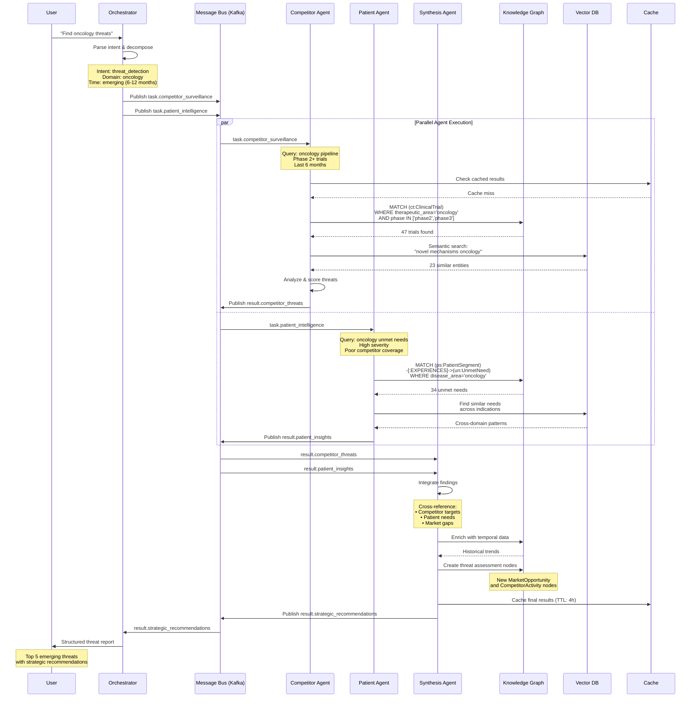
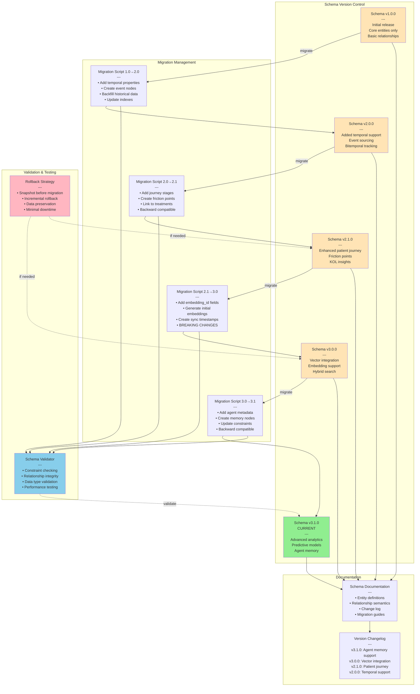
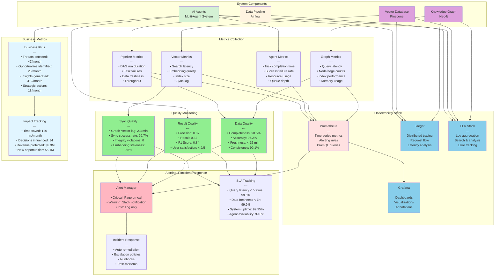
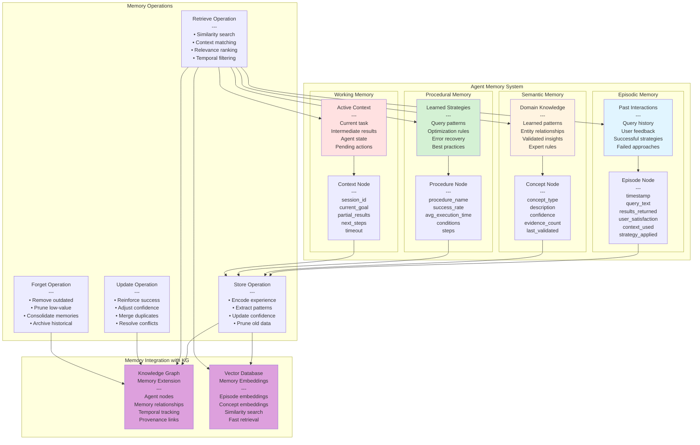
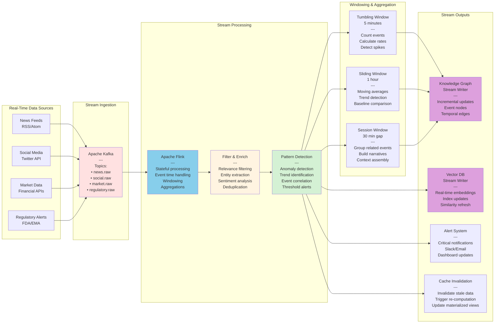
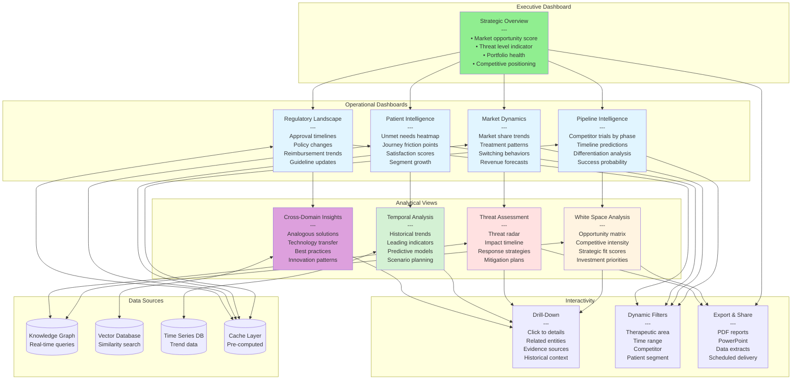
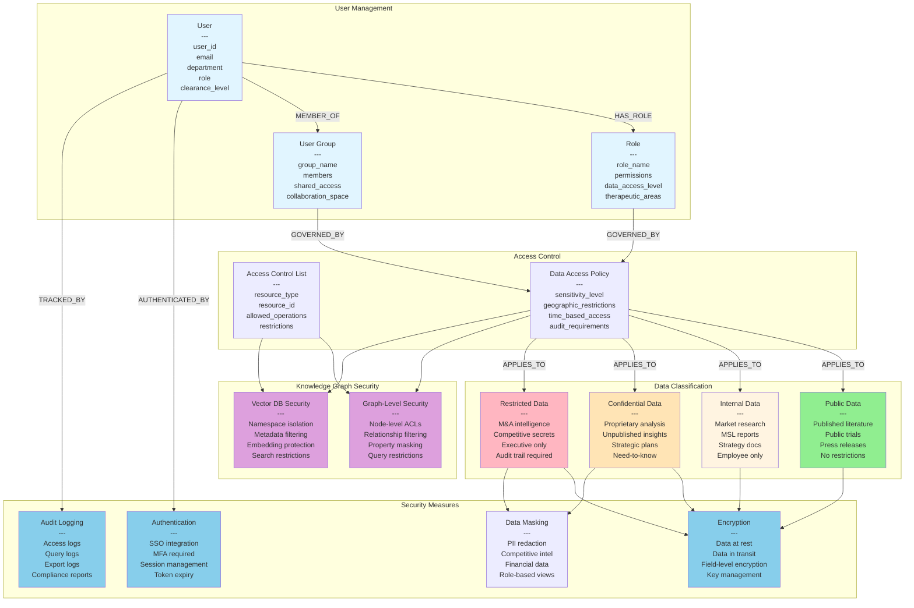

# Additional Knowledge Graph Schema Visualizations

## Agent Communication Flow & Task Orchestration

```mermaid
graph TB
    subgraph "User Interaction Layer"
        USER[User Query:<br/>"Identify emerging threats<br/>in oncology pipeline"]
    end
    
    subgraph "Orchestration Layer"
        ORCH[Master Orchestrator Agent<br/>---<br/>• Parse intent<br/>• Decompose tasks<br/>• Route to specialists<br/>• Synthesize results]
        
        MSG_BUS[Message Bus - Kafka<br/>---<br/>Topics:<br/>• agent.requests<br/>• agent.responses<br/>• agent.events<br/>• agent.alerts]
    end
    
    subgraph "Specialized Agent Pool"
        A1[Competitor Surveillance Agent<br/>---<br/>• Monitor pipeline databases<br/>• Track clinical trials<br/>• Detect new filings<br/>Status: ACTIVE]
        
        A2[Patient Intelligence Agent<br/>---<br/>• Analyze patient segments<br/>• Map unmet needs<br/>• Track RWE patterns<br/>Status: ACTIVE]
        
        A3[Clinical Trial Intelligence Agent<br/>---<br/>• Evaluate trial designs<br/>• Compare endpoints<br/>• Assess differentiation<br/>Status: ACTIVE]
        
        A4[Regulatory & Payer Agent<br/>---<br/>• Monitor FDA/EMA<br/>• Track reimbursement<br/>• Analyze policy shifts<br/>Status: ACTIVE]
        
        A5[Market Dynamics Agent<br/>---<br/>• Assess opportunities<br/>• Forecast trends<br/>• Model scenarios<br/>Status: ACTIVE]
        
        A6[Synthesis & Strategy Agent<br/>---<br/>• Integrate findings<br/>• Generate recommendations<br/>• Create reports<br/>Status: ACTIVE]
    end
    
    subgraph "Data & Knowledge Layer"
        KG[(Knowledge Graph<br/>Neo4j)]
        VDB[(Vector Database<br/>Pinecone)]
        CACHE[(Redis Cache)]
        TS[(Time Series DB<br/>InfluxDB)]
    end
    
    subgraph "Memory & Context"
        STM[Short-Term Memory<br/>---<br/>Current conversation<br/>Recent queries<br/>Session context]
        
        LTM[Long-Term Memory<br/>---<br/>Historical analyses<br/>Validated insights<br/>Learned patterns]
        
        WM[Working Memory<br/>---<br/>Active tasks<br/>Intermediate results<br/>Agent states]
    end
    
    USER --> ORCH
    
    ORCH <--> MSG_BUS
    
    MSG_BUS <--> A1
    MSG_BUS <--> A2
    MSG_BUS <--> A3
    MSG_BUS <--> A4
    MSG_BUS <--> A5
    MSG_BUS <--> A6
    
    A1 <--> KG
    A1 <--> VDB
    A2 <--> KG
    A2 <--> VDB
    A3 <--> KG
    A4 <--> KG
    A5 <--> KG
    A5 <--> VDB
    A5 <--> TS
    A6 <--> KG
    A6 <--> VDB
    
    ORCH <--> STM
    ORCH <--> WM
    A1 <--> LTM
    A2 <--> LTM
    A6 <--> LTM
    
    MSG_BUS <--> CACHE
    
    style USER fill:#e1f5ff
    style ORCH fill:#fff4e1
    style MSG_BUS fill:#ffe1e1
    style A1 fill:#d4f1d4
    style A2 fill:#d4f1d4
    style A3 fill:#d4f1d4
    style A4 fill:#d4f1d4
    style A5 fill:#d4f1d4
    style A6 fill:#90EE90
    style KG fill:#DDA0DD
    style VDB fill:#DDA0DD
    style CACHE fill:#FFE4B5
    style TS fill:#DDA0DD
```

## Detailed Agent Communication Sequence



## Data Ingestion Pipeline Architecture

```mermaid
graph TB
    subgraph "External Data Sources"
        S1[Clinical Trial Registries<br/>ClinicalTrials.gov<br/>EU Clinical Trials<br/>Citeline]
        S2[Regulatory Databases<br/>FDA CDER<br/>EMA<br/>Patent Offices]
        S3[Scientific Literature<br/>PubMed<br/>bioRxiv<br/>Conference Abstracts]
        S4[Claims & RWE<br/>IQVIA<br/>Symphony Health<br/>Flatiron]
        S5[News & Social<br/>News Aggregators<br/>Twitter/X<br/>Patient Forums]
        S6[Financial Data<br/>SEC Filings<br/>Earnings Calls<br/>Market Data]
        S7[Internal Sources<br/>MSL Reports<br/>Sales Data<br/>Market Research]
    end
    
    subgraph "Ingestion Layer"
        API[API Connectors<br/>---<br/>REST/GraphQL clients<br/>Rate limiting<br/>Authentication]
        
        SCRAPE[Web Scrapers<br/>---<br/>Selenium/Playwright<br/>Anti-bot handling<br/>Proxy rotation]
        
        STREAM[Stream Processors<br/>---<br/>Kafka Connect<br/>Real-time feeds<br/>Change data capture]
        
        BATCH[Batch Loaders<br/>---<br/>Airflow DAGs<br/>Scheduled jobs<br/>Incremental loads]
    end
    
    subgraph "Processing Layer"
        VALID[Data Validation<br/>---<br/>Schema validation<br/>Quality checks<br/>Deduplication]
        
        EXTRACT[Entity Extraction<br/>---<br/>NER (BioBERT)<br/>Relationship extraction<br/>Temporal parsing]
        
        ENRICH[Data Enrichment<br/>---<br/>Cross-reference<br/>Normalization<br/>Ontology mapping]
        
        EMBED[Embedding Generation<br/>---<br/>Text embeddings<br/>Context assembly<br/>Vector creation]
    end
    
    subgraph "Orchestration"
        AIRFLOW[Apache Airflow<br/>---<br/>DAG scheduling<br/>Dependency management<br/>Retry logic<br/>Monitoring]
    end
    
    subgraph "Storage Layer"
        RAW[(Raw Data Lake<br/>S3/Azure Blob<br/>---<br/>Parquet files<br/>Partitioned by date<br/>Compressed)]
        
        STAGE[(Staging Database<br/>PostgreSQL<br/>---<br/>Normalized tables<br/>Quality scores<br/>Processing status)]
        
        KG[(Knowledge Graph<br/>Neo4j<br/>---<br/>Entities<br/>Relationships<br/>Temporal data)]
        
        VDB[(Vector Database<br/>Pinecone<br/>---<br/>Embeddings<br/>Metadata<br/>Indexes)]
        
        TS[(Time Series DB<br/>InfluxDB<br/>---<br/>Metrics<br/>Trends<br/>Aggregations)]
    end
    
    subgraph "Quality & Monitoring"
        DQ[Data Quality Monitor<br/>---<br/>Completeness checks<br/>Freshness alerts<br/>Anomaly detection]
        
        PROV[Provenance Tracker<br/>---<br/>Source attribution<br/>Lineage tracking<br/>Audit trail]
        
        ALERT[Alert System<br/>---<br/>Pipeline failures<br/>Quality issues<br/>SLA breaches]
    end
    
    S1 --> API
    S2 --> API
    S3 --> SCRAPE
    S4 --> BATCH
    S5 --> STREAM
    S6 --> API
    S7 --> BATCH
    
    API --> VALID
    SCRAPE --> VALID
    STREAM --> VALID
    BATCH --> VALID
    
    VALID --> RAW
    VALID --> EXTRACT
    
    EXTRACT --> ENRICH
    ENRICH --> EMBED
    
    RAW --> STAGE
    EXTRACT --> STAGE
    ENRICH --> KG
    EMBED --> VDB
    ENRICH --> TS
    
    AIRFLOW -.->|orchestrates| API
    AIRFLOW -.->|orchestrates| SCRAPE
    AIRFLOW -.->|orchestrates| BATCH
    AIRFLOW -.->|orchestrates| VALID
    AIRFLOW -.->|orchestrates| EXTRACT
    
    DQ -.->|monitors| STAGE
    DQ -.->|monitors| KG
    DQ -.->|monitors| VDB
    
    PROV -.->|tracks| RAW
    PROV -.->|tracks| STAGE
    PROV -.->|tracks| KG
    
    DQ --> ALERT
    PROV --> ALERT
    
    style S1 fill:#e1f5ff
    style S2 fill:#e1f5ff
    style S3 fill:#e1f5ff
    style S4 fill:#e1f5ff
    style S5 fill:#e1f5ff
    style S6 fill:#e1f5ff
    style S7 fill:#e1f5ff
    style AIRFLOW fill:#fff4e1
    style KG fill:#DDA0DD
    style VDB fill:#DDA0DD
    style TS fill:#DDA0DD
```

## Schema Evolution & Versioning Strategy



## Monitoring & Observability Architecture



## Query Pattern Library Visualization

```mermaid
graph TB
    subgraph "Query Pattern Categories"
        CAT1[White Space<br/>Discovery]
        CAT2[Competitive<br/>Threat Detection]
        CAT3[Patient Journey<br/>Optimization]
        CAT4[Temporal<br/>Trend Analysis]
        CAT5[Cross-Domain<br/>Discovery]
    end
    
    subgraph "White Space Patterns"
        WS1[Pattern: High Unmet Need<br/>+ Low Competitor Coverage<br/>---<br/>MATCH patient segments<br/>with severe unmet needs<br/>WHERE competitor solutions<br/>are ineffective]
        
        WS2[Pattern: Emerging Need<br/>+ No Solutions<br/>---<br/>MATCH recently identified<br/>unmet needs<br/>WHERE no treatments<br/>in development]
        
        WS3[Pattern: Adjacent Opportunity<br/>---<br/>MATCH successful treatments<br/>in similar indications<br/>WHERE mechanism applicable<br/>to new segments]
    end
    
    subgraph "Threat Detection Patterns"
        TD1[Pattern: Pipeline Advancement<br/>---<br/>MATCH competitor trials<br/>moving to late phase<br/>WHERE targets overlap<br/>with our portfolio]
        
        TD2[Pattern: Disruptive Innovation<br/>---<br/>MATCH novel mechanisms<br/>with strong early data<br/>WHERE addresses current<br/>treatment limitations]
        
        TD3[Pattern: Market Share Erosion<br/>---<br/>MATCH temporal patterns<br/>showing declining share<br/>WHERE competitor activity<br/>correlates with loss]
    end
    
    subgraph "Patient Journey Patterns"
        PJ1[Pattern: Friction Point Analysis<br/>---<br/>MATCH journey stages<br/>with high dropout<br/>WHERE competitor solutions<br/>reduce friction]
        
        PJ2[Pattern: Switching Behavior<br/>---<br/>MATCH patient flows<br/>between treatments<br/>WHERE reasons indicate<br/>addressable gaps]
        
        PJ3[Pattern: Access Barriers<br/>---<br/>MATCH patient segments<br/>with delayed diagnosis<br/>WHERE early intervention<br/>improves outcomes]
    end
    
    subgraph "Temporal Patterns"
        TP1[Pattern: Leading Indicators<br/>---<br/>MATCH historical sequences<br/>of events<br/>WHERE pattern predicts<br/>future market shifts]
        
        TP2[Pattern: Trend Acceleration<br/>---<br/>MATCH time series data<br/>showing rapid change<br/>WHERE trajectory suggests<br/>strategic inflection]
        
        TP3[Pattern: Seasonal Effects<br/>---<br/>MATCH periodic patterns<br/>in treatment uptake<br/>WHERE timing optimization<br/>possible]
    end
    
    subgraph "Cross-Domain Patterns"
        CD1[Pattern: Analogous Solutions<br/>---<br/>MATCH treatments in<br/>different therapeutic areas<br/>WHERE similar patient needs<br/>and mechanisms]
        
        CD2[Pattern: Technology Transfer<br/>---<br/>MATCH digital health tools<br/>successful in one domain<br/>WHERE applicable to<br/>our patient segments]
        
        CD3[Pattern: Regulatory Precedent<br/>---<br/>MATCH approval pathways<br/>in similar indications<br/>WHERE precedent informs<br/>our strategy]
    end
    
    CAT1 --> WS1
    CAT1 --> WS2
    CAT1 --> WS3
    
    CAT2 --> TD1
    CAT2 --> TD2
    CAT2 --> TD3
    
    CAT3 --> PJ1
    CAT3 --> PJ2
    CAT3 --> PJ3
    
    CAT4 --> TP1
    CAT4 --> TP2
    CAT4 --> TP3
    
    CAT5 --> CD1
    CAT5 --> CD2
    CAT5 --> CD3
    
    style CAT1 fill:#e1f5ff
    style CAT2 fill:#ffe1e1
    style CAT3 fill:#fff4e1
    style CAT4 fill:#d4f1d4
    style CAT5 fill:#DDA0DD
```



## Agent Memory Architecture



## Real-Time Streaming Architecture



## Competitive Intelligence Dashboard Schema



## Security & Access Control Schema



## Disaster Recovery & Business Continuity

```mermaid
graph TB
    subgraph "Primary System"
        PRIMARY[Primary Data Center<br/>---<br/>Knowledge Graph (Active)<br/>Vector DB (Active)<br/>Agents (Active)<br/>Full operations]
    end
    
    subgraph "Backup Strategy"
        FULL[Full Backup<br/>---<br/>Frequency: Daily<br/>Retention: 90 days<br/>Storage: S3 Glacier<br/>Encryption: AES-256]
        
        INCR[Incremental Backup<br/>---<br/>Frequency: Hourly<br/>Retention: 7 days<br/>Storage: S3 Standard<br/>Change data capture]
        
        SNAP[Snapshots<br/>---<br/>Frequency: Every 15 min<br/>Retention: 24 hours<br/>Storage: EBS snapshots<br/>Point-in-time recovery]
    end
    
    subgraph "Replication"
        SYNC[Synchronous Replication<br/>---<br/>Target: Hot standby<br/>Lag: < 1 second<br/>Consistency: Strong<br/>Auto-failover enabled]
        
        ASYNC[Asynchronous Replication<br/>---<br/>Target: DR site<br/>Lag: < 5 minutes<br/>Consistency: Eventual<br/>Manual failover]
    end
    
    subgraph "Secondary System"
        STANDBY[Hot Standby<br/>Same Region<br/>---<br/>Knowledge Graph (Standby)<br/>Vector DB (Standby)<br/>Agents (Standby)<br/>Ready for failover]
        
        DR[DR Site<br/>Different Region<br/>---<br/>Knowledge Graph (Warm)<br/>Vector DB (Warm)<br/>Agents (Cold)<br/>RTO: 4 hours<br/>RPO: 15 minutes]
    end
    
    subgraph "Failover Process"
        DETECT[Failure Detection<br/>---<br/>Health checks<br/>Heartbeat monitoring<br/>Automated alerts<br/>Response time: 30s]
        
        SWITCH[Failover Switch<br/>---<br/>DNS update<br/>Load balancer config<br/>Connection rerouting<br/>Switch time: 2 min]
        
        VALIDATE[Validation<br/>---<br/>Data integrity check<br/>Service health<br/>Query testing<br/>User notification]
    end
    
    subgraph "Recovery Procedures"
        RESTORE[Data Restore<br/>---<br/>Select restore point<br/>Validate backups<br/>Restore to target<br/>Verify integrity]
        
        REBUILD[System Rebuild<br/>---<br/>Provision infrastructure<br/>Deploy applications<br/>Restore configurations<br/>Test functionality]
        
        FAILBACK[Failback<br/>---<br/>Sync data forward<br/>Planned maintenance<br/>Gradual traffic shift<br/>Monitor stability]
    end
    
    PRIMARY --> FULL
    PRIMARY --> INCR
    PRIMARY --> SNAP
    
    PRIMARY -->|sync| SYNC
    PRIMARY -->|async| ASYNC
    
    SYNC --> STANDBY
    ASYNC --> DR
    
    PRIMARY -.->|failure| DETECT
    DETECT --> SWITCH
    SWITCH --> STANDBY
    SWITCH --> VALIDATE
    
    FULL --> RESTORE
    INCR --> RESTORE
    SNAP --> RESTORE
    
    RESTORE --> REBUILD
    REBUILD --> FAILBACK
    FAILBACK --> PRIMARY
    
    style PRIMARY fill:#90EE90
    style STANDBY fill:#fff4e1
    style DR fill:#FFE4B5
    style DETECT fill:#FFB6C1
    style SWITCH fill:#FFB6C1
    style VALIDATE fill:#87CEEB
```

---

These additional diagrams cover:

1. **Agent communication** and task orchestration flows
2. **Data ingestion pipeline** with quality monitoring
3. **Schema evolution** and versioning strategies
4. **Monitoring & observability** architecture
5. **Query pattern library** for common use cases
6. **Agent memory systems** with episodic, semantic, and procedural memory
7. **Real-time streaming** architecture for live data
8. **Dashboard schema** for different user roles
9. **Security & access control** with data classification
10. **Disaster recovery** and business continuity planning

**Would you like me to create additional visualizations for specific scenarios—such as a detailed agent decision-making flowchart, specific query optimization patterns, or integration architectures with existing enterprise systems (SAP, Salesforce, Veeva)?** I can also provide diagrams for cost optimization strategies, multi-region deployment architectures, or regulatory compliance workflows (GDPR, HIPAA, SOC 2).