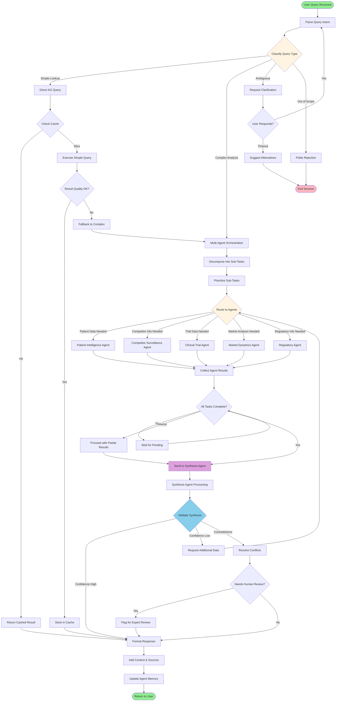

# Agent Decision-Making Flowcharts

## Master Orchestrator Agent Decision Flow

## Competitor Surveillance Agent Decision Flow

```mermaid
flowchart TD
    START([Task Received:<br/>Analyze Competitor Threat]) --> EXTRACT[Extract Parameters]
    
    EXTRACT --> PARAMS{Parameters Complete?}
    PARAMS -->|No| REQUEST[Request Missing Info]
    PARAMS -->|Yes| SCOPE[Define Search Scope]
    
    REQUEST --> WAIT_PARAMS[Wait for Response]
    WAIT_PARAMS --> PARAMS
    
    SCOPE --> STRATEGY{Select Strategy}
    
    STRATEGY -->|Known Competitor| TARGETED[Targeted Analysis]
    STRATEGY -->|Therapeutic Area| BROAD[Broad Surveillance]
    STRATEGY -->|Specific Treatment| FOCUSED[Focused Deep Dive]
    
    TARGETED --> QUERY_COMP[Query Competitor Profile]
    QUERY_COMP --> GET_PIPELINE[Get Pipeline Treatments]
    
    GET_PIPELINE --> FILTER_STAGE{Filter by Stage?}
    FILTER_STAGE -->|Late Stage Only| LATE[Phase 3 + Regulatory]
    FILTER_STAGE -->|All Stages| ALL[Complete Pipeline]
    
    LATE --> ASSESS_THREAT
    ALL --> ASSESS_THREAT
    
    BROAD --> QUERY_AREA[Query Therapeutic Area]
    QUERY_AREA --> IDENTIFY_PLAYERS[Identify Active Competitors]
    IDENTIFY_PLAYERS --> RANK_RELEVANCE[Rank by Relevance]
    RANK_RELEVANCE --> TOP_N{Select Top N}
    TOP_N --> ASSESS_THREAT
    
    FOCUSED --> QUERY_TREAT[Query Specific Treatment]
    QUERY_TREAT --> GET_CONTEXT[Get Full Context]
    
    GET_CONTEXT --> HYBRID_SEARCH{Use Hybrid Search?}
    HYBRID_SEARCH -->|Yes| VECTOR_SEARCH[Semantic Similarity Search]
    HYBRID_SEARCH -->|No| GRAPH_ONLY[Graph Traversal Only]
    
    VECTOR_SEARCH --> MERGE_RESULTS[Merge Vector + Graph]
    GRAPH_ONLY --> ASSESS_THREAT
    MERGE_RESULTS --> ASSESS_THREAT
    
    ASSESS_THREAT[Assess Threat Level] --> SCORE_DIMS{Score Dimensions}
    
    SCORE_DIMS --> MARKET_OVERLAP[Calculate Market Overlap]
    SCORE_DIMS --> PATIENT_IMPACT[Assess Patient Impact]
    SCORE_DIMS --> TIMELINE[Estimate Timeline]
    SCORE_DIMS --> DIFFERENTIATION[Evaluate Differentiation]
    
    MARKET_OVERLAP --> COMBINE
    PATIENT_IMPACT --> COMBINE
    TIMELINE --> COMBINE
    DIFFERENTIATION --> COMBINE
    
    COMBINE[Combine Threat Scores] --> TEMPORAL{Check Temporal Trends}
    
    TEMPORAL --> QUERY_HISTORY[Query Historical Data]
    QUERY_HISTORY --> DETECT_PATTERN[Detect Patterns]
    
    DETECT_PATTERN --> TREND{Trend Direction?}
    TREND -->|Intensifying| ESCALATE[Escalate Priority]
    TREND -->|Stable| MAINTAIN[Maintain Monitoring]
    TREND -->|Declining| DOWNGRADE[Lower Priority]
    
    ESCALATE --> FINAL_SCORE
    MAINTAIN --> FINAL_SCORE
    DOWNGRADE --> FINAL_SCORE
    
    FINAL_SCORE[Calculate Final Threat Score] --> THRESHOLD{Score > Threshold?}
    
    THRESHOLD -->|Critical| ALERT[Generate Alert]
    THRESHOLD -->|Medium| REPORT[Add to Report]
    THRESHOLD -->|Low| LOG[Log for Reference]
    
    ALERT --> ENRICH_ALERT[Enrich with Evidence]
    ENRICH_ALERT --> RECOMMEND[Generate Recommendations]
    
    REPORT --> ENRICH_REPORT[Add Context]
    ENRICH_REPORT --> RECOMMEND
    
    LOG --> STORE_RESULT
    
    RECOMMEND --> VALIDATE_REC{Validate Recommendations}
    
    VALIDATE_REC -->|High Confidence| STORE_RESULT
    VALIDATE_REC -->|Low Confidence| FLAG_REVIEW[Flag for Review]
    
    FLAG_REVIEW --> STORE_RESULT
    
    STORE_RESULT[Store in Knowledge Graph] --> UPDATE_MEMORY[Update Agent Memory]
    
    UPDATE_MEMORY --> LEARN{Learn from Result?}
    
    LEARN -->|Success Pattern| REINFORCE[Reinforce Strategy]
    LEARN -->|Failure Pattern| ADJUST[Adjust Approach]
    LEARN -->|New Pattern| RECORD[Record New Pattern]
    
    REINFORCE --> PUBLISH
    ADJUST --> PUBLISH
    RECORD --> PUBLISH
    
    PUBLISH[Publish Result to Message Bus] --> COMPLETE([Task Complete])
    
    style START fill:#90EE90
    style COMPLETE fill:#90EE90
    style ALERT fill:#FFB6C1
    style STRATEGY fill:#fff4e1
    style HYBRID_SEARCH fill:#DDA0DD
    style VALIDATE_REC fill:#87CEEB
```

## Patient Intelligence Agent Decision Flow

```mermaid
flowchart TD
    START([Task: Identify Unmet Needs]) --> DEFINE_SCOPE[Define Patient Scope]
    
    DEFINE_SCOPE --> HAS_SEGMENT{Segment Specified?}
    
    HAS_SEGMENT -->|Yes| QUERY_SEGMENT[Query Specific Segment]
    HAS_SEGMENT -->|No| DISCOVER_SEGMENTS[Discover Relevant Segments]
    
    DISCOVER_SEGMENTS --> CRITERIA{Apply Criteria}
    CRITERIA --> DISEASE_FILTER[Filter by Disease Area]
    CRITERIA --> SIZE_FILTER[Filter by Segment Size]
    CRITERIA --> GROWTH_FILTER[Filter by Growth Rate]
    
    DISEASE_FILTER --> COMBINE_FILTERS
    SIZE_FILTER --> COMBINE_FILTERS
    GROWTH_FILTER --> COMBINE_FILTERS
    
    COMBINE_FILTERS[Combine Filters] --> QUERY_SEGMENT
    
    QUERY_SEGMENT --> GET_NEEDS[Get Associated Unmet Needs]
    
    GET_NEEDS --> SCORE_NEEDS{Score Each Need}
    
    SCORE_NEEDS --> SEVERITY[Assess Severity]
    SCORE_NEEDS --> PREVALENCE[Check Prevalence]
    SCORE_NEEDS --> IMPACT[Evaluate QoL Impact]
    SCORE_NEEDS --> COMP_COVERAGE[Check Competitor Coverage]
    
    SEVERITY --> CALC_PRIORITY
    PREVALENCE --> CALC_PRIORITY
    IMPACT --> CALC_PRIORITY
    COMP_COVERAGE --> CALC_PRIORITY
    
    CALC_PRIORITY[Calculate Priority Score] --> RANK[Rank Unmet Needs]
    
    RANK --> JOURNEY_ANALYSIS{Analyze Patient Journey?}
    
    JOURNEY_ANALYSIS -->|Yes| MAP_JOURNEY[Map Care Continuum]
    JOURNEY_ANALYSIS -->|No| EVIDENCE_CHECK
    
    MAP_JOURNEY --> IDENTIFY_STAGES[Identify Journey Stages]
    IDENTIFY_STAGES --> FIND_FRICTION[Find Friction Points]
    
    FIND_FRICTION --> FRICTION_SEVERITY{Friction Severity?}
    
    FRICTION_SEVERITY -->|High| PRIORITIZE_FRICTION[Prioritize for Analysis]
    FRICTION_SEVERITY -->|Medium| TRACK_FRICTION[Track for Monitoring]
    FRICTION_SEVERITY -->|Low| DOCUMENT_FRICTION[Document Only]
    
    PRIORITIZE_FRICTION --> LINK_TO_NEEDS[Link to Unmet Needs]
    TRACK_FRICTION --> LINK_TO_NEEDS
    DOCUMENT_FRICTION --> EVIDENCE_CHECK
    
    LINK_TO_NEEDS --> COMPETITOR_SOLUTIONS{Check Competitor Solutions}
    
    COMPETITOR_SOLUTIONS --> QUERY_TREATMENTS[Query Competing Treatments]
    QUERY_TREATMENTS --> EFFECTIVENESS[Assess Effectiveness]
    
    EFFECTIVENESS --> GAP_ANALYSIS{Gap Exists?}
    
    GAP_ANALYSIS -->|Significant Gap| WHITE_SPACE[Identify White Space]
    GAP_ANALYSIS -->|Partial Gap| IMPROVEMENT_OPP[Improvement Opportunity]
    GAP_ANALYSIS -->|No Gap| SATURATED[Market Saturated]
    
    WHITE_SPACE --> CREATE_OPPORTUNITY
    IMPROVEMENT_OPP --> CREATE_OPPORTUNITY
    SATURATED --> EVIDENCE_CHECK
    
    CREATE_OPPORTUNITY[Create Market Opportunity Node] --> EVIDENCE_CHECK
    
    EVIDENCE_CHECK{Sufficient Evidence?} -->|Yes| RWE_ANALYSIS
    EVIDENCE_CHECK -->|No| SEEK_EVIDENCE[Seek Additional Evidence]
    
    SEEK_EVIDENCE --> DATA_SOURCES{Available Sources?}
    DATA_SOURCES -->|Claims Data| QUERY_CLAIMS[Query Claims Database]
    DATA_SOURCES -->|Patient Forums| ANALYZE_FORUMS[Analyze Patient Forums]
    DATA_SOURCES -->|Literature| SEARCH_LITERATURE[Search Scientific Literature]
    
    QUERY_CLAIMS --> INTEGRATE_EVIDENCE
    ANALYZE_FORUMS --> INTEGRATE_EVIDENCE
    SEARCH_LITERATURE --> INTEGRATE_EVIDENCE
    
    INTEGRATE_EVIDENCE[Integrate Evidence] --> RWE_ANALYSIS
    
    RWE_ANALYSIS[Real-World Evidence Analysis] --> PATTERN_DETECT{Detect Patterns}
    
    PATTERN_DETECT --> SWITCHING[Treatment Switching Patterns]
    PATTERN_DETECT --> ADHERENCE[Adherence Challenges]
    PATTERN_DETECT --> OUTCOMES[Outcome Variations]
    
    SWITCHING --> INSIGHTS
    ADHERENCE --> INSIGHTS
    OUTCOMES --> INSIGHTS
    
    INSIGHTS[Generate Insights] --> CONFIDENCE{Confidence Level?}
    
    CONFIDENCE -->|High > 0.8| ACTIONABLE[Mark as Actionable]
    CONFIDENCE -->|Medium 0.5-0.8| HYPOTHESIS[Mark as Hypothesis]
    CONFIDENCE -->|Low < 0.5| EXPLORATORY[Mark as Exploratory]
    
    ACTIONABLE --> RECOMMENDATIONS
    HYPOTHESIS --> RECOMMENDATIONS
    EXPLORATORY --> STORE_FINDINGS
    
    RECOMMENDATIONS[Generate Recommendations] --> STRATEGIC_FIT{Assess Strategic Fit}
    
    STRATEGIC_FIT --> PORTFOLIO_ALIGN[Check Portfolio Alignment]
    STRATEGIC_FIT --> CAPABILITY_MATCH[Match Capabilities]
    STRATEGIC_FIT --> MARKET_SIZE[Evaluate Market Size]
    
    PORTFOLIO_ALIGN --> SCORE_FIT
    CAPABILITY_MATCH --> SCORE_FIT
    MARKET_SIZE --> SCORE_FIT
    
    SCORE_FIT[Calculate Strategic Fit Score] --> PRIORITIZE{Prioritization}
    
    PRIORITIZE -->|Top Priority| ALERT_STRATEGY[Alert Strategy Team]
    PRIORITIZE -->|Medium Priority| REPORT_FINDINGS[Add to Report]
    PRIORITIZE -->|Low Priority| STORE_FINDINGS
    
    ALERT_STRATEGY --> STORE_FINDINGS
    REPORT_FINDINGS --> STORE_FINDINGS
    
    STORE_FINDINGS[Store in Knowledge Graph] --> UPDATE_VECTORS[Update Vector Embeddings]
    
    UPDATE_VECTORS --> CROSS_REFERENCE{Cross-Reference with Other Agents?}
    
    CROSS_REFERENCE -->|Yes| NOTIFY_AGENTS[Notify Relevant Agents]
    CROSS_REFERENCE -->|No| MEMORY_UPDATE
    
    NOTIFY_AGENTS --> MEMORY_UPDATE
    
    MEMORY_UPDATE[Update Agent Memory] --> PUBLISH_RESULT[Publish to Message Bus]
    
    PUBLISH_RESULT --> COMPLETE([Task Complete])
    
    style START fill:#90EE90
    style COMPLETE fill:#90EE90
    style WHITE_SPACE fill:#FFE4B5
    style ALERT_STRATEGY fill:#FFB6C1
    style JOURNEY_ANALYSIS fill:#fff4e1
    style CONFIDENCE fill:#87CEEB
```

## Synthesis Agent Decision Flow

```mermaid
flowchart TD
    START([Receive Multiple Agent Results]) --> COLLECT[Collect All Results]
    
    COLLECT --> COUNT{Result Count}
    
    COUNT -->|< 2| INSUFFICIENT[Insufficient Data]
    COUNT -->|>= 2| VALIDATE_INPUTS[Validate Input Quality]
    
    INSUFFICIENT --> REQUEST_MORE[Request Additional Analysis]
    REQUEST_MORE --> WAIT[Wait for Results]
    WAIT --> COLLECT
    
    VALIDATE_INPUTS --> CHECK_QUALITY{Quality Check}
    
    CHECK_QUALITY --> CONFIDENCE_CHECK[Check Confidence Scores]
    CHECK_QUALITY --> COMPLETENESS[Check Completeness]
    CHECK_QUALITY --> CONSISTENCY[Check Consistency]
    
    CONFIDENCE_CHECK --> QUALITY_SCORE
    COMPLETENESS --> QUALITY_SCORE
    CONSISTENCY --> QUALITY_SCORE
    
    QUALITY_SCORE[Calculate Quality Score] --> THRESHOLD{Score > Threshold?}
    
    THRESHOLD -->|No| FLAG_QUALITY[Flag Quality Issues]
    THRESHOLD -->|Yes| INTEGRATION
    
    FLAG_QUALITY --> DECIDE{Proceed Anyway?}
    DECIDE -->|No| REQUEST_MORE
    DECIDE -->|Yes, with Caveat| ADD_DISCLAIMER[Add Disclaimer]
    
    ADD_DISCLAIMER --> INTEGRATION
    
    INTEGRATION[Integrate Findings] --> DETECT_CONFLICTS{Conflicts Detected?}
    
    DETECT_CONFLICTS -->|Yes| RESOLVE_CONFLICTS
    DETECT_CONFLICTS -->|No| FIND_PATTERNS
    
    RESOLVE_CONFLICTS[Conflict Resolution] --> CONFLICT_TYPE{Conflict Type}
    
    CONFLICT_TYPE -->|Data Contradiction| EVIDENCE_WEIGHT[Weight by Evidence Quality]
    CONFLICT_TYPE -->|Temporal Mismatch| TEMPORAL_ALIGN[Align Temporal Context]
    CONFLICT_TYPE -->|Interpretation Diff| MULTI_PERSPECTIVE[Present Multiple Views]
    
    EVIDENCE_WEIGHT --> RESOLVED
    TEMPORAL_ALIGN --> RESOLVED
    MULTI_PERSPECTIVE --> RESOLVED
    
    RESOLVED[Conflicts Resolved] --> FIND_PATTERNS
    
    FIND_PATTERNS[Identify Cross-Domain Patterns] --> PATTERN_TYPE{Pattern Type}
    
    PATTERN_TYPE --> CONVERGENT[Convergent Evidence]
    PATTERN_TYPE --> COMPLEMENTARY[Complementary Insights]
    PATTERN_TYPE --> EMERGENT[Emergent Patterns]
    
    CONVERGENT --> STRENGTHEN[Strengthen Conclusions]
    COMPLEMENTARY --> BROADEN[Broaden Perspective]
    EMERGENT --> NOVEL_INSIGHT[Identify Novel Insights]
    
    STRENGTHEN --> SYNTHESIS
    BROADEN --> SYNTHESIS
    NOVEL_INSIGHT --> SYNTHESIS
    
    SYNTHESIS[Synthesize Strategic View] --> CONTEXT_ASSEMBLY{Assemble Context}
    
    CONTEXT_ASSEMBLY --> PATIENT_CONTEXT[Patient Intelligence Context]
    CONTEXT_ASSEMBLY --> COMPETITIVE_CONTEXT[Competitive Context]
    CONTEXT_ASSEMBLY --> MARKET_CONTEXT[Market Dynamics Context]
    CONTEXT_ASSEMBLY --> REGULATORY_CONTEXT[Regulatory Context]
    
    PATIENT_CONTEXT --> BUILD_NARRATIVE
    COMPETITIVE_CONTEXT --> BUILD_NARRATIVE
    MARKET_CONTEXT --> BUILD_NARRATIVE
    REGULATORY_CONTEXT --> BUILD_NARRATIVE
    
    BUILD_NARRATIVE[Build Strategic Narrative] --> OPPORTUNITY_ID{Identify Opportunities}
    
    OPPORTUNITY_ID --> WHITE_SPACE[White Space Opportunities]
    OPPORTUNITY_ID --> THREAT_MITIGATION[Threat Mitigation Needs]
    OPPORTUNITY_ID --> COMPETITIVE_ADVANTAGE[Competitive Advantages]
    
    WHITE_SPACE --> SCORE_OPPORTUNITIES
    THREAT_MITIGATION --> SCORE_OPPORTUNITIES
    COMPETITIVE_ADVANTAGE --> SCORE_OPPORTUNITIES
    
    SCORE_OPPORTUNITIES[Score & Rank Opportunities] --> STRATEGIC_FIT{Assess Strategic Fit}
    
    STRATEGIC_FIT --> ALIGNMENT[Portfolio Alignment]
    STRATEGIC_FIT --> FEASIBILITY[Feasibility Analysis]
    STRATEGIC_FIT --> IMPACT[Potential Impact]
    STRATEGIC_FIT --> URGENCY[Urgency Assessment]
    
    ALIGNMENT --> PRIORITY_MATRIX
    FEASIBILITY --> PRIORITY_MATRIX
    IMPACT --> PRIORITY_MATRIX
    URGENCY --> PRIORITY_MATRIX
    
    PRIORITY_MATRIX[Create Priority Matrix] --> RECOMMENDATIONS{Generate Recommendations}
    
    RECOMMENDATIONS --> IMMEDIATE[Immediate Actions]
    RECOMMENDATIONS --> SHORT_TERM[Short-Term Initiatives]
    RECOMMENDATIONS --> LONG_TERM[Long-Term Strategy]
    
    IMMEDIATE --> ACTIONABILITY
    SHORT_TERM --> ACTIONABILITY
    LONG_TERM --> ACTIONABILITY
    
    ACTIONABILITY[Ensure Actionability] --> SPECIFICITY{Specific Enough?}
    
    SPECIFICITY -->|No| REFINE[Refine Recommendations]
    SPECIFICITY -->|Yes| EVIDENCE_LINK
    
    REFINE --> SPECIFICITY
    
    EVIDENCE_LINK[Link to Evidence] --> TRACE{Create Traceability}
    
    TRACE --> SOURCE_ATTRIBUTION[Attribute to Sources]
    TRACE --> REASONING_CHAIN[Document Reasoning Chain]
    TRACE --> CONFIDENCE_LEVELS[Assign Confidence Levels]
    
    SOURCE_ATTRIBUTION --> QUALITY_ASSURANCE
    REASONING_CHAIN --> QUALITY_ASSURANCE
    CONFIDENCE_LEVELS --> QUALITY_ASSURANCE
    
    QUALITY_ASSURANCE[Quality Assurance Check] --> FINAL_REVIEW{Final Review}
    
    FINAL_REVIEW -->|Issues Found| REVISE[Revise Synthesis]
    FINAL_REVIEW -->|Approved| FORMAT_OUTPUT
    
    REVISE --> BUILD_NARRATIVE
    
    FORMAT_OUTPUT[Format Output] --> OUTPUT_TYPE{Output Type}
    
    OUTPUT_TYPE --> EXECUTIVE_SUMMARY[Executive Summary]
    OUTPUT_TYPE --> DETAILED_REPORT[Detailed Report]
    OUTPUT_TYPE --> DASHBOARD_UPDATE[Dashboard Update]
    OUTPUT_TYPE --> ALERT_GENERATION[Alert Generation]
    
    EXECUTIVE_SUMMARY --> STORE_RESULTS
    DETAILED_REPORT --> STORE_RESULTS
    DASHBOARD_UPDATE --> STORE_RESULTS
    ALERT_GENERATION --> STORE_RESULTS
    
    STORE_RESULTS[Store in Knowledge Graph] --> CREATE_NODES{Create New Nodes}
    
    CREATE_NODES --> OPPORTUNITY_NODES[Market Opportunity Nodes]
    CREATE_NODES --> INSIGHT_NODES[Strategic Insight Nodes]
    CREATE_NODES --> RECOMMENDATION_NODES[Recommendation Nodes]
    
    OPPORTUNITY_NODES --> LINK_ENTITIES
    INSIGHT_NODES --> LINK_ENTITIES
    RECOMMENDATION_NODES --> LINK_ENTITIES
    
    LINK_ENTITIES[Link to Source Entities] --> UPDATE_EMBEDDINGS[Update Vector Embeddings]
    
    UPDATE_EMBEDDINGS --> MEMORY_UPDATE[Update Agent Memory]
    
    MEMORY_UPDATE --> LEARN{Learning Opportunity?}
    
    LEARN -->|Successful Pattern| RECORD_SUCCESS[Record Success Pattern]
    LEARN -->|Novel Approach| RECORD_INNOVATION[Record Innovation]
    LEARN -->|Improvement Needed| RECORD_LESSON[Record Lesson Learned]
    
    RECORD_SUCCESS --> PUBLISH
    RECORD_INNOVATION --> PUBLISH
    RECORD_LESSON --> PUBLISH
    
    PUBLISH[Publish to Message Bus] --> NOTIFY{Notify Stakeholders}
    
    NOTIFY -->|Critical Findings| IMMEDIATE_ALERT[Send Immediate Alert]
    NOTIFY -->|Standard Update| SCHEDULED_REPORT[Add to Scheduled Report]
    
    IMMEDIATE_ALERT --> COMPLETE
    SCHEDULED_REPORT --> COMPLETE
    
    COMPLETE([Synthesis Complete])
    
    style START fill:#90EE90
    style COMPLETE fill:#90EE90
    style DETECT_CONFLICTS fill:#FFB6C1
    style NOVEL_INSIGHT fill:#FFE4B5
    style PRIORITY_MATRIX fill:#fff4e1
    style QUALITY_ASSURANCE fill:#87CEEB
```

## Clinical Trial Intelligence Agent Decision Flow

```mermaid
flowchart TD
    START([Task: Analyze Trial Landscape]) --> SCOPE_DEF[Define Analysis Scope]
    
    SCOPE_DEF --> SCOPE_TYPE{Scope Type}
    
    SCOPE_TYPE -->|Competitor Trial| COMP_TRIAL[Analyze Specific Trial]
    SCOPE_TYPE -->|Therapeutic Area| AREA_SCAN[Scan Area Trials]
    SCOPE_TYPE -->|Endpoint Analysis| ENDPOINT_FOCUS[Focus on Endpoints]
    
    COMP_TRIAL --> GET_TRIAL[Retrieve Trial Data]
    GET_TRIAL --> ENRICH_TRIAL[Enrich with Context]
    
    ENRICH_TRIAL --> TRIAL_DETAILS{Extract Details}
    TRIAL_DETAILS --> DESIGN[Study Design]
    TRIAL_DETAILS --> POPULATION[Patient Population]
    TRIAL_DETAILS --> ENDPOINTS_PRIMARY[Primary Endpoints]
    TRIAL_DETAILS --> ENDPOINTS_SECONDARY[Secondary Endpoints]
    
    DESIGN --> ANALYZE_DESIGN
    POPULATION --> ANALYZE_POPULATION
    ENDPOINTS_PRIMARY --> ANALYZE_ENDPOINTS
    ENDPOINTS_SECONDARY --> ANALYZE_ENDPOINTS
    
    AREA_SCAN --> QUERY_TRIALS[Query Trials in Area]
    QUERY_TRIALS --> FILTER_TRIALS{Apply Filters}
    
    FILTER_TRIALS --> PHASE_FILTER[Filter by Phase]
    FILTER_TRIALS --> STATUS_FILTER[Filter by Status]
    FILTER_TRIALS --> SPONSOR_FILTER[Filter by Sponsor]
    
    PHASE_FILTER --> AGGREGATE
    STATUS_FILTER --> AGGREGATE
    SPONSOR_FILTER --> AGGREGATE
    
    AGGREGATE[Aggregate Trial Data] --> LANDSCAPE_VIEW[Create Landscape View]
    LANDSCAPE_VIEW --> ANALYZE_DESIGN
    
    ENDPOINT_FOCUS --> QUERY_ENDPOINTS[Query Endpoint Patterns]
    QUERY_ENDPOINTS --> COMPARE_ENDPOINTS[Compare Across Trials]
    COMPARE_ENDPOINTS --> ANALYZE_ENDPOINTS
    
    ANALYZE_DESIGN[Analyze Trial Design] --> DESIGN_ASSESSMENT{Design Quality}
    
    DESIGN_ASSESSMENT --> RANDOMIZATION[Check Randomization]
    DESIGN_ASSESSMENT --> BLINDING[Assess Blinding]
    DESIGN_ASSESSMENT --> COMPARATOR[Evaluate Comparator]
    DESIGN_ASSESSMENT --> DURATION[Review Duration]
    
    RANDOMIZATION --> DESIGN_SCORE
    BLINDING --> DESIGN_SCORE
    COMPARATOR --> DESIGN_SCORE
    DURATION --> DESIGN_SCORE
    
    DESIGN_SCORE[Calculate Design Score] --> ANALYZE_POPULATION
    
    ANALYZE_POPULATION[Analyze Patient Population] --> POP_ASSESSMENT{Population Assessment}
    
    POP_ASSESSMENT --> INCLUSION[Review Inclusion Criteria]
    POP_ASSESSMENT --> EXCLUSION[Review Exclusion Criteria]
    POP_ASSESSMENT --> DIVERSITY[Assess Diversity]
    POP_ASSESSMENT --> REAL_WORLD[Compare to Real-World]
    
    INCLUSION --> POPULATION_SCORE
    EXCLUSION --> POPULATION_SCORE
    DIVERSITY --> POPULATION_SCORE
    REAL_WORLD --> POPULATION_SCORE
    
    POPULATION_SCORE[Calculate Population Score] --> PATIENT_CENTRICITY{Patient-Centric?}
    
    PATIENT_CENTRICITY -->|High| PC_HIGH[High Patient Centricity]
    PATIENT_CENTRICITY -->|Medium| PC_MED[Medium Patient Centricity]
    PATIENT_CENTRICITY -->|Low| PC_LOW[Low Patient Centricity]
    
    PC_HIGH --> ANALYZE_ENDPOINTS
    PC_MED --> ANALYZE_ENDPOINTS
    PC_LOW --> ANALYZE_ENDPOINTS
    
    ANALYZE_ENDPOINTS[Analyze Endpoints] --> ENDPOINT_TYPES{Endpoint Types}
    
    ENDPOINT_TYPES --> CLINICAL[Clinical Endpoints]
    ENDPOINT_TYPES --> PRO[Patient-Reported Outcomes]
    ENDPOINT_TYPES --> SURROGATE[Surrogate Markers]
    ENDPOINT_TYPES --> COMPOSITE[Composite Endpoints]
    
    CLINICAL --> ENDPOINT_RELEVANCE
    PRO --> ENDPOINT_RELEVANCE
    SURROGATE --> ENDPOINT_RELEVANCE
    COMPOSITE --> ENDPOINT_RELEVANCE
    
    ENDPOINT_RELEVANCE[Assess Endpoint Relevance] --> PATIENT_PRIORITY{Match Patient Priorities?}
    
    PATIENT_PRIORITY -->|High Match| STRONG_ALIGNMENT[Strong Patient Alignment]
    PATIENT_PRIORITY -->|Partial Match| PARTIAL_ALIGNMENT[Partial Alignment]
    PATIENT_PRIORITY -->|Poor Match| WEAK_ALIGNMENT[Weak Alignment]
    
    STRONG_ALIGNMENT --> DIFFERENTIATION
    PARTIAL_ALIGNMENT --> DIFFERENTIATION
    WEAK_ALIGNMENT --> DIFFERENTIATION
    
    DIFFERENTIATION[Assess Differentiation] --> COMPARE{Compare to Competitors}
    
    COMPARE --> NOVEL_ENDPOINTS[Novel Endpoints Used?]
    COMPARE --> BETTER_POPULATION[Better Population?]
    COMPARE --> INNOVATIVE_DESIGN[Innovative Design?]
    
    NOVEL_ENDPOINTS --> DIFF_SCORE
    BETTER_POPULATION --> DIFF_SCORE
    INNOVATIVE_DESIGN --> DIFF_SCORE
    
    DIFF_SCORE[Calculate Differentiation Score] --> COMPETITIVE_THREAT{Threat Assessment}
    
    COMPETITIVE_THREAT --> OVERLAP[Market Overlap Analysis]
    OVERLAP --> TIMELINE[Estimate Timeline to Market]
    TIMELINE --> SUCCESS_PROB[Estimate Success Probability]
    
    SUCCESS_PROB --> THREAT_LEVEL{Threat Level}
    
    THREAT_LEVEL -->|High| HIGH_THREAT[High Threat]
    THREAT_LEVEL -->|Medium| MED_THREAT[Medium Threat]
    THREAT_LEVEL -->|Low| LOW_THREAT[Low Threat]
    
    HIGH_THREAT --> RECOMMENDATIONS
    MED_THREAT --> RECOMMENDATIONS
    LOW_THREAT --> RECOMMENDATIONS
    
    RECOMMENDATIONS[Generate Recommendations] --> REC_TYPE{Recommendation Type}
    
    REC_TYPE --> TRIAL_DESIGN_REC[Trial Design Improvements]
    REC_TYPE --> ENDPOINT_REC[Endpoint Recommendations]
    REC_TYPE --> POPULATION_REC[Population Strategy]
    REC_TYPE --> COMPETITIVE_REC[Competitive Response]
    
    TRIAL_DESIGN_REC --> VALIDATE_REC
    ENDPOINT_REC --> VALIDATE_REC
    POPULATION_REC --> VALIDATE_REC
    COMPETITIVE_REC --> VALIDATE_REC
    
    VALIDATE_REC[Validate Recommendations] --> EVIDENCE_SUPPORT{Sufficient Evidence?}
    
    EVIDENCE_SUPPORT -->|Yes| CONFIDENCE_HIGH[High Confidence]
    EVIDENCE_SUPPORT -->|Partial| CONFIDENCE_MED[Medium Confidence]
    EVIDENCE_SUPPORT -->|No| SEEK_MORE_DATA[Seek More Data]
    
    SEEK_MORE_DATA --> LITERATURE_SEARCH[Search Literature]
    LITERATURE_SEARCH --> VALIDATE_REC
    
    CONFIDENCE_HIGH --> STORE_INSIGHTS
    CONFIDENCE_MED --> STORE_INSIGHTS
    
    STORE_INSIGHTS[Store in Knowledge Graph] --> CREATE_RELATIONSHIPS{Create Relationships}
    
    CREATE_RELATIONSHIPS --> LINK_TRIALS[Link Trial to Competitors]
    CREATE_RELATIONSHIPS --> LINK_TREATMENTS[Link to Treatments]
    CREATE_RELATIONSHIPS --> LINK_UNMET_NEEDS[Link to Unmet Needs]
    
    LINK_TRIALS --> UPDATE_TEMPORAL
    LINK_TREATMENTS --> UPDATE_TEMPORAL
    LINK_UNMET_NEEDS --> UPDATE_TEMPORAL
    
    UPDATE_TEMPORAL[Update Temporal Data] --> TRACK_CHANGES{Track Changes Over Time}
    
    TRACK_CHANGES --> PHASE_PROGRESSION[Track Phase Progression]
    TRACK_CHANGES --> ENROLLMENT_RATE[Monitor Enrollment Rate]
    TRACK_CHANGES --> DESIGN_AMENDMENTS[Track Design Changes]
    
    PHASE_PROGRESSION --> MEMORY_UPDATE
    ENROLLMENT_RATE --> MEMORY_UPDATE
    DESIGN_AMENDMENTS --> MEMORY_UPDATE
    
    MEMORY_UPDATE[Update Agent Memory] --> PATTERN_LEARNING{Learn Patterns}
    
    PATTERN_LEARNING --> SUCCESS_PATTERNS[Successful Trial Patterns]
    PATTERN_LEARNING --> FAILURE_PATTERNS[Failure Indicators]
    PATTERN_LEARNING --> INNOVATION_PATTERNS[Innovation Trends]
    
    SUCCESS_PATTERNS --> PUBLISH
    FAILURE_PATTERNS --> PUBLISH
    INNOVATION_PATTERNS --> PUBLISH
    
    PUBLISH[Publish Results] --> COMPLETE([Task Complete])
    
    style START fill:#90EE90
    style COMPLETE fill:#90EE90
    style HIGH_THREAT fill:#FFB6C1
    style STRONG_ALIGNMENT fill:#90EE90
    style DIFFERENTIATION fill:#fff4e1
    style VALIDATE_REC fill:#87CEEB
```

## Market Dynamics Agent Decision Flow

```mermaid
flowchart TD
    START([Task: Analyze Market Dynamics]) --> DEFINE_MARKET[Define Market Scope]
    
    DEFINE_MARKET --> MARKET_TYPE{Market Type}
    
    MARKET_TYPE -->|Therapeutic Area| AREA_MARKET[Therapeutic Area Market]
    MARKET_TYPE -->|Patient Segment| SEGMENT_MARKET[Patient Segment Market]
    MARKET_TYPE -->|Geographic| GEO_MARKET[Geographic Market]
    
    AREA_MARKET --> COLLECT_DATA
    SEGMENT_MARKET --> COLLECT_DATA
    GEO_MARKET --> COLLECT_DATA
    
    COLLECT_DATA[Collect Market Data] --> DATA_SOURCES{Data Sources}
    
    DATA_SOURCES --> CLAIMS[Claims Data]
    DATA_SOURCES --> SALES[Sales Data]
    DATA_SOURCES --> PRESCRIPTION[Prescription Data]
    DATA_SOURCES --> FINANCIAL[Financial Reports]
    
    CLAIMS --> INTEGRATE_DATA
    SALES --> INTEGRATE_DATA
    PRESCRIPTION --> INTEGRATE_DATA
    FINANCIAL --> INTEGRATE_DATA
    
    INTEGRATE_DATA[Integrate Data Sources] --> TEMPORAL_ANALYSIS{Temporal Analysis}
    
    TEMPORAL_ANALYSIS --> CURRENT_STATE[Current State Analysis]
    TEMPORAL_ANALYSIS --> HISTORICAL_TRENDS[Historical Trend Analysis]
    TEMPORAL_ANALYSIS --> FORECAST[Forecast Future State]
    
    CURRENT_STATE --> MARKET_SHARE[Calculate Market Share]
    MARKET_SHARE --> COMPETITIVE_POSITION[Assess Competitive Position]
    
    COMPETITIVE_POSITION --> POSITION_TYPE{Position Type}
    POSITION_TYPE -->|Leader| LEADER_ANALYSIS[Leader Analysis]
    POSITION_TYPE -->|Challenger| CHALLENGER_ANALYSIS[Challenger Analysis]
    POSITION_TYPE -->|Follower| FOLLOWER_ANALYSIS[Follower Analysis]
    POSITION_TYPE -->|Niche| NICHE_ANALYSIS[Niche Analysis]
    
    LEADER_ANALYSIS --> MARKET_DYNAMICS
    CHALLENGER_ANALYSIS --> MARKET_DYNAMICS
    FOLLOWER_ANALYSIS --> MARKET_DYNAMICS
    NICHE_ANALYSIS --> MARKET_DYNAMICS
    
    HISTORICAL_TRENDS --> TREND_DETECTION[Detect Trends]
    TREND_DETECTION --> TREND_TYPE{Trend Type}
    
    TREND_TYPE --> GROWTH_TREND[Growth Trends]
    TREND_TYPE --> SWITCHING_TREND[Switching Patterns]
    TREND_TYPE --> PRICING_TREND[Pricing Dynamics]
    TREND_TYPE --> ACCESS_TREND[Access Patterns]
    
    GROWTH_TREND --> MARKET_DYNAMICS
    SWITCHING_TREND --> MARKET_DYNAMICS
    PRICING_TREND --> MARKET_DYNAMICS
    ACCESS_TREND --> MARKET_DYNAMICS
    
    FORECAST --> FORECAST_METHOD{Forecasting Method}
    
    FORECAST_METHOD --> TIME_SERIES[Time Series Analysis]
    FORECAST_METHOD --> REGRESSION[Regression Models]
    FORECAST_METHOD --> SCENARIO[Scenario Planning]
    
    TIME_SERIES --> PREDICTIONS
    REGRESSION --> PREDICTIONS
    SCENARIO --> PREDICTIONS
    
    PREDICTIONS[Generate Predictions] --> CONFIDENCE_INTERVALS[Calculate Confidence Intervals]
    CONFIDENCE_INTERVALS --> MARKET_DYNAMICS
    
    MARKET_DYNAMICS[Analyze Market Dynamics] --> FORCES{Analyze Forces}
    
    FORCES --> COMPETITIVE_INTENSITY[Competitive Intensity]
    FORCES --> PATIENT_POWER[Patient Bargaining Power]
    FORCES --> PAYER_PRESSURE[Payer Pressure]
    FORCES --> REGULATORY_IMPACT[Regulatory Impact]
    FORCES --> INNOVATION_RATE[Innovation Rate]
    
    COMPETITIVE_INTENSITY --> OPPORTUNITY_ANALYSIS
    PATIENT_POWER --> OPPORTUNITY_ANALYSIS
    PAYER_PRESSURE --> OPPORTUNITY_ANALYSIS
    REGULATORY_IMPACT --> OPPORTUNITY_ANALYSIS
    INNOVATION_RATE --> OPPORTUNITY_ANALYSIS
    
    OPPORTUNITY_ANALYSIS[Opportunity Analysis] --> IDENTIFY_OPPS{Identify Opportunities}
    
    IDENTIFY_OPPS --> WHITE_SPACE[White Space Opportunities]
    IDENTIFY_OPPS --> GROWTH_OPPS[Growth Opportunities]
    IDENTIFY_OPPS --> EXPANSION_OPPS[Expansion Opportunities]
    
    WHITE_SPACE --> SCORE_OPPS
    GROWTH_OPPS --> SCORE_OPPS
    EXPANSION_OPPS --> SCORE_OPPS
    
    SCORE_OPPS[Score Opportunities] --> SCORING_DIMS{Scoring Dimensions}
    
    SCORING_DIMS --> MARKET_SIZE[Market Size]
    SCORING_DIMS --> GROWTH_RATE[Growth Rate]
    SCORING_DIMS --> COMPETITIVE_INT[Competitive Intensity]
    SCORING_DIMS --> STRATEGIC_FIT[Strategic Fit]
    SCORING_DIMS --> BARRIERS[Barriers to Entry]
    
    MARKET_SIZE --> FINAL_SCORE
    GROWTH_RATE --> FINAL_SCORE
    COMPETITIVE_INT --> FINAL_SCORE
    STRATEGIC_FIT --> FINAL_SCORE
    BARRIERS --> FINAL_SCORE
    
    FINAL_SCORE[Calculate Final Scores] --> RANK_OPPS[Rank Opportunities]
    
    RANK_OPPS --> VALIDATE_OPPS{Validate Opportunities}
    
    VALIDATE_OPPS --> CROSS_CHECK[Cross-Check with Other Agents]
    CROSS_CHECK --> PATIENT_VALIDATION[Validate with Patient Intelligence]
    CROSS_CHECK --> COMP_VALIDATION[Validate with Competitor Intel]
    
    PATIENT_VALIDATION --> VALIDATION_RESULT
    COMP_VALIDATION --> VALIDATION_RESULT
    
    VALIDATION_RESULT{Validation Result} -->|Confirmed| HIGH_PRIORITY[High Priority Opportunity]
    VALIDATION_RESULT -->|Partial| MEDIUM_PRIORITY[Medium Priority]
    VALIDATION_RESULT -->|Contradicted| LOW_PRIORITY[Low Priority]
    
    HIGH_PRIORITY --> RECOMMENDATIONS
    MEDIUM_PRIORITY --> RECOMMENDATIONS
    LOW_PRIORITY --> STORE_RESULTS
    
    RECOMMENDATIONS[Generate Recommendations] --> REC_CATEGORIES{Recommendation Categories}
    
    REC_CATEGORIES --> INVESTMENT_REC[Investment Recommendations]
    REC_CATEGORIES --> POSITIONING_REC[Positioning Strategy]
    REC_CATEGORIES --> PRICING_REC[Pricing Strategy]
    REC_CATEGORIES --> ACCESS_REC[Access Strategy]
    
    INVESTMENT_REC --> ACTIONABLE_RECS
    POSITIONING_REC --> ACTIONABLE_RECS
    PRICING_REC --> ACTIONABLE_RECS
    ACCESS_REC --> ACTIONABLE_RECS
    
    ACTIONABLE_RECS[Create Actionable Recommendations] --> STORE_RESULTS
    
    STORE_RESULTS[Store in Knowledge Graph] --> CREATE_MARKET_OPP[Create Market Opportunity Nodes]
    
    CREATE_MARKET_OPP --> LINK_ENTITIES{Link to Entities}
    
    LINK_ENTITIES --> LINK_SEGMENTS[Link to Patient Segments]
    LINK_ENTITIES --> LINK_COMPETITORS[Link to Competitors]
    LINK_ENTITIES --> LINK_TREATMENTS[Link to Treatments]
    
    LINK_SEGMENTS --> UPDATE_EMBEDDINGS
    LINK_COMPETITORS --> UPDATE_EMBEDDINGS
    LINK_TREATMENTS --> UPDATE_EMBEDDINGS
    
    UPDATE_EMBEDDINGS[Update Vector Embeddings] --> MEMORY_UPDATE[Update Agent Memory]
    
    MEMORY_UPDATE --> PUBLISH[Publish Results]
    
    PUBLISH --> COMPLETE([Task Complete])
    
    style START fill:#90EE90
    style COMPLETE fill:#90EE90
    style HIGH_PRIORITY fill:#90EE90
    style WHITE_SPACE fill:#FFE4B5
    style VALIDATE_OPPS fill:#87CEEB
    style MARKET_DYNAMICS fill:#fff4e1
```

---

These flowcharts provide detailed decision-making logic for:

1. **Master Orchestrator Agent** - Query routing, task decomposition, and result synthesis coordination
2. **Competitor Surveillance Agent** - Threat detection, pipeline monitoring, and competitive assessment
3. **Patient Intelligence Agent** - Unmet need identification, patient journey analysis, and white space discovery
4. **Synthesis Agent** - Multi-source integration, conflict resolution, and strategic recommendation generation
5. **Clinical Trial Intelligence Agent** - Trial design analysis, endpoint assessment, and differentiation evaluation
6. **Market Dynamics Agent** - Market analysis, opportunity scoring, and strategic positioning

**Would you like me to create additional flowcharts for specific scenarios—such as error handling and recovery workflows, real-time alert decision trees, agent learning and adaptation processes, or human-in-the-loop intervention points?** I can also provide flowcharts for specific query patterns (e.g., "find emerging threats in oncology") or agent collaboration scenarios where multiple agents need to coordinate their decision-making.