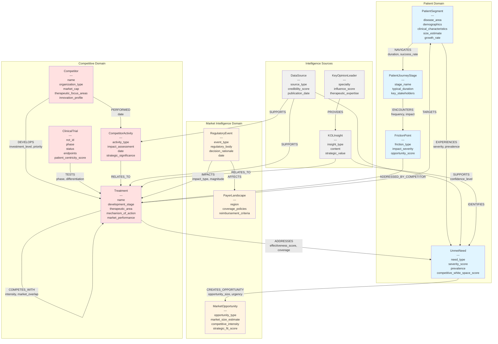
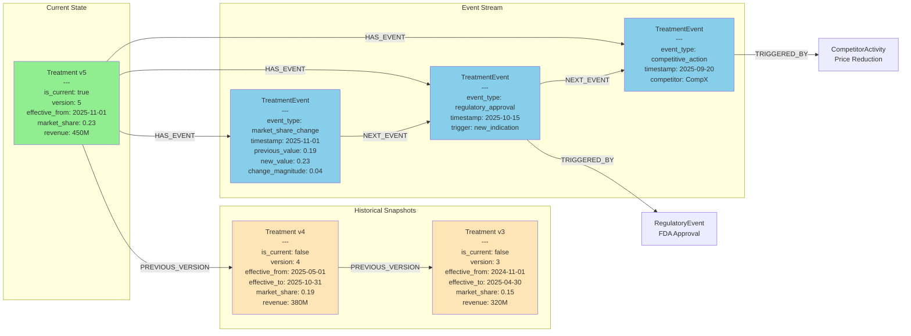
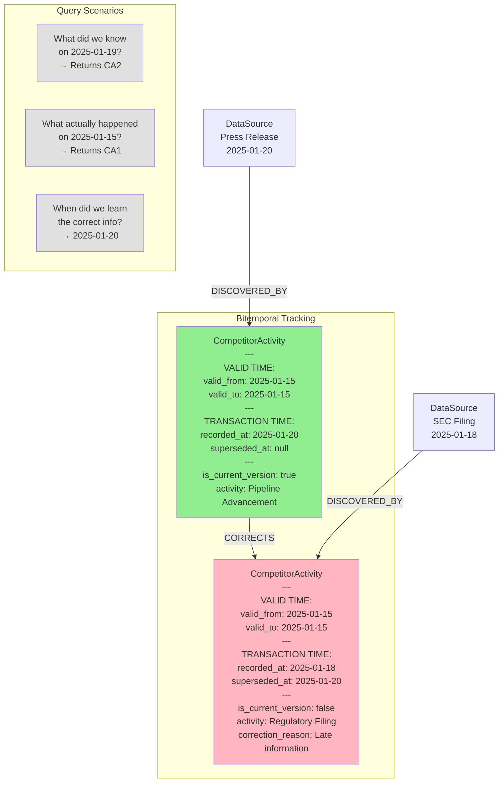
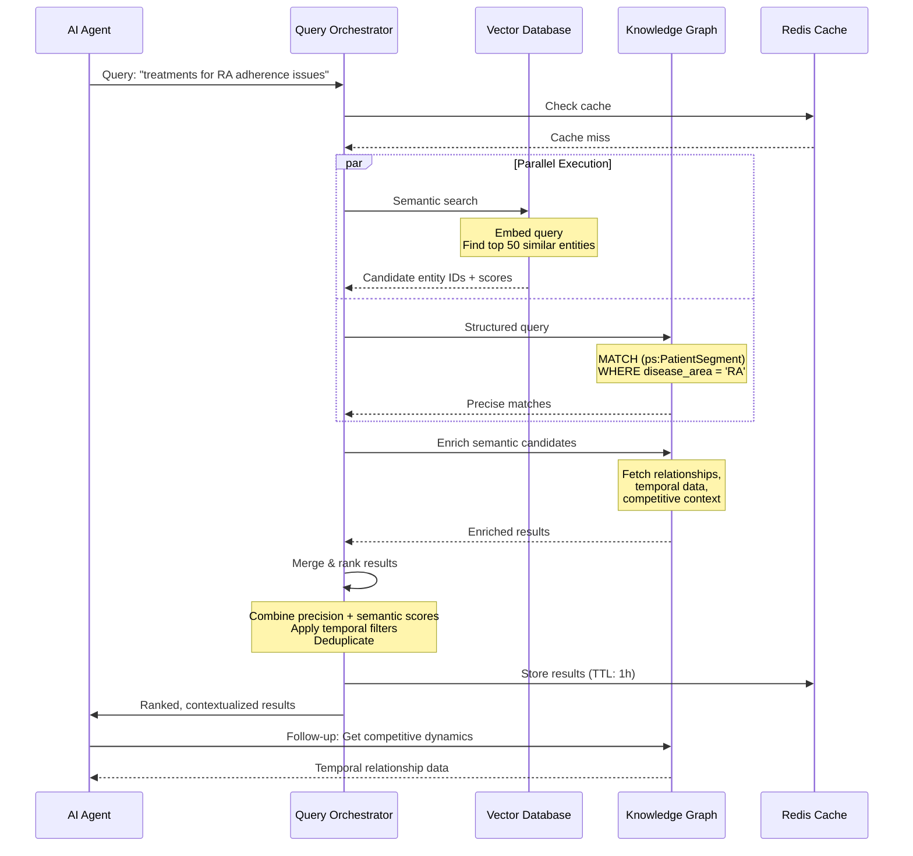
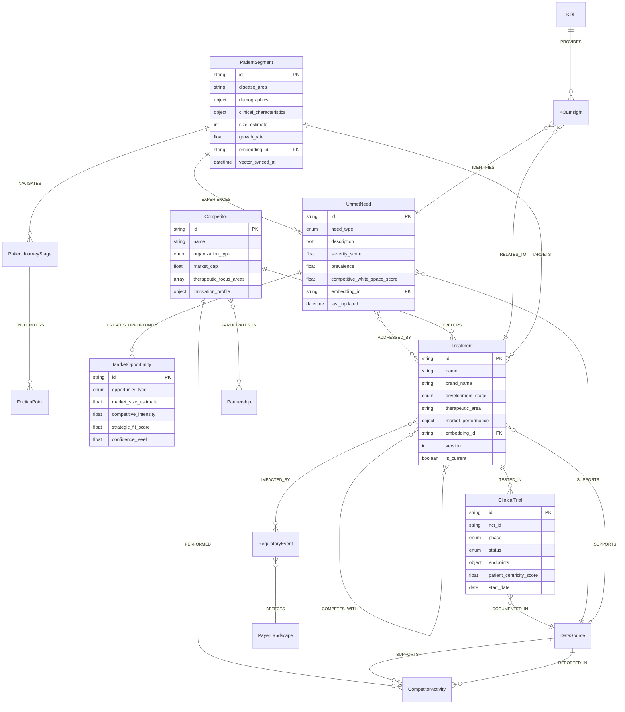
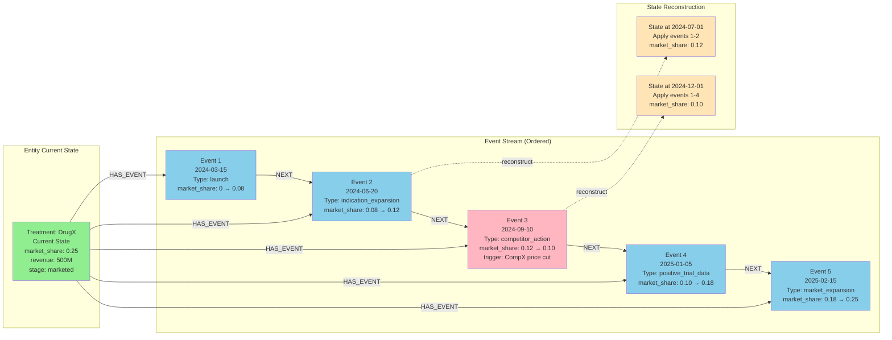

# Knowledge Graph Schema Visualization Using Mermaid

## Core Patient-Centric Competitive Intelligence Schema



## Temporal Relationship Schema



## Temporal Competitive Dynamics Schema

```mermaid
graph TB
    subgraph "Time-Varying Relationships"
        T1[Treatment A<br/>OurCompany]
        T2[Treatment B<br/>Competitor X]
        
        T1 -.->|COMPETES_WITH<br/>valid_from: 2024-01-01<br/>valid_to: 2024-06-30<br/>competitive_intensity: 6.5<br/>market_overlap: 0.42| T2
        
        T1 ==>|COMPETES_WITH<br/>valid_from: 2024-07-01<br/>valid_to: 2025-01-31<br/>competitive_intensity: 8.2<br/>market_overlap: 0.58<br/>trend: intensifying| T2
        
        T1 -->|COMPETES_WITH<br/>valid_from: 2025-02-01<br/>valid_to: null<br/>competitive_intensity: 9.1<br/>market_overlap: 0.65<br/>trend: intensifying| T2
    end
    
    subgraph "Historical Snapshots Embedded"
        REL[COMPETES_WITH Relationship<br/>---<br/>historical_snapshots: [<br/>&nbsp;&nbsp;{date: 2024-01-15, intensity: 6.5},<br/>&nbsp;&nbsp;{date: 2024-07-15, intensity: 8.2},<br/>&nbsp;&nbsp;{date: 2025-02-15, intensity: 9.1}<br/>]<br/>intensity_change_rate: 0.43/month<br/>trend_confidence: 0.87]
    end
    
    subgraph "Trigger Events"
        E1[CompetitorActivity<br/>2024-06-15<br/>New Indication Approval]
        E2[CompetitorActivity<br/>2025-01-20<br/>Head-to-Head Trial Results]
    end
    
    E1 -.->|CAUSED_CHANGE| REL
    E2 -.->|CAUSED_CHANGE| REL
    
    style T1 fill:#90EE90
    style T2 fill:#FFB6C1
    style REL fill:#FFE4B5
    style E1 fill:#DDA0DD
    style E2 fill:#DDA0DD
```

## Bitemporal Schema (Valid Time vs Transaction Time)



## Hybrid Knowledge Graph + Vector Database Schema

```mermaid
graph TB
    subgraph "Knowledge Graph Layer - Neo4j"
        PS_G[PatientSegment<br/>---<br/>id: PS_001<br/>disease_area: RA<br/>embedding_id: PS_001_emb<br/>vector_synced_at: 2025-02-20]
        
        UN_G[UnmetNeed<br/>---<br/>id: UN_123<br/>description: adherence challenges<br/>severity_score: 8.5<br/>embedding_id: UN_123_emb<br/>vector_synced_at: 2025-02-20]
        
        T_G[Treatment<br/>---<br/>id: TREAT_456<br/>name: DrugX<br/>mechanism: JAK inhibitor<br/>embedding_id: TREAT_456_emb<br/>vector_synced_at: 2025-02-19]
    end
    
    subgraph "Vector Database Layer - Pinecone"
        PS_V[Vector: PS_001_emb<br/>---<br/>embedding: [0.23, -0.45, ...]<br/>metadata:<br/>&nbsp;&nbsp;entity_type: PatientSegment<br/>&nbsp;&nbsp;entity_id: PS_001<br/>&nbsp;&nbsp;disease_area: RA<br/>&nbsp;&nbsp;last_synced: 2025-02-20]
        
        UN_V[Vector: UN_123_emb<br/>---<br/>embedding: [0.67, 0.12, ...]<br/>metadata:<br/>&nbsp;&nbsp;entity_type: UnmetNeed<br/>&nbsp;&nbsp;entity_id: UN_123<br/>&nbsp;&nbsp;severity: 8.5<br/>&nbsp;&nbsp;last_synced: 2025-02-20]
        
        T_V[Vector: TREAT_456_emb<br/>---<br/>embedding: [-0.34, 0.78, ...]<br/>metadata:<br/>&nbsp;&nbsp;entity_type: Treatment<br/>&nbsp;&nbsp;entity_id: TREAT_456<br/>&nbsp;&nbsp;therapeutic_area: RA<br/>&nbsp;&nbsp;last_synced: 2025-02-19]
    end
    
    subgraph "Sync Layer"
        SYNC[Bidirectional Sync<br/>---<br/>Graph Update → Vector Update<br/>Incremental Sync Every 5 min<br/>Integrity Validation Hourly]
    end
    
    PS_G <-.->|sync| PS_V
    UN_G <-.->|sync| UN_V
    T_G <-.->|sync| T_V
    
    PS_G -->|EXPERIENCES| UN_G
    UN_G -->|ADDRESSED_BY| T_G
    
    PS_V -.->|semantic_similarity: 0.87| UN_V
    UN_V -.->|semantic_similarity: 0.72| T_V
    
    SYNC -.->|monitors| PS_G
    SYNC -.->|monitors| UN_G
    SYNC -.->|monitors| T_G
    SYNC -.->|updates| PS_V
    SYNC -.->|updates| UN_V
    SYNC -.->|updates| T_V
    
    style PS_G fill:#e1f5ff
    style UN_G fill:#e1f5ff
    style T_G fill:#ffe1e1
    style PS_V fill:#d4f1d4
    style UN_V fill:#d4f1d4
    style T_V fill:#ffd4d4
    style SYNC fill:#fff4e1
```

## Hybrid Search Query Flow



## Entity Embedding Architecture

```mermaid
graph TB
    subgraph "Entity in Knowledge Graph"
        E[UnmetNeed: RA Adherence<br/>---<br/>Properties:<br/>• need_type: adherence<br/>• severity_score: 8.5<br/>• description: "complex dosing..."<br/>• prevalence: 0.45]
        
        R1[Related: PatientSegment<br/>RA, elderly, comorbidities]
        R2[Related: Treatment<br/>DrugX, DrugY]
        R3[Related: FrictionPoint<br/>Complex dosing schedule]
    end
    
    E -->|EXPERIENCED_BY| R1
    E -->|ADDRESSED_BY| R2
    E -->|MANIFESTS_AS| R3
    
    subgraph "Embedding Generation"
        CTX[Context Assembly<br/>---<br/>Entity properties +<br/>1-hop neighbors +<br/>2-hop context +<br/>Temporal patterns]
        
        TXT[Rich Text Construction<br/>---<br/>"UnmetNeed in RA: complex dosing<br/>adherence challenges, severity 8.5,<br/>affects elderly patients with<br/>comorbidities, partially addressed<br/>by DrugX and DrugY..."]
        
        EMB[Embedding Model<br/>text-embedding-3-large<br/>---<br/>Output: [0.23, -0.45, 0.67, ...]<br/>Dimensions: 1536]
    end
    
    E --> CTX
    R1 --> CTX
    R2 --> CTX
    R3 --> CTX
    
    CTX --> TXT
    TXT --> EMB
    
    subgraph "Vector Storage"
        VEC[Pinecone Vector<br/>---<br/>id: UN_RA_ADH_001<br/>values: [0.23, -0.45, ...]<br/>metadata:<br/>&nbsp;&nbsp;entity_id: UN_RA_ADH_001<br/>&nbsp;&nbsp;entity_type: UnmetNeed<br/>&nbsp;&nbsp;severity: 8.5<br/>&nbsp;&nbsp;disease_area: RA]
    end
    
    EMB --> VEC
    
    VEC -.->|similarity search| VEC2[Similar Vectors<br/>Other adherence issues<br/>across therapeutic areas]
    
    style E fill:#e1f5ff
    style R1 fill:#f0f0f0
    style R2 fill:#f0f0f0
    style R3 fill:#f0f0f0
    style CTX fill:#fff4e1
    style TXT fill:#fff4e1
    style EMB fill:#d4f1d4
    style VEC fill:#d4f1d4
    style VEC2 fill:#d4f1d4
```

## Multi-Agent Query Orchestration Schema

```mermaid
graph TB
    subgraph "User Query"
        Q[Find white spaces in oncology<br/>where patients have high unmet needs<br/>and competitors are weak]
    end
    
    subgraph "Query Decomposition"
        QD[Query Orchestrator<br/>---<br/>Decompose into:<br/>1. Semantic: "high unmet needs"<br/>2. Structured: disease_area = oncology<br/>3. Competitive: weak competitor coverage<br/>4. Temporal: recent trends]
    end
    
    Q --> QD
    
    subgraph "Parallel Execution"
        VQ[Vector Query<br/>---<br/>Semantic search:<br/>"high unmet needs oncology"<br/>Top 100 candidates]
        
        GQ1[Graph Query 1<br/>---<br/>MATCH (ps:PatientSegment)<br/>WHERE disease_area = 'oncology'<br/>AND severity > 7.0]
        
        GQ2[Graph Query 2<br/>---<br/>MATCH (un)-[:ADDRESSED_BY]->(t)<br/>WHERE effectiveness < 5.0<br/>Weak competitor solutions]
        
        GQ3[Graph Query 3<br/>---<br/>MATCH (t)-[:HAS_EVENT]->(e)<br/>WHERE timestamp > date()-6months<br/>Recent competitive dynamics]
    end
    
    QD --> VQ
    QD --> GQ1
    QD --> GQ2
    QD --> GQ3
    
    subgraph "Result Fusion"
        MERGE[Result Merger<br/>---<br/>• Intersect entity IDs<br/>• Calculate combined scores<br/>• Deduplicate<br/>• Rank by relevance]
        
        ENRICH[Context Enrichment<br/>---<br/>• Fetch full entity details<br/>• Add relationship context<br/>• Include temporal trends<br/>• Attach evidence sources]
    end
    
    VQ --> MERGE
    GQ1 --> MERGE
    GQ2 --> MERGE
    GQ3 --> MERGE
    
    MERGE --> ENRICH
    
    subgraph "Final Results"
        RES[Ranked Market Opportunities<br/>---<br/>1. Lung cancer, EGFR+ adherence<br/>&nbsp;&nbsp;&nbsp;Score: 0.92 (semantic: 0.88, graph: 0.95)<br/>2. Melanoma, elderly access barriers<br/>&nbsp;&nbsp;&nbsp;Score: 0.87 (semantic: 0.82, graph: 0.91)<br/>3. Breast cancer, HER2+ side effects<br/>&nbsp;&nbsp;&nbsp;Score: 0.84 (semantic: 0.86, graph: 0.82)]
    end
    
    ENRICH --> RES
    
    style Q fill:#e1f5ff
    style QD fill:#fff4e1
    style VQ fill:#d4f1d4
    style GQ1 fill:#ffe1e1
    style GQ2 fill:#ffe1e1
    style GQ3 fill:#ffe1e1
    style MERGE fill:#fff4e1
    style ENRICH fill:#fff4e1
    style RES fill:#90EE90
```

## Complete Entity Relationship Diagram (ERD Style)



## Temporal Event Sourcing Schema



---

These Mermaid diagrams provide comprehensive visualizations of:

1. **Core schema** with all major entities and relationships
2. **Temporal modeling** approaches (snapshots, events, bitemporal)
3. **Hybrid architecture** integrating knowledge graphs and vector databases
4. **Query orchestration** patterns for multi-agent systems
5. **Entity embedding** generation and synchronization
6. **Event sourcing** for temporal state reconstruction

**Would you like me to create additional diagrams for specific aspects—such as the agent communication flow, data ingestion pipeline architecture, or specific query pattern visualizations for different competitive intelligence use cases?** I can also provide diagrams showing the schema evolution strategy or monitoring/observability architecture.