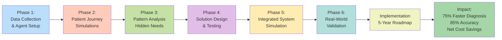
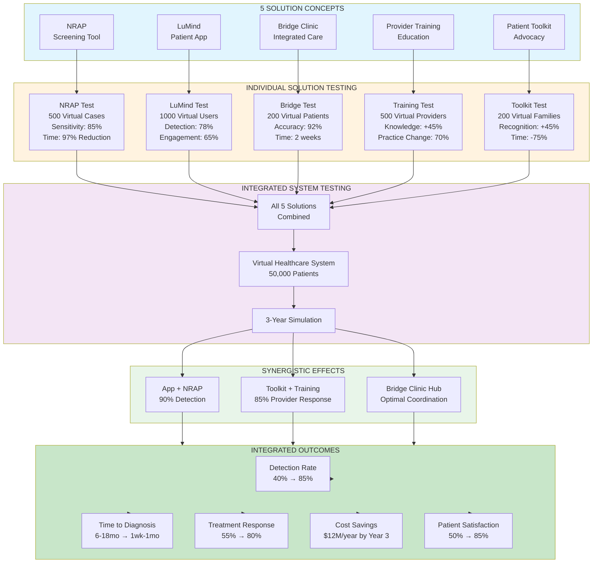

# Mermaid Diagram: NPSLE Hidden Needs Discovery Protocol

```mermaid
graph TB
    Start([AI Agentic Playground<br/>NPSLE Protocol]) --> Phase1[Phase 1: Knowledge Base<br/>Architecture]
    
    Phase1 --> Data[Data Collection]
    Data --> PatientVoice[Patient Voice Sources<br/>Forums, Blogs, Social Media]
    Data --> Clinical[Clinical Literature<br/>NPSLE Research, Case Reports]
    Data --> System[Healthcare System Data<br/>ER Records, Hospitalizations]
    Data --> Demo[Demographic Data<br/>Disparities, Cultural Factors]
    
    Phase1 --> Agents[Agent Configuration]
    Agents --> Agent1[Agent 1: Cognitive<br/>Dysfunction Detector]
    Agents --> Agent2[Agent 2: Acute Event<br/>Analyzer]
    Agents --> Agent3[Agent 3: Steroid vs NPSLE<br/>Differentiator]
    Agents --> Agent4[Agent 4: Mood/Personality<br/>Change Tracker]
    Agents --> Agent5[Agent 5: Headache/Seizure<br/>Pattern Analyzer]
    Agents --> Agent6[Agent 6: Functional Decline<br/>Assessor]
    Agents --> Agent7[Agent 7: Demographic<br/>Disparity Detector]
    
    Phase1 --> Phase2[Phase 2: Simulation<br/>Scenarios]
    
    Phase2 --> Scenario1[Scenario 1: Gradual<br/>Cognitive Decline<br/>Keisha, 32]
    Phase2 --> Scenario2[Scenario 2: Steroid<br/>Psychosis vs NPSLE<br/>Maria, 26]
    Phase2 --> Scenario3[Scenario 3: Seizure<br/>Presentation<br/>Jessica, 19]
    Phase2 --> Scenario4[Scenario 4: Treatment-Resistant<br/>Depression<br/>David, 45]
    Phase2 --> Scenario5[Scenario 5: Pediatric<br/>Behavioral Changes<br/>Aaliyah, 14]
    
    Scenario1 --> Timeline1[18-Month Journey<br/>Symptoms → Crisis → Diagnosis]
    Scenario2 --> Timeline2[Acute Crisis<br/>Psychosis → Hospitalization]
    Scenario3 --> Timeline3[Seizure → Misdiagnosis<br/>→ Correct Diagnosis]
    Scenario4 --> Timeline4[Depression → Multiple<br/>Medication Failures]
    Scenario5 --> Timeline5[Behavior Changes<br/>→ School Problems]
    
    Timeline1 --> Phase3[Phase 3: Cross-Pattern<br/>Meta-Analysis]
    Timeline2 --> Phase3
    Timeline3 --> Phase3
    Timeline4 --> Phase3
    Timeline5 --> Phase3
    
    Phase3 --> MetaPattern1[Meta-Pattern 1:<br/>Legitimacy Crisis]
    Phase3 --> MetaPattern2[Meta-Pattern 2:<br/>Normal Imaging Trap]
    Phase3 --> MetaPattern3[Meta-Pattern 3:<br/>Specialty Silo Problem]
    Phase3 --> MetaPattern4[Meta-Pattern 4:<br/>Mild Lupus Misconception]
    Phase3 --> MetaPattern5[Meta-Pattern 5:<br/>Treatment Resistance Flag]
    Phase3 --> MetaPattern6[Meta-Pattern 6:<br/>Demographic Disparities]
    Phase3 --> MetaPattern7[Meta-Pattern 7:<br/>Family Observation Dismissal]
    Phase3 --> MetaPattern8[Meta-Pattern 8:<br/>Steroid Paradox]
    Phase3 --> MetaPattern9[Meta-Pattern 9:<br/>Cognitive Invisibility]
    Phase3 --> MetaPattern10[Meta-Pattern 10:<br/>Recovery Gap]
    
    MetaPattern1 --> HiddenNeeds[Hidden Needs<br/>Identified: 33 Total]
    MetaPattern2 --> HiddenNeeds
    MetaPattern3 --> HiddenNeeds
    MetaPattern4 --> HiddenNeeds
    MetaPattern5 --> HiddenNeeds
    MetaPattern6 --> HiddenNeeds
    MetaPattern7 --> HiddenNeeds
    MetaPattern8 --> HiddenNeeds
    MetaPattern9 --> HiddenNeeds
    MetaPattern10 --> HiddenNeeds
    
    HiddenNeeds --> Phase4[Phase 4: Solution<br/>Concept Development]
    
    Phase4 --> Sol1[Solution 1: NRAP<br/>NPSLE Rapid Assessment Protocol]
    Phase4 --> Sol2[Solution 2: LuMind App<br/>Patient Monitoring & AI Detection]
    Phase4 --> Sol3[Solution 3: Bridge Clinic<br/>Multidisciplinary Integration]
    Phase4 --> Sol4[Solution 4: NPSLE Mastery<br/>Provider Education Program]
    Phase4 --> Sol5[Solution 5: Patient Toolkit<br/>Recognition & Advocacy]
    
    Sol1 --> SimTest1[Simulation Testing<br/>n=500 Virtual Cases]
    Sol2 --> SimTest2[Simulation Testing<br/>n=1000 Virtual Users]
    Sol3 --> SimTest3[Simulation Testing<br/>200 Patients/Year]
    Sol4 --> SimTest4[Simulation Testing<br/>n=500 Providers]
    Sol5 --> SimTest5[Simulation Testing<br/>n=200 Families]
    
    SimTest1 --> Results1[Sensitivity: 85%<br/>Time Reduction: 97%]
    SimTest2 --> Results2[Early Detection: 78%<br/>Engagement: 65% at 6mo]
    SimTest3 --> Results3[Diagnostic Accuracy: 92%<br/>Time: 2 weeks vs 6-18mo]
    SimTest4 --> Results4[Knowledge Gain: 45%<br/>Practice Change: 70%]
    SimTest5 --> Results5[Recognition: 40%→85%<br/>Time: 75% Reduction]
    
    Results1 --> Phase5[Phase 5: Integrated<br/>Multi-Solution Simulation]
    Results2 --> Phase5
    Results3 --> Phase5
    Results4 --> Phase5
    Results5 --> Phase5
    
    Phase5 --> Integrated[Virtual Healthcare System<br/>50,000 Lupus Patients<br/>All 5 Solutions Implemented]
    
    Integrated --> Year1[Year 1: Foundation<br/>Provider Training<br/>NRAP Implementation<br/>App Launch]
    Integrated --> Year2[Year 2: Scale-Up<br/>Training Expansion<br/>Bridge Clinic Opens]
    Integrated --> Year3[Year 3: Optimization<br/>Full System Adoption<br/>Outcomes Measurement]
    
    Year1 --> Outcomes[Population Outcomes]
    Year2 --> Outcomes
    Year3 --> Outcomes
    
    Outcomes --> Clinical[Clinical Outcomes<br/>Detection: 85% vs 40%<br/>Time to Dx: 1wk-1mo vs 3-12mo<br/>Response Rate: 80% vs 55%]
    Outcomes --> Economic[Economic Outcomes<br/>Cost Savings: $12M/year<br/>ROI: 1.5:1 by Year 3<br/>Avoided Hospitalizations: 65%]
    Outcomes --> Patient[Patient Outcomes<br/>QoL: 40% Improvement<br/>Satisfaction: 85% vs 50%<br/>Empowerment: Significant]
    
    Outcomes --> Synergies[Synergistic Effects<br/>App + NRAP: 90% Detection<br/>Toolkit + Training: 85% Response<br/>Bridge Clinic: Optimal Outcomes]
    
    Phase5 --> Phase6[Phase 6: Real-World<br/>Validation]
    
    Phase6 --> Val1[Qualitative Validation<br/>n=40 Patient Interviews<br/>n=4 Family Focus Groups]
    Phase6 --> Val2[Quantitative Validation<br/>n=300 Provider Survey<br/>n=300 Patient Survey]
    Phase6 --> Val3[Pilot Testing<br/>6 Sites, 12 Months<br/>All 5 Solutions]
    
    Val1 --> Analysis[Validation Analysis<br/>Compare Simulation vs Reality<br/>Refine Solutions]
    Val2 --> Analysis
    Val3 --> Analysis
    
    Analysis --> Refinement[Solution Refinement<br/>Adjust Based on Feedback<br/>Optimize Implementation]
    
    Refinement --> Implementation[Implementation Roadmap<br/>5-Year Plan]
    
    Implementation --> Yr1[Year 1: Pilot<br/>6 Sites]
    Implementation --> Yr2[Year 2: Early Scale<br/>20 Sites]
    Implementation --> Yr3[Year 3: Regional<br/>50 Sites, 5 Clinics]
    Implementation --> Yr4[Year 4: National<br/>200 Sites, 20 Clinics]
    Implementation --> Yr5[Year 5: Optimization<br/>Sustainability Planning]
    
    Yr1 --> Metrics[Success Metrics]
    Yr2 --> Metrics
    Yr3 --> Metrics
    Yr4 --> Metrics
    Yr5 --> Metrics
    
    Metrics --> Target1[Time to Diagnosis<br/>75% Reduction]
    Metrics --> Target2[Diagnostic Accuracy<br/>>85%]
    Metrics --> Target3[Treatment Response<br/>>75%]
    Metrics --> Target4[Healthcare Costs<br/>Net Savings by Year 3]
    Metrics --> Target5[Provider Confidence<br/>>70%]
    
    Metrics --> End([Protocol Complete<br/>Transferable to Other<br/>Inflammatory Conditions])
    
    style Start fill:#e1f5ff
    style Phase1 fill:#fff4e1
    style Phase2 fill:#ffe1f5
    style Phase3 fill:#e1ffe1
    style Phase4 fill:#f5e1ff
    style Phase5 fill:#ffe1e1
    style Phase6 fill:#e1ffff
    style Implementation fill:#ffffe1
    style End fill:#e1f5ff
    
    style HiddenNeeds fill:#ff6b6b,color:#fff
    style Outcomes fill:#4ecdc4,color:#fff
    style Metrics fill:#45b7d1,color:#fff
```

---

# Alternative Detailed Flow Diagram

```mermaid
flowchart TD
    subgraph Input["INPUT: Data Sources"]
        A1[Patient Forums & Social Media]
        A2[Clinical Literature]
        A3[Healthcare Records]
        A4[Demographic Data]
    end
    
    subgraph Agents["AGENT ENSEMBLE: 7 Specialized Agents"]
        B1[Cognitive Dysfunction<br/>Detector]
        B2[Acute Event<br/>Analyzer]
        B3[Steroid vs NPSLE<br/>Differentiator]
        B4[Mood/Personality<br/>Tracker]
        B5[Neurological<br/>Pattern Analyzer]
        B6[Functional Impact<br/>Assessor]
        B7[Disparity<br/>Detector]
    end
    
    subgraph Scenarios["SIMULATION SCENARIOS: 5 Patient Journeys"]
        C1[Keisha<br/>Gradual Cognitive Decline<br/>Professional Impact]
        C2[Maria<br/>Acute Psychosis<br/>Steroid Complexity]
        C3[Jessica<br/>New-Onset Seizures<br/>Misdiagnosis]
        C4[David<br/>Treatment-Resistant Depression<br/>Male Patient]
        C5[Aaliyah<br/>Pediatric Behavioral Changes<br/>Racial Bias]
    end
    
    subgraph Analysis["META-ANALYSIS: Pattern Recognition"]
        D1[10 Cross-Cutting<br/>Meta-Patterns]
        D2[33 Hidden Needs<br/>Identified]
        D3[Demographic<br/>Disparities]
        D4[System Failures<br/>Mapped]
    end
    
    subgraph Solutions["SOLUTION CONCEPTS: 5 Interventions"]
        E1[NRAP<br/>Screening Protocol<br/>85% Sensitivity]
        E2[LuMind App<br/>AI Monitoring<br/>78% Early Detection]
        E3[Bridge Clinic<br/>Multidisciplinary<br/>92% Accuracy]
        E4[Provider Training<br/>NPSLE Mastery<br/>45% Knowledge Gain]
        E5[Patient Toolkit<br/>Advocacy Resources<br/>75% Time Reduction]
    end
    
    subgraph Testing["SOLUTION TESTING: Virtual Simulations"]
        F1[500 Virtual ER Cases]
        F2[1000 Virtual App Users]
        F3[200 Virtual Clinic Patients]
        F4[500 Virtual Providers]
        F5[200 Virtual Families]
    end
    
    subgraph Integration["INTEGRATED SYSTEM: All Solutions Combined"]
        G1[Year 1<br/>Foundation<br/>Training & Launch]
        G2[Year 2<br/>Scale-Up<br/>Expansion]
        G3[Year 3<br/>Optimization<br/>Full Adoption]
    end
    
    subgraph Outcomes["POPULATION OUTCOMES"]
        H1[Clinical<br/>Detection: 85%<br/>Time: 1wk-1mo<br/>Response: 80%]
        H2[Economic<br/>Savings: $12M/yr<br/>ROI: 1.5:1<br/>Hosp: -65%]
        H3[Patient<br/>QoL: +40%<br/>Satisfaction: 85%<br/>Empowerment: High]
    end
    
    subgraph Validation["REAL-WORLD VALIDATION"]
        I1[Qualitative<br/>40 Interviews<br/>4 Focus Groups]
        I2[Quantitative<br/>300 Provider Survey<br/>300 Patient Survey]
        I3[Pilot Testing<br/>6 Sites<br/>12 Months]
    end
    
    subgraph Implementation["5-YEAR IMPLEMENTATION"]
        J1[Year 1: Pilot<br/>6 Sites]
        J2[Year 2: Early Scale<br/>20 Sites]
        J3[Year 3: Regional<br/>50 Sites]
        J4[Year 4: National<br/>200 Sites]
        J5[Year 5: Optimization<br/>Sustainability]
    end
    
    subgraph Impact["FINAL IMPACT"]
        K1[Time to Diagnosis<br/>75% Reduction]
        K2[Diagnostic Accuracy<br/>>85%]
        K3[Treatment Response<br/>>75%]
        K4[Net Cost Savings<br/>By Year 3]
        K5[Transferable Model<br/>Other Conditions]
    end
    
    Input --> Agents
    Agents --> Scenarios
    Scenarios --> Analysis
    Analysis --> Solutions
    Solutions --> Testing
    Testing --> Integration
    Integration --> Outcomes
    Outcomes --> Validation
    Validation --> Implementation
    Implementation --> Impact
    
    style Input fill:#e3f2fd
    style Agents fill:#fff3e0
    style Scenarios fill:#fce4ec
    style Analysis fill:#e8f5e9
    style Solutions fill:#f3e5f5
    style Testing fill:#ffe0b2
    style Integration fill:#ffebee
    style Outcomes fill:#e0f2f1
    style Validation fill:#f1f8e9
    style Implementation fill:#fff9c4
    style Impact fill:#c8e6c9
```

---

# Simplified High-Level Overview

---

# Solution Testing & Outcomes Flow

---

# Patient Journey Comparison: Before vs After

```mermaid
flowchart LR
    subgraph Before["BEFORE: Traditional Care"]
        B1[Symptom Onset] --> B2[Patient Confusion<br/>Self-Doubt]
        B2 --> B3[Multiple Provider Visits<br/>Poor Communication]
        B3 --> B4[Misdiagnosis<br/>Inappropriate Treatment]
        B4 --> B5[Crisis/Hospitalization]
        B5 --> B6[Delayed NPSLE Diagnosis<br/>6-18 Months]
        B6 --> B7[Functional Decline<br/>Career/Relationship Loss]
    end
    
    subgraph After["AFTER: Integrated System"]
        A1[Symptom Onset] --> A2[LuMind App Detection<br/>Patient Toolkit Recognition]
        A2 --> A3[NRAP Screening<br/>Automatic Trigger]
        A3 --> A4[Bridge Clinic Referral<br/>Multidisciplinary Team]
        A4 --> A5[Comprehensive Evaluation<br/>1-2 Weeks]
        A5 --> A6[Accurate NPSLE Diagnosis<br/>Appropriate Treatment]
        A6 --> A7[Recovery & Function<br/>Preserved Quality of Life]
    end
    
    B7 -.->|Transformation| A1
    
    style Before fill:#ffcdd2
    style After fill:#c8e6c9
    style B7 fill:#ef5350,color:#fff
    style A7 fill:#66bb6a,color:#fff
```

These diagrams provide multiple perspectives on the protocol:

1. **First diagram**: Comprehensive flow showing all phases, agents, scenarios, and outcomes
2. **Second diagram**: Detailed view with subgraphs for each major component
3. **Third diagram**: Simplified high-level overview of the 8 main phases
4. **Fourth diagram**: Focus on solution testing and synergistic effects
5. **Fifth diagram**: Before/after comparison showing patient journey transformation

Would you like me to create additional diagrams focusing on specific aspects, such as:
- Agent interaction patterns
- Validation protocol flow
- Implementation timeline
- Cost-benefit analysis flow
- Demographic disparity detection process