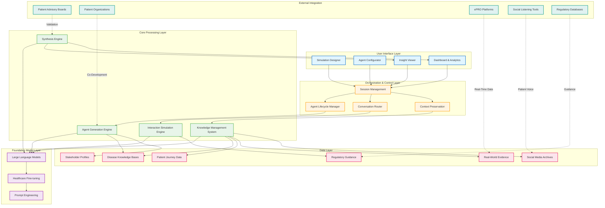
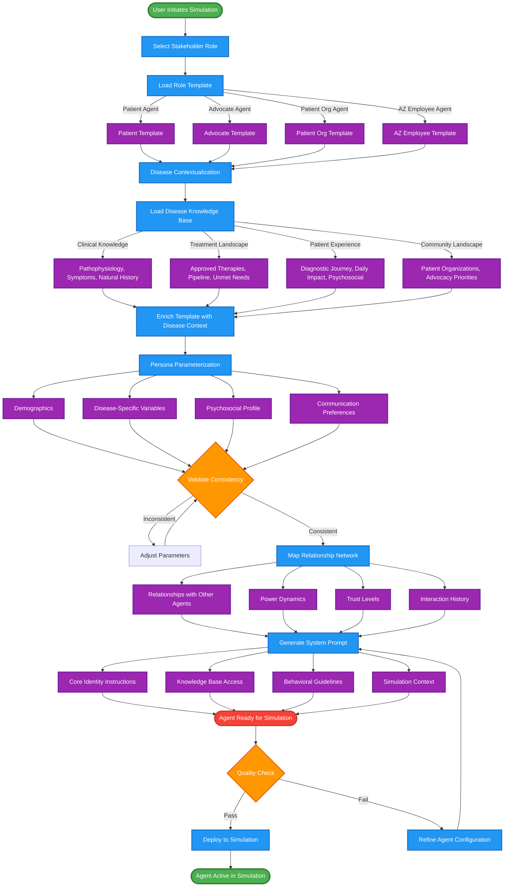
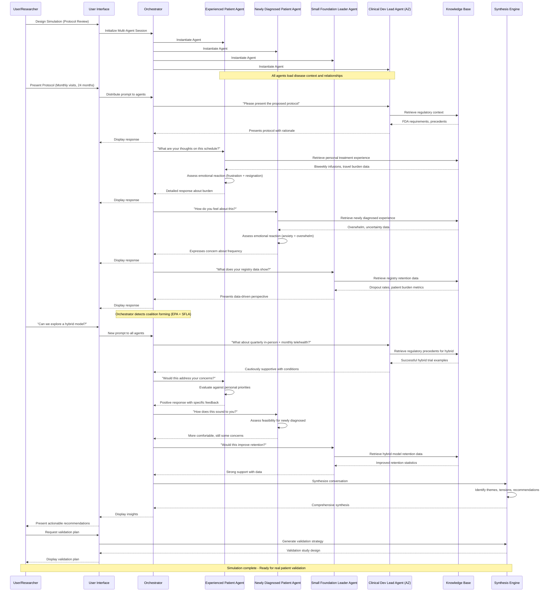
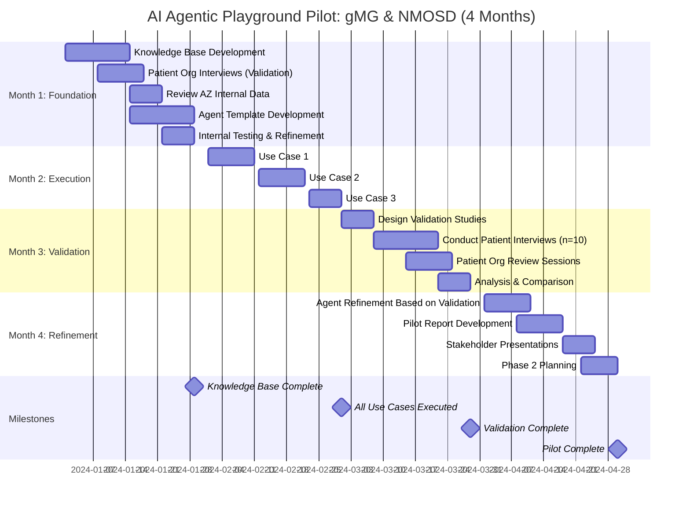

# Mermaid Diagrams: AI Agentic Playground Architecture, Methodology & Functioning

## 1. System Architecture Diagram

---

## 2. Agent Generation Methodology

---

## 3. Simulation Interaction Flow

---

## 4. Use Case Workflow: Clinical Trial Protocol Optimization

```mermaid
flowchart LR
    subgraph "Phase 1: Problem Definition"
        P1[Identify Protocol Challenge]
        P2[Define Research Questions]
        P3[Select Success Criteria]
    end
    
    subgraph "Phase 2: Simulation Design"
        S1[Select Agent Roles]
        S2[Configure Personas]
        S3[Design Interaction Mode]
        S4[Prepare Prompts]
    end
    
    subgraph "Phase 3: Simulation Execution"
        E1[Sequential Consultation]
        E2[Multi-Agent Dialogue]
        E3[Scenario Testing]
        E4[Document Insights]
    end
    
    subgraph "Phase 4: Analysis & Synthesis"
        A1[Identify Themes]
        A2[Map Stakeholder Alignment]
        A3[Assess Feasibility]
        A4[Generate Recommendations]
    end
    
    subgraph "Phase 5: Validation"
        V1[Design Validation Study]
        V2[Conduct Patient Interviews]
        V3[Compare AI vs Real Insights]
        V4[Refine Recommendations]
    end
    
    subgraph "Phase 6: Implementation"
        I1[Protocol Modifications]
        I2[Regulatory Justification]
        I3[Patient Advisory Board]
        I4[Measure Impact]
    end
    
    P1 --> P2 --> P3 --> S1
    S1 --> S2 --> S3 --> S4 --> E1
    E1 --> E2 --> E3 --> E4 --> A1
    A1 --> A2 --> A3 --> A4 --> V1
    V1 --> V2 --> V3 --> V4 --> I1
    I1 --> I2 --> I3 --> I4
    
    I4 -.->|Continuous Improvement| P1
    
    classDef phase1 fill:#e3f2fd,stroke:#1976d2,stroke-width:2px
    classDef phase2 fill:#f3e5f5,stroke:#7b1fa2,stroke-width:2px
    classDef phase3 fill:#e8f5e9,stroke:#388e3c,stroke-width:2px
    classDef phase4 fill:#fff3e0,stroke:#f57c00,stroke-width:2px
    classDef phase5 fill:#fce4ec,stroke:#c2185b,stroke-width:2px
    classDef phase6 fill:#e0f2f1,stroke:#00796b,stroke-width:2px
    
    class P1,P2,P3 phase1
    class S1,S2,S3,S4 phase2
    class E1,E2,E3,E4 phase3
    class A1,A2,A3,A4 phase4
    class V1,V2,V3,V4 phase5
    class I1,I2,I3,I4 phase6
```

---

## 5. Agent Response Generation Process

```mermaid
flowchart TD
    Start([User Prompt Received]) --> Parse[Parse Prompt Content]
    
    Parse --> Layer1[Layer 1: Emotional Assessment]
    Layer1 --> Trigger{Identify Emotional Triggers}
    
    Trigger --> |Family Impact|E1[High Intensity: Guilt + Protection]
    Trigger --> |Disease Progression|E2[High Intensity: Anxiety + Fear]
    Trigger --> |Treatment Burden|E3[Moderate: Frustration + Resignation]
    Trigger --> |Financial Stress|E4[High Intensity: Anxiety + Anger]
    Trigger --> |Hope/Progress|E5[Moderate: Cautious Optimism]
    Trigger --> |Validation|E6[Moderate: Relief + Gratitude]
    Trigger --> |Neutral Topic|E7[Low: Neutral Engagement]
    
    E1 --> Layer2[Layer 2: Knowledge Retrieval]
    E2 --> Layer2
    E3 --> Layer2
    E4 --> Layer2
    E5 --> Layer2
    E6 --> Layer2
    E7 --> Layer2
    
    Layer2 --> Search[Semantic Search Knowledge Base]
    Search --> Filter[Filter by Relevance & Perspective]
    Filter --> Rank[Rank by Confidence Score]
    Rank --> Select[Select Top Knowledge Items]
    
    Select --> Layer3[Layer 3: Experiential Integration]
    Layer3 --> Map[Map to Personal Experience]
    Map --> |Treatment History|EXP1[Current Therapy Experience]
    Map --> |Symptom Management|EXP2[Daily Living Challenges]
    Map --> |Healthcare Navigation|EXP3[Insurance/Access Barriers]
    Map --> |Family Dynamics|EXP4[Caregiver/Family Impact]
    
    EXP1 --> Layer4[Layer 4: Relationship Context]
    EXP2 --> Layer4
    EXP3 --> Layer4
    EXP4 --> Layer4
    
    Layer4 --> Who{Who is the audience?}
    Who --> |Patient|R1[Mentoring/Supportive Stance]
    Who --> |Clinician/AZ|R2[Collaborative/Assertive Stance]
    Who --> |Patient Org|R3[Collegial/Aligned Stance]
    Who --> |Advocate|R4[Strategic/Collaborative Stance]
    
    R1 --> Layer5[Layer 5: Communication Style]
    R2 --> Layer5
    R3 --> Layer5
    R4 --> Layer5
    
    Layer5 --> Style{Determine Style Based on Emotion + Relationship}
    Style --> |High Emotion|ST1[Very Direct + Open Expression]
    Style --> |Moderate Emotion|ST2[Direct + Measured Expression]
    Style --> |Low Emotion|ST3[Professional + Informative]
    
    ST1 --> Layer6[Layer 6: Response Construction]
    ST2 --> Layer6
    ST3 --> Layer6
    
    Layer6 --> Build[Build Response Components]
    Build --> C1[Emotional Opening if applicable]
    Build --> C2[Personal Experience Narrative]
    Build --> C3[Knowledge-Based Perspective]
    Build --> C4[Practical Implications]
    Build --> C5[Forward-Looking Statement]
    
    C1 --> Combine[Combine with Natural Transitions]
    C2 --> Combine
    C3 --> Combine
    C4 --> Combine
    C5 --> Combine
    
    Combine --> Layer7[Layer 7: Authenticity Filters]
    Layer7 --> Check1{Check Language Patterns}
    Check1 --> |Too Formal|Adjust1[Adjust to Persona Style]
    Check1 --> |Appropriate|Check2{Check Emotional Nuance}
    Adjust1 --> Check2
    
    Check2 --> |Missing|Adjust2[Add Realistic Hesitations]
    Check2 --> |Present|Check3{Check Knowledge Level}
    Adjust2 --> Check3
    
    Check3 --> |Too Technical|Adjust3[Simplify or Explain]
    Check3 --> |Too Simple|Adjust4[Add Appropriate Complexity]
    Check3 --> |Appropriate|Check4{Check for Bias/Stereotypes}
    Adjust3 --> Check4
    Adjust4 --> Check4
    
    Check4 --> |Detected|Adjust5[Remove Biased Content]
    Check4 --> |Clear|Final[Final Response]
    Adjust5 --> Final
    
    Final --> Update[Update Agent State]
    Update --> History[Add to Conversation History]
    Update --> Emotion[Update Emotional State]
    Update --> Trust[Update Trust/Rapport Levels]
    
    History --> Output([Response Delivered to User])
    Emotion --> Output
    Trust --> Output
    
    classDef start fill:#4caf50,stroke:#2e7d32,stroke-width:3px,color:#fff
    classDef layer fill:#2196f3,stroke:#1565c0,stroke-width:2px,color:#fff
    classDef decision fill:#ff9800,stroke:#e65100,stroke-width:2px,color:#fff
    classDef process fill:#9c27b0,stroke:#6a1b9a,stroke-width:2px,color:#fff
    classDef output fill:#f44336,stroke:#c62828,stroke-width:2px,color:#fff
    
    class Start,Output start
    class Layer1,Layer2,Layer3,Layer4,Layer5,Layer6,Layer7 layer
    class Trigger,Who,Style,Check1,Check2,Check3,Check4 decision
    class Parse,Search,Filter,Rank,Select,Map,Build,Combine,Update,History,Emotion,Trust,Final process
    class E1,E2,E3,E4,E5,E6,E7,EXP1,EXP2,EXP3,EXP4,R1,R2,R3,R4,ST1,ST2,ST3,C1,C2,C3,C4,C5,Adjust1,Adjust2,Adjust3,Adjust4,Adjust5 process
```

---

## 6. Validation & Quality Assurance Workflow

```mermaid
flowchart TD
    Start([AI Simulation Complete]) --> Assess{Assess Validation Need}
    
    Assess --> |Critical Decision|V1[High Priority Validation]
    Assess --> |Novel Insight|V2[Medium Priority Validation]
    Assess --> |Routine Insight|V3[Low Priority Validation]
    Assess --> |Periodic Check|V4[Calibration Validation]
    
    V1 --> Design[Design Validation Study]
    V2 --> Design
    V3 --> Design
    V4 --> Design
    
    Design --> Method{Select Validation Method}
    
    Method --> |Parallel PAB|M1[Patient Advisory Board]
    Method --> |Interviews|M2[Structured Patient Interviews]
    Method --> |Survey|M3[Patient Survey]
    Method --> |PO Review|M4[Patient Organization Review]
    
    M1 --> Recruit[Recruit Participants]
    M2 --> Recruit
    M3 --> Recruit
    M4 --> Contact[Contact Patient Organizations]
    
    Recruit --> Collect[Collect Real Patient Data]
    Contact --> Collect
    
    Collect --> Analyze[Analyze & Compare]
    
    Analyze --> Qual[Qualitative Coding]
    Analyze --> Quant[Quantitative Metrics]
    
    Qual --> Theme[Thematic Alignment]
    Quant --> Stats[Statistical Comparison]
    
    Theme --> Calculate[Calculate Alignment Score]
    Stats --> Calculate
    
    Calculate --> Score{Alignment Level?}
    
    Score --> |≥85%|High[High Alignment]
    Score --> |60-84%|Mod[Moderate Alignment]
    Score --> |<60%|Low[Low Alignment]
    
    High --> Report1[Validation Report: High Confidence]
    Mod --> Report2[Validation Report: Moderate Confidence]
    Low --> Report3[Validation Report: Low Confidence]
    
    Report1 --> Action1[Proceed with AI Insights]
    Report2 --> Action2[Refine Critical Elements]
    Report3 --> Action3[Major Agent Refinement Needed]
    
    Action1 --> Implement[Implement Recommendations]
    Action2 --> Refine[Refine AI Agents]
    Action3 --> Investigate[Investigate Root Causes]
    
    Refine --> Update1[Update Knowledge Base]
    Investigate --> Update2[Major Agent Overhaul]
    
    Update1 --> Revalidate{Re-validation Needed?}
    Update2 --> Revalidate
    
    Revalidate --> |Yes|Design
    Revalidate --> |No|Document[Document Learnings]
    
    Implement --> Measure[Measure Real-World Impact]
    Document --> Archive[Archive in Best Practices]
    
    Measure --> Track[Track Outcomes]
    Archive --> Track
    
    Track --> QA[Quality Assurance Review]
    
    QA --> Audit[Quarterly Bias Audit]
    QA --> Trend[Trend Analysis]
    QA --> Feedback[User Feedback Analysis]
    
    Audit --> Improve[Continuous Improvement]
    Trend --> Improve
    Feedback --> Improve
    
    Improve --> End([Updated Framework])
    
    classDef start fill:#4caf50,stroke:#2e7d32,stroke-width:3px,color:#fff
    classDef decision fill:#ff9800,stroke:#e65100,stroke-width:2px,color:#fff
    classDef highPriority fill:#f44336,stroke:#c62828,stroke-width:2px,color:#fff
    classDef medPriority fill:#ff9800,stroke:#e65100,stroke-width:2px,color:#fff
    classDef lowPriority fill:#4caf50,stroke:#2e7d32,stroke-width:2px,color:#fff
    classDef process fill:#2196f3,stroke:#1565c0,stroke-width:2px,color:#fff
    
    class Start,End start
    class Assess,Method,Score,Revalidate decision
    class V1,High,Report1,Action1 highPriority
    class V2,Mod,Report2,Action2 medPriority
    class V3,V4,Low,Report3,Action3 lowPriority
    class Design,Recruit,Contact,Collect,Analyze,Qual,Quant,Theme,Stats,Calculate,Implement,Refine,Investigate,Update1,Update2,Document,Measure,Track,QA,Audit,Trend,Feedback,Improve,Archive process
    class M1,M2,M3,M4 process
```

---

## 7. Pilot Implementation Timeline (gMG & NMOSD)

---

## 8. Governance & Decision-Making Structure

```mermaid
graph TD
    subgraph "Strategic Oversight"
        SC[Steering Committee]
        SC --> SC1[R&D Leadership - Chair]
        SC --> SC2[Patient Engagement Lead]
        SC --> SC3[Medical Affairs Rep]
        SC --> SC4[Regulatory Affairs Rep]
        SC --> SC5[Ethics & Compliance]
        SC --> SC6[External Patient Advocate]
        SC --> SC7[External Ethicist]
    end
    
    subgraph "Operational Management"
        OC[Operating Committee]
        OC --> OC1[Framework Product Owner]
        OC --> OC2[AI/ML Technical Lead]
        OC --> OC3[Patient Insights Lead]
        OC --> OC4[UX Lead]
        OC --> OC5[Data Governance Rep]
    end
    
    subgraph "Patient Advisory"
        PAB[Patient Advisory Board]
        PAB --> PAB1[gMG Patient Representatives]
        PAB --> PAB2[NMOSD Patient Representatives]
        PAB --> PAB3[Patient Organization Leaders]
        PAB --> PAB4[Patient Advocates]
    end
    
    subgraph "Ethics Review"
        ERB[Ethics Review Board]
        ERB --> ERB1[Steering Committee Subset]
        ERB --> ERB2[Patient Advisory Board Reps]
        ERB --> ERB3[External Ethicist]
        ERB --> ERB4[Legal/Compliance]
    end
    
    subgraph "User Community"
        UC[Community of Practice]
        UC --> UC1[Core Users - R&D]
        UC --> UC2[Frequent Users - Med Affairs]
        UC --> UC3[Occasional Users - Leadership]
    end
    
    SC -.->|Strategic Direction| OC
    SC -.->|Oversight| PAB
    SC -.->|Ethical Guidance| ERB
    
    OC -.->|Operations Updates| SC
    OC -.->|User Support| UC
    OC -.->|Escalations| ERB
    
    PAB -.->|Patient Perspective| SC
    PAB -.->|Agent Validation| OC
    PAB -.->|Ethics Input| ERB
    
    ERB -.->|Approval/Rejection| OC
    ERB -.->|Policy Recommendations| SC
    
    UC -.->|Feedback & Issues| OC
    UC -.->|Use Case Requests| SC
    
    User[End Users] --> Decision{Decision Type?}
    
    Decision --> |Standard Use|Auto[Auto-Approved]
    Decision --> |Novel Use Case|OC
    Decision --> |Sensitive Topic|ERB
    Decision --> |External Communication|SC
    Decision --> |Patient Org Partnership|PAB
    
    Auto --> Execute[Execute Simulation]
    OC --> Review1[Operating Committee Review]
    ERB --> Review2[Ethics Review]
    SC --> Review3[Strategic Review]
    PAB --> Review4[Patient Advisory Review]
    
    Review1 --> Approve1{Approved?}
    Review2 --> Approve2{Approved?}
    Review3 --> Approve3{Approved?}
    Review4 --> Approve4{Approved?}
    
    Approve1 --> |Yes|Execute
    Approve1 --> |No|Revise[Revise Approach]
    Approve2 --> |Yes|Execute
    Approve2 --> |No|Revise
    Approve3 --> |Yes|Execute
    Approve3 --> |No|Revise
    Approve4 --> |Yes|Execute
    Approve4 --> |No|Revise
    
    Revise --> User
    Execute --> Monitor[Monitor & Report]
    Monitor --> UC
    
    classDef strategic fill:#1976d2,stroke:#0d47a1,stroke-width:2px,color:#fff
    classDef operational fill:#388e3c,stroke:#1b5e20,stroke-width:2px,color:#fff
    classDef advisory fill:#7b1fa2,stroke:#4a148c,stroke-width:2px,color:#fff
    classDef ethics fill:#d32f2f,stroke:#b71c1c,stroke-width:2px,color:#fff
    classDef community fill:#f57c00,stroke:#e65100,stroke-width:2px,color:#fff
    classDef decision fill:#fbc02d,stroke:#f57f17,stroke-width:2px,color:#000
    classDef process fill:#0097a7,stroke:#006064,stroke-width:2px,color:#fff
    
    class SC,SC1,SC2,SC3,SC4,SC5,SC6,SC7 strategic
    class OC,OC1,OC2,OC3,OC4,OC5 operational
    class PAB,PAB1,PAB2,PAB3,PAB4 advisory
    class ERB,ERB1,ERB2,ERB3,ERB4 ethics
    class UC,UC1,UC2,UC3 community
    class Decision,Approve1,Approve2,Approve3,Approve4 decision
    class Auto,Review1,Review2,Review3,Review4,Execute,Revise,Monitor process
```

These diagrams provide comprehensive visual representations of the AI Agentic Playground's architecture, methodology, and operational workflows, making the complex system more accessible and understandable for stakeholders across technical and non-technical backgrounds.